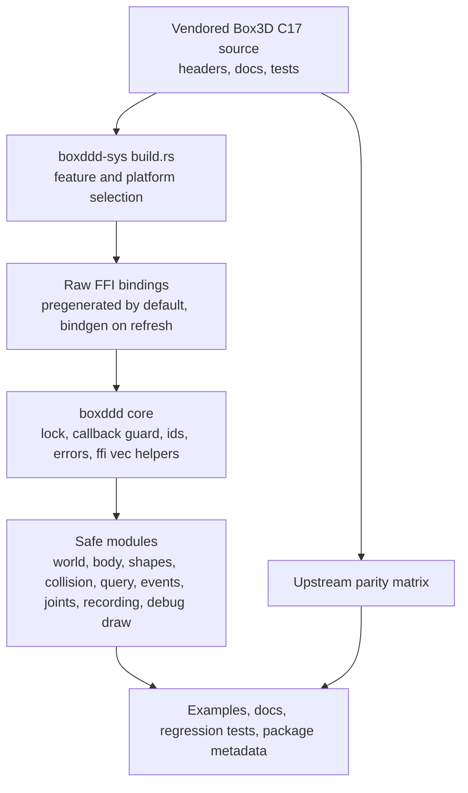
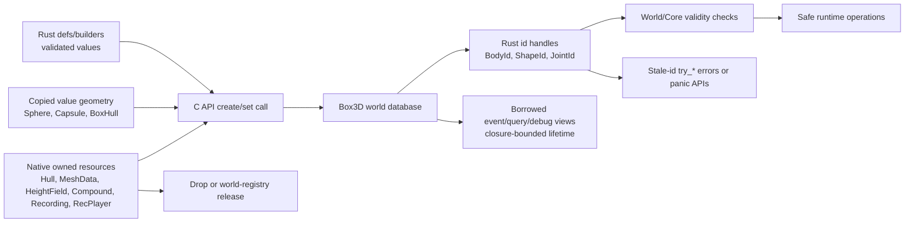
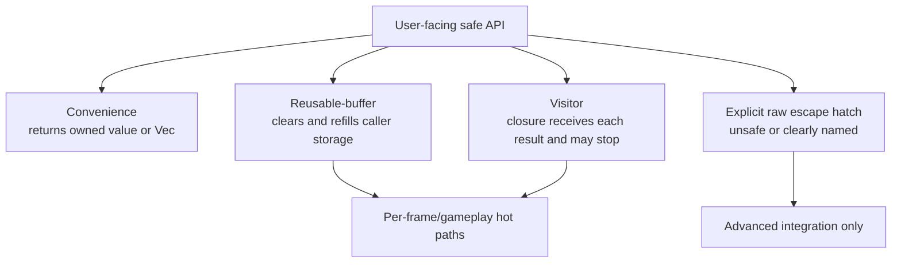

# Box3D Binding Roadmap

## Goal Capsule

Build `boxddd` into a publishable, maintainable Rust binding for Box3D rather than a thin Hello World wrapper. The plan keeps `boxddd-sys` responsible for reproducible raw C API access and keeps `boxddd` responsible for the safe Rust model: crate-owned math/id/value types, RAII native resources, typed world/body/shape/joint handles, allocation-aware queries, events, callbacks, recording, examples, and release packaging.

The source of truth is the maintainer-confirmed scope from 2026-07-02, the current `boxddd` scaffold, the mature `boxdd` sibling crate patterns, and the vendored Box3D C headers/docs/tests. Stop and re-scope if upstream Box3D changes its public ABI enough to invalidate generated bindings, if a proposed safe API would require unsound lifetime guarantees, or if the maintainer changes the release goal from early 0.x support to full API parity before first publication.

---

## Summary

`boxddd` should remain a new crate family, not a 3D feature inside `boxdd`. Box3D has a familiar C API style, but the Rust-facing domain is different: `Vec3`, `Quat`, `b3Pos`/large-world ABI, convex hull resources, triangle meshes, height fields, static compounds, 3D joints, geometric character mover APIs, debug draw resources, and recording/replay all need first-class 3D ownership and validation.

The implementation should proceed foundation-first. Complete and reproducible raw bindings come before broad safe wrappers; safe wrappers then expand in dependency order from core math/world/body/shape lifecycles into collision, queries, events, joints, recording, interop, docs, and release readiness.

---

## Problem Frame

The current workspace proves the build path and a minimal safe wrapper: it can create a world, create bodies, attach sphere and box hull shapes, step simulation, and read transforms. That is not enough to support real users because every next feature currently requires hand-extending `boxddd-sys::ffi`, and the current safe layer does not yet encode Box3D's harder ownership contracts.

The main engineering risk is not syntax translation from C to Rust. It is preserving soundness while Box3D is still alpha and while several APIs expose pointer-backed resources, callback trampolines, borrowed event buffers, build-time ABI modes, and handles that become stale after destruction.

---

## Requirements

**R1. Raw binding completeness.** `boxddd-sys` must expose the public Box3D C API through reproducible bindings that work for normal users without requiring libclang.

**R2. Safe Rust surface.** `boxddd` must expose crate-owned Rust value types and typed handles as the primary API; raw FFI must stay explicit through named escape hatches.

**R3. Core simulation coverage.** Users must be able to configure worlds, create/destroy bodies, attach/edit shapes, step simulation, inspect transforms, forces, mass data, contacts, counters, and runtime tuning without dropping to raw FFI.

**R4. Native resource ownership.** Hulls, meshes, height fields, compounds, recordings, and replay players must have RAII wrappers or world-owned registries that prevent use-after-free and invalid destroy order.

**R5. Collision, queries, and mover support.** Standalone collision algorithms, world/body queries, ray/shape casts, overlap queries, dynamic-tree helpers where appropriate, and the Box3D character mover workflow must have safe wrappers with validation.

**R6. Callback and event safety.** Contact/sensor/body/joint events, custom filters, pre-solve callbacks, material mixing callbacks, and debug draw callbacks must not permit reentrant Box3D access or Rust panics to cross the C boundary unsafely.

**R7. Joint coverage.** Typed builders and runtime wrappers must cover Box3D joint families: parallel, distance, motor, filter, prismatic, revolute, spherical, weld, and wheel.

**R8. Build-mode and ABI clarity.** SIMD, validation, docs.rs, bindgen regeneration, and double-precision large-world mode must be represented intentionally rather than accidentally inherited from the default C build.

**R9. Upstream drift control.** The project must track the vendored Box3D commit, detect layout/API drift, and port meaningful upstream tests/examples so alpha churn is visible before release.

**R10. Release usability.** The workspace must include docs, examples, feature flags, package includes, and CI gates sufficient for docs.rs and crates.io publication under the `boxddd` / `boxddd-sys` crate family.

---

## Scope Boundaries

### In Scope

- `boxddd-sys` raw binding generation, pregenerated bindings, vendored Box3D packaging, and feature-driven C build modes.
- `boxddd` safe wrappers for core math, ids, definitions, world/body/shape/joint/query/event/collision/recording/debug-draw APIs.
- Wrapper-level ownership and validation that follows Box3D behavior while hiding unsafe raw pointer lifetimes from normal users.
- Test coverage based on the current MVP, `boxdd` regression patterns, and upstream Box3D tests/docs.
- README, examples, docs.rs readiness, changelog guidance, and package metadata for 0.x releases.

### Deferred to Follow-Up Work

- A full graphical 3D testbed. Debug draw command collection is in scope; an interactive renderer is a separate product.
- System-library or `pkg-config` linking for Box3D. The first reliable path should remain vendored source.
- WASM native C builds. The build script may leave documented skeletons, but WASM support should not block native releases.
- Fully safe task-system worker callbacks. Raw/advanced configuration may exist first; safe multithreaded stepping requires a separate design pass.
- Automatic upstream pull/rebase bots. The plan requires a reproducible refresh tool and drift checks, not unattended dependency updates.

### Non-Goals

- Merging `boxddd` into `boxdd`.
- Promising SemVer 1.0 stability while upstream Box3D is still alpha.
- Recreating all upstream C++ samples as Rust demos before the first usable release.
- Building a game engine, renderer, ECS integration, or asset pipeline.

---

## Key Technical Decisions

**KTD1. Keep `boxddd` independent from `boxdd`.** Reusing patterns is valuable, but a shared 2D/3D abstraction would hide important differences in math, ownership, collision, and large-world ABI.

**KTD2. Move from hand-written FFI to pregenerated raw bindings.** The current hand-written `ffi.rs` is acceptable for the scaffold only. Full support should mirror `boxdd-sys`: generated bindings are checked in for default builds, while bindgen remains an explicit refresh path.

**KTD3. Treat raw interop as an escape hatch.** Public safe APIs should use `Vec3`, `Quat`, `Pos`, `WorldTransform`, `BodyId`, `ShapeId`, `JointId`, `Filter`, `SurfaceMaterial`, and typed geometry wrappers. `from_raw`, `into_raw`, and unsafe raw constructors should be visible and named.

**KTD4. Encode resource classes explicitly.** Value geometry such as spheres and stack box hulls can be copied. Native heap resources such as created hulls, meshes, height fields, compounds, recordings, and replay players need `Drop` or world-owned registries. World-owned handles need validity checks and stale-id error paths.

**KTD5. Preserve a conservative threading model.** `World` and owned handles stay `!Send`/`!Sync` until a safe task-system contract exists. The global Box3D lock and callback-depth guard remain part of the safe boundary.

**KTD6. Match `boxdd` error style.** Convenience APIs may panic on misuse; recoverable `try_*` APIs return a non-exhaustive API error enum for invalid ids, callback-locked access, invalid arguments, NUL strings, wrong joint type, index ranges, and resource-lifetime violations.

**KTD7. Make hot paths allocation-aware from the start.** Query/event/debug-draw APIs should offer owned `Vec` convenience, reusable-buffer `*_into` variants, and visitor forms where early exit or zero allocation is important.

**KTD8. Model double precision as an ABI mode, not a runtime toggle.** Box3D large-world mode changes public types such as `b3Pos` and `b3WorldTransform`. Rust types and tests must make that difference explicit before claiming support.

**KTD9. Port upstream behavior tests before broadening abstractions.** Upstream tests for body queries, collision, compounds, height fields, joints, mover, large worlds, determinism, and recording should drive wrapper coverage.

**KTD10. Release in staged 0.x slices.** A small publishable slice after the foundation is acceptable if docs clearly mark alpha status and unsupported modules. Full API parity is the roadmap, not a prerequisite for every early release.

---

## Alternative Approaches Considered

**Add Box3D to `boxdd` behind a 3D feature flag.** Rejected. The 2D and 3D APIs share C-style handles, but the Rust model diverges at the math layer, collision resource layer, large-world ABI, joint families, and examples. A feature flag would create a larger crate with weaker names and more conditional API complexity.

**Expose `boxddd-sys` plus a very thin safe wrapper only.** Rejected for the main crate. This would publish quickly, but it would force users to reason about native resource lifetimes, callback safety, and stale ids themselves. That is exactly the value a Rust binding should provide.

**Hand-write raw FFI as features are needed.** Accepted only for the scaffold. It keeps the first slice small, but it does not scale to Box3D's world/body/shape/query/joint/recording surface and makes upstream drift hard to detect.

**Wait for upstream Box3D to leave alpha.** Rejected for the project direction. Early `0.x` support is useful as long as docs and versioning are honest and binding refresh checks make upstream churn explicit.

---

## High-Level Technical Design

### Component Topology



### Resource Lifecycle Model



### Access Mode Shape



### Build Mode Matrix

| Mode | Intended behavior | Safe-layer implication |
| --- | --- | --- |
| Default vendored source | Build Box3D C sources with pregenerated Rust bindings | Normal users do not need libclang |
| Bindgen refresh | Regenerate bindings from vendored headers | Produces checked-in binding updates and layout drift evidence |
| docs.rs / skip native C | Rust docs compile without linking Box3D C objects | Public API docs stay publishable |
| `disable-simd` / `validate` | Forward Box3D compile definitions | Tests prove features do not alter Rust layout assumptions |
| Double precision | Build with `BOX3D_DOUBLE_PRECISION` | `Pos` and `WorldTransform` layout/API are distinct from local `Vec3`/`Transform` |

---

## Output Structure

The final shape may evolve during implementation, but the expected organization is:

```text
boxddd-sys/
  build.rs
  src/
    lib.rs
    bindings_pregenerated.rs
  tests/
    layout.rs
  tools/
    update_box3d_and_bindings.py

boxddd/
  src/
    core/
    world/
    body/
    shapes/
    collision/
    query/
    events/
    joints/
    recording.rs
    debug_draw.rs
    prelude.rs
  tests/
  examples/

docs/
  plans/
  upstream-parity/

.github/
  workflows/
```

---

## Implementation Units

### U1. Raw Bindings And Build Foundation

**Goal:** Replace the scaffold-only hand-written FFI subset with a reliable `boxddd-sys` foundation that can cover the full public Box3D C API.

**Requirements:** R1, R8, R9, R10

**Dependencies:** None

**Files:** `boxddd-sys/build.rs`, `boxddd-sys/Cargo.toml`, `boxddd-sys/src/lib.rs`, `boxddd-sys/src/ffi.rs`, `boxddd-sys/src/bindings_pregenerated.rs`, `boxddd-sys/tests/layout.rs`, `boxddd-sys/README.md`, `tools/update_box3d_and_bindings.py`

**Approach:** Mirror the proven `boxdd-sys` pattern: pregenerated bindings are used by default, bindgen is opt-in for refresh, docs.rs skips native C linking, and the build script forwards feature flags intentionally. Keep the vendored-source path as the release-critical path. Add double-precision support only when Rust bindings and layout tests can prove the ABI mode is coherent.

**Patterns to follow:** The sibling `boxdd` sys-crate pattern: pregenerated bindings by default, explicit bindgen refresh tooling, docs.rs native-build skip, and feature-aware C compilation.

**Test scenarios:**

- Generate bindings from the vendored `box3d.h` and confirm the pregenerated file contains representative world, body, shape, joint, query, collision, and recording symbols.
- Build the sys crate in default mode without requiring libclang and confirm exported bindings compile.
- Build the sys crate in docs-only mode and confirm Rust documentation can type-check without linking native Box3D objects.
- Enable validation and no-SIMD feature modes and confirm native C compilation receives the intended definitions without changing Rust type assumptions.
- Enable double precision and confirm `b3Pos` / `b3WorldTransform` layout differs from the default ABI where upstream says it should.
- Deliberately remove or stale a representative binding in a local test fixture and confirm layout/API drift is caught by tests or refresh verification.

**Verification:** Normal native builds, docs builds, feature-mode builds, and binding-refresh output all agree on the same vendored Box3D commit and fail visibly when a layout-critical public type changes.

### U2. Safe Core, Math, Ids, And Errors

**Goal:** Establish the crate-wide safe boundary used by every later module.

**Requirements:** R2, R6, R8

**Dependencies:** U1

**Files:** `boxddd/src/lib.rs`, `boxddd/src/error.rs`, `boxddd/src/types.rs`, `boxddd/src/core/mod.rs`, `boxddd/src/core/box3d_lock.rs`, `boxddd/src/core/callback_state.rs`, `boxddd/src/core/ffi_vec.rs`, `boxddd/src/core/debug_checks.rs`, `boxddd/tests/math.rs`, `boxddd/tests/handle_validity_panics.rs`, `boxddd/tests/try_api.rs`

**Approach:** Expand the current `Error` into a non-exhaustive API error model, split core helpers out of `world.rs`, and add crate-owned wrappers for all high-traffic value types: `Vec2`, `Vec3`, `Quat`, `Transform`, `Pos`, `WorldTransform`, `Matrix3`, `Aabb`, `Plane`, `Filter`, `MassData`, `Capacity`, `Profile`, and counters. Add `JointId`, `ContactId`, and raw conversion methods consistently.

**Execution note:** Implement new domain behavior test-first because these types become the contract for every later unit.

**Patterns to follow:** The sibling `boxdd` core pattern: a central lock, callback-depth guard, crate-owned raw-convertible math/id types, and a non-exhaustive fallible API error enum.

**Test scenarios:**

- Construct valid `Vec3`, `Quat`, `Transform`, `Pos`, and `WorldTransform` values and confirm round-trip raw conversion preserves fields.
- Pass NaN or infinite scalar values into validation helpers and confirm fallible APIs return invalid-argument errors.
- Enter the callback guard and confirm `try_*` APIs return callback-locked errors while panic APIs fail at the safe boundary.
- Destroy a world-created handle and confirm stale id checks return the typed invalid-id error.
- Assert `World` and owned runtime handles remain `!Send` and `!Sync`.
- Run layout checks for every crate-owned `repr(C)` value type that is allowed to cross FFI by value.

**Verification:** Every public raw crossing has an explicit conversion path, invalid values are rejected before reaching C where practical, and later modules can share one lock/callback/error/id vocabulary.

### U3. World And Body Runtime Core

**Goal:** Turn the MVP world/body layer into a complete core simulation surface.

**Requirements:** R2, R3, R6

**Dependencies:** U1, U2

**Files:** `boxddd/src/world.rs`, `boxddd/src/world/mod.rs`, `boxddd/src/world/definition.rs`, `boxddd/src/world/creation.rs`, `boxddd/src/world/body_api.rs`, `boxddd/src/world/runtime.rs`, `boxddd/src/body/mod.rs`, `boxddd/src/body/definition.rs`, `boxddd/src/body/runtime.rs`, `boxddd/src/body/owned.rs`, `boxddd/src/body/scoped.rs`, `boxddd/tests/world_hello.rs`, `boxddd/tests/world_destroy_and_recycle.rs`, `boxddd/tests/body_runtime.rs`

**Approach:** Refactor the flat MVP into the `boxdd` style: `World` owns the native world, optional `WorldHandle` supports read-oriented id follow-up, and owned/scoped body wrappers share id validation and runtime methods. Cover world creation, destroy, stepping, gravity, bounds, counters, profiles, sleeping/continuous/warm-start/speculative tuning, body transforms, velocities, forces, mass data, damping, sleep, enabled state, bullet state, motion locks, body shape/joint enumeration, and user data placeholders.

**Patterns to follow:** The sibling `boxdd` world/body module split and the current MVP `boxddd` world/body creation flow.

**Test scenarios:**

- Create the current hello-world scene, step it, and confirm a dynamic cube or sphere falls under gravity.
- Destroy a `World` containing bodies and shapes and confirm Box3D byte-count or id-validity signals show no live world use remains.
- Recycle/destroy bodies and confirm old body ids fail fallible operations.
- Set body transform, velocities, damping, gravity scale, and motion locks, then read them back through both world-id and owned/scoped surfaces.
- Apply force, torque, linear impulse, and angular impulse to a dynamic body and confirm observable velocity or transform changes after stepping.
- Attempt body operations while in callback guard and confirm fallible APIs return callback-locked errors.
- Enumerate attached shapes and joints into caller-owned buffers and confirm buffers are cleared and reused.

**Verification:** Users can perform ordinary world and body workflows without touching raw FFI, and stale handles cannot reach Box3D unchecked through safe APIs.

### U4. Shape Geometry And Native Resource Ownership

**Goal:** Cover Box3D geometry creation and attach/edit flows while preserving native resource lifetimes.

**Requirements:** R3, R4, R8

**Dependencies:** U1, U2, U3

**Files:** `boxddd/src/shapes.rs`, `boxddd/src/shapes/mod.rs`, `boxddd/src/shapes/definition.rs`, `boxddd/src/shapes/geometry.rs`, `boxddd/src/shapes/resources.rs`, `boxddd/src/shapes/runtime.rs`, `boxddd/src/world/shape_api.rs`, `boxddd/tests/shape_geometry_validation.rs`, `boxddd/tests/shape_resources.rs`, `boxddd/tests/shape_runtime.rs`

**Approach:** Keep simple value shapes cheap, but treat created hulls, meshes, height fields, and compounds as native resources with explicit ownership. Hull shape creation may copy data into the world, while mesh/height-field/compound shape creation must preserve the native resource until the referencing shape is gone. Implement this through world-attached resource tracking or an equivalent typed ownership model, then expose safe shape creation/editing for sphere, capsule, hull, transformed hull, mesh, height field, and compound.

**Execution note:** Add characterization coverage for each resource class before broadening the public API because the destroy-order rules differ by shape type.

**Patterns to follow:** Current `boxddd/src/shapes.rs` plus the sibling `boxdd` separation between shape definitions, geometry value types, runtime shape APIs, and world-level shape creation.

**Test scenarios:**

- Create sphere, capsule, box hull, offset/transformed hull, created hull, mesh, height field, and compound shapes on valid bodies and confirm `ShapeId` validity.
- Create a dynamic body with zero-density shape data and confirm the safe layer catches or documents the mass behavior expected by Box3D.
- Destroy or drop a created hull after attaching it and confirm the world-owned hull shape remains valid when upstream copies the hull.
- Attempt to drop mesh, height-field, or compound backing data before the safe shape reference is destroyed and confirm the safe API prevents this path.
- Attach a compound shape to a non-static body and confirm fallible APIs return invalid-argument errors before Box3D asserts.
- Set runtime density, friction, restitution, surface material, filter, sensor/contact/hit/pre-solve flags, and geometry replacement, then read back the resulting state.
- Validate per-triangle material arrays for mesh shapes and reject out-of-range material indices.

**Verification:** Shape APIs encode the correct Box3D copy-versus-borrow behavior, native resources are destroyed exactly once, and runtime shape mutation is safe through typed wrappers.

### U5. Standalone Collision And Geometry Algorithms

**Goal:** Expose Box3D's world-free collision algorithms as safe Rust value APIs.

**Requirements:** R5, R8

**Dependencies:** U1, U2, U4

**Files:** `boxddd/src/collision/mod.rs`, `boxddd/src/collision/types.rs`, `boxddd/src/collision/algorithms.rs`, `boxddd/src/collision/dynamic_tree.rs`, `boxddd/tests/collision_validation.rs`, `boxddd/tests/distance.rs`, `boxddd/tests/manifold_collision.rs`, `boxddd/tests/collision_aabb.rs`

**Approach:** Keep standalone collision separate from `World` so users can run geometry checks without a simulation. Wrap shape proxies, ray inputs/results, cast outputs, distance inputs/cache/output, sweeps, time-of-impact output, local manifolds, planes, AABBs, mass/AABB computations, overlap functions, ray casts, shape casts, distance, TOI, and dynamic-tree helpers where their ownership model is clear.

**Patterns to follow:** The sibling `boxdd` standalone collision module style, Box3D `collision.h`, and upstream `test_collision.c`, `test_distance.c`, `test_height_field.c`, `test_compound.c`.

**Test scenarios:**

- Build a `ShapeProxy` from zero points, too many points, invalid radius, and valid point clouds; confirm validation results match the documented limits.
- Ray-cast against sphere, capsule, hull, mesh, height field, and compound fixtures and confirm hit/miss, fraction, point, and normal behavior.
- Confirm a ray starting inside a convex shape follows Box3D's documented miss behavior.
- Run GJK distance with a reusable simplex cache and confirm repeated nearby queries produce stable output.
- Run shape cast and time-of-impact scenarios from upstream tests and confirm state/fraction results.
- Compute mass and AABB for each supported geometry type and confirm invalid density or transform inputs fail fallibly.
- Create, query, ray-cast, rebuild, and destroy a dynamic tree without leaking native storage.

**Verification:** Collision-heavy users can stay on safe Rust types, and world-free algorithms match upstream tests closely enough to detect Box3D drift.

### U6. World Queries, Body Queries, And Character Mover

**Goal:** Provide allocation-aware spatial query and mover APIs for real-time gameplay loops.

**Requirements:** R5, R6, R8

**Dependencies:** U1, U2, U3, U4, U5

**Files:** `boxddd/src/query/mod.rs`, `boxddd/src/query/types.rs`, `boxddd/src/query/raw.rs`, `boxddd/src/query/checked.rs`, `boxddd/src/query/world_api.rs`, `boxddd/src/mover.rs`, `boxddd/tests/world_and_queries.rs`, `boxddd/tests/query_validation.rs`, `boxddd/tests/buffer_reuse.rs`, `boxddd/tests/mover_api.rs`, `boxddd/tests/panic_across_ffi_is_caught.rs`, `boxddd/examples/query_casts.rs`, `boxddd/examples/character_mover.rs`

**Approach:** Wrap `b3World_OverlapAABB`, `b3World_OverlapShape`, `b3World_CastRay`, `b3World_CastRayClosest`, `b3World_CastShape`, body-level cast/overlap/mover calls, and the full character mover pipeline. For result-heavy APIs, provide owned-result, reusable-buffer, and visitor variants. Callback trampolines must catch Rust panics, restore callback state, and stop native traversal safely.

**Patterns to follow:** The sibling `boxdd` query module and allocation-hotpath design, Box3D `docs/character.md`, and upstream `test_body_query.c`, `test_mover.c`.

**Test scenarios:**

- Query an AABB containing two shapes and confirm owned, reusable-buffer, and visitor APIs return the same shape ids.
- Use filter category/mask/group settings to include and exclude shapes in overlap and cast queries.
- Cast a ray through near and far shapes and confirm closest-hit and all-hit behavior differ as expected.
- Cast a shape with and without encroachment and confirm fraction/hit behavior matches upstream body-query tests.
- Reuse a non-empty output buffer across two queries and confirm stale results are cleared while capacity is preserved.
- Make a query visitor return early and confirm native traversal stops without appending extra results.
- Trigger a panic inside a Rust query callback and confirm it does not cross the C ABI boundary.
- Run the mover workflow: cast intended motion, collide to gather planes, solve planes, clip velocity, and confirm the resulting capsule does not penetrate a simple hull scene.
- Run a large-origin query scenario and confirm `Pos` origin handling keeps result points coherent in the selected precision mode.

**Verification:** Per-frame query users have ergonomic APIs for one-off calls and allocation-stable APIs for hot paths, with callback safety enforced consistently.

### U7. Events, Callbacks, And Debug Draw

**Goal:** Safely expose Box3D's event buffers and callback-driven extension points.

**Requirements:** R6, R10

**Dependencies:** U1, U2, U3, U4, U6

**Files:** `boxddd/src/events/mod.rs`, `boxddd/src/events/body.rs`, `boxddd/src/events/contact.rs`, `boxddd/src/events/sensor.rs`, `boxddd/src/events/joint.rs`, `boxddd/src/contact.rs`, `boxddd/src/filter.rs`, `boxddd/src/debug_draw.rs`, `boxddd/tests/events_and_sensors.rs`, `boxddd/tests/world_callbacks.rs`, `boxddd/tests/material_mix_callbacks.rs`, `boxddd/tests/debug_draw.rs`, `boxddd/examples/events_summary.rs`, `boxddd/examples/debug_draw.rs`

**Approach:** Offer owned event snapshots, reusable-buffer snapshots, zero-copy closure-bounded views, and explicit raw-slice escape hatches. Add callback registration for custom filtering, pre-solve, friction/restitution mixing, and debug draw command capture. Debug shape create/destroy callbacks need a resource map so user-side draw handles are created, reused, and destroyed predictably.

**Execution note:** Callback paths need integration tests, not only unit tests, because their correctness depends on C calling Rust and Rust refusing reentrant world access.

**Patterns to follow:** The sibling `boxdd` events, debug draw, and material-mix registry patterns, plus Box3D `types.h` debug draw definitions.

**Test scenarios:**

- Enable sensor events, overlap a sensor and a body, step the world, and confirm begin/end sensor events are available as owned data and zero-copy views.
- Enable contact and hit events, generate a contact, and confirm begin/end/hit data carries shape ids, points, normals, and material ids as safe value types.
- Move a body and confirm body move events return contiguous snapshots without per-body runtime getter calls.
- Destroy a joint after creation and confirm joint events expose valid invalidation semantics.
- Invoke custom filter and pre-solve callbacks and confirm callback-locked world access returns the correct fallible error.
- Register friction and restitution callbacks, create two materials with user material ids, and confirm mixed coefficients are used.
- Collect debug draw output into owned command buffers and reusable buffers, including shape, segment, transform, point, sphere, capsule, box, and string commands.
- Exercise debug shape create/destroy callbacks and confirm user draw resources are not leaked when Box3D removes debug shapes.

**Verification:** Event and callback APIs are safe to use in gameplay/editor loops, reentrant calls are blocked, and debug draw collection is useful without requiring a renderer.

### U8. Joints And Constraints

**Goal:** Cover Box3D joint creation and runtime APIs with typed Rust definitions and handles.

**Requirements:** R7, R3, R6

**Dependencies:** U1, U2, U3

**Files:** `boxddd/src/joints/mod.rs`, `boxddd/src/joints/base.rs`, `boxddd/src/joints/base_def.rs`, `boxddd/src/joints/creation.rs`, `boxddd/src/joints/parallel.rs`, `boxddd/src/joints/distance.rs`, `boxddd/src/joints/motor.rs`, `boxddd/src/joints/filter.rs`, `boxddd/src/joints/prismatic.rs`, `boxddd/src/joints/revolute.rs`, `boxddd/src/joints/spherical.rs`, `boxddd/src/joints/weld.rs`, `boxddd/src/joints/wheel.rs`, `boxddd/tests/joints.rs`, `boxddd/tests/joint_runtime.rs`, `boxddd/tests/joint_new_apis.rs`, `boxddd/examples/joints.rs`

**Approach:** Build a shared base joint model with local frames, connected bodies, collide-connected, user data, constraint force/torque, separation, tuning, and thresholds. Add typed definitions and runtime surfaces per joint family. Wrong-family access should return a typed error rather than silently calling the wrong C function.

**Patterns to follow:** The sibling `boxdd` typed-joint module organization, upstream `test_joint.c`, and Box3D joint sections in `types.h` and `box3d.h`.

**Test scenarios:**

- Create every joint family between two valid bodies and confirm the returned `JointId` is valid and has the expected `JointType`.
- Create a joint with an invalid or stale body id and confirm fallible APIs return invalid-body errors.
- Read and update common joint metadata: bodies, local frames, collide-connected, tuning, thresholds, force, torque, and separations.
- Use a distance joint through the prismatic API and confirm the safe layer returns invalid-joint-type.
- Enable and configure limits, motors, springs, cone/twist limits, suspension, spin, and steering on the relevant typed joints; confirm getters reflect the updated state.
- Destroy a joint and confirm old ids fail validation while body joint enumeration updates.
- Step a simple constrained scene and confirm the constraint keeps bodies within the expected coarse bound.

**Verification:** Joint APIs are typed, discoverable, and aligned across world/id/owned/scoped access styles without raw FFI for ordinary constraint work.

### U9. Recording And Replay

**Goal:** Expose Box3D recording/replay as a safe debugging and determinism tool.

**Requirements:** R4, R8, R9, R10

**Dependencies:** U1, U2, U3, U4, U6, U7

**Files:** `boxddd/src/recording.rs`, `boxddd/tests/recording.rs`, `boxddd/tests/determinism.rs`, `boxddd/examples/recording_replay.rs`, `boxddd/examples/determinism.rs`

**Approach:** Wrap `b3Recording` and `b3RecPlayer` as owned native resources. `Recording` owns its byte buffer and exposes borrowed byte views plus save/load helpers. `World` can start/stop recording at step boundaries. `RecPlayer` owns a replay world id internally and should expose a controlled read surface rather than pretending it is the same as a normal user-created `World`.

**Patterns to follow:** Box3D `docs/recording.md`, upstream `test_recording.c`, and the sibling `boxdd` determinism example style.

**Test scenarios:**

- Record a minimal world from before the first step, stop recording, and confirm replay validation succeeds.
- Start recording mid-session and confirm the initial snapshot plus subsequent mutating calls replay to the same final frame.
- Destroy a world while recording is active and confirm the recording buffer remains readable afterward.
- Load malformed recording bytes and confirm player creation or replay validation fails without leaking native resources.
- Step, restart, seek, and finish a replay player while confirming frame counters and end/divergence flags are coherent.
- Change replay worker count and confirm deterministic validation behavior is explicit in the API.
- Read recorded query metadata from a replay player and draw query debug output after the replay world has been drawn.

**Verification:** Recording resources are owned and reusable, replay worlds cannot be misused as ordinary worlds, and replay validation catches divergence in a user-visible way.

### U10. Interop, Documentation, CI, And Release Readiness

**Goal:** Make `boxddd` usable and publishable as a staged 0.x crate family.

**Requirements:** R8, R9, R10

**Dependencies:** U1, U2, U3 for the first foundation release; U4, U5, U6, U7, U8, U9 before claiming full roadmap coverage.

**Files:** `Cargo.toml`, `boxddd/Cargo.toml`, `boxddd-sys/Cargo.toml`, `README.md`, `CHANGELOG.md`, `boxddd/src/prelude.rs`, `boxddd/examples/README.md`, `boxddd/examples/*.rs`, `docs/upstream-parity/box3d-api-matrix.md`, `.github/workflows/ci.yml`

**Approach:** Treat release readiness as staged work, not only as a final cleanup pass. The first foundation release needs package metadata, README status, docs.rs readiness, and core examples for U1-U3; later milestones extend the same docs, examples, CI, and parity matrix as U4-U9 land. Add optional ecosystem interop only after the crate-owned model is stable: `mint` first, then `glam`, `nalgebra`, `cgmath`, `serde`, and possibly `bytemuck` for plain value types that qualify.

**Patterns to follow:** The sibling `boxdd` README, example catalog, changelog, and broad integration-test organization.

**Test scenarios:**

- Build documentation with all public modules visible and no broken intra-doc links.
- Compile every optional feature alone and in the all-features set without feature conflicts.
- Convert crate-owned math values to and from `mint`, `glam`, `nalgebra`, and `cgmath` types where the feature is enabled; reject invalid quaternion/transform conversions fallibly.
- Serialize and deserialize core value/config types behind the serialization feature and confirm raw pointer fields are not silently serialized.
- Run representative examples for world basics, shapes, queries, mover, events, joints, recording, debug draw, and math interop.
- Package both crates and confirm all vendored headers/sources/license files needed by crates.io are included while build artifacts are excluded.
- Compare the upstream parity matrix against current Box3D headers and confirm every public API is wrapped, intentionally raw-only, or explicitly deferred.

**Verification:** The crate family can be published, docs.rs can render it, examples teach the intended workflows, and CI guards the release-critical build, feature, test, and packaging modes.

---

## Phased Delivery

**Phase 0: Current scaffold.** The repository already contains a working workspace, vendored Box3D source, minimal hand-written FFI, and a hello-world safe wrapper.

**Phase 1: Release foundation.** Complete U1 through U3. This creates a credible early crate even if advanced modules remain documented as unsupported.

**Phase 2: Geometry and query usefulness.** Complete U4 through U6. This makes the crate useful for real 3D physics integration and gameplay/editor queries.

**Phase 3: Advanced simulation surface.** Complete U7 through U9. This brings events, callbacks, joints, recording, and debugging into the safe model.

**Phase 4: Public polish.** Complete U10. This aligns docs, examples, CI, optional interop, packaging, and release notes.

---

## Upstream Drift Strategy

- Treat the vendored Box3D commit as release metadata. Every binding refresh should record the upstream commit, relevant feature modes, and whether generated bindings changed public layout.
- Keep a parity matrix organized by upstream header and test file rather than by current Rust module. This prevents the safe layer from hiding unwrapped C API surface.
- Port upstream tests as characterization first, then improve the safe API around those behaviors. When Rust ergonomics differ from C, the test should preserve the Box3D behavior and document the Rust-level adaptation.
- Require explicit classification for every newly discovered upstream symbol: safe wrapper now, raw-only advanced API, deferred follow-up, or intentionally unsupported.
- Avoid local patches to vendored Box3D unless there is no safe wrapper-level alternative. If a local patch becomes necessary, document it as a release blocker until upstreaming or wrapper-level replacement is decided.

---

## System-Wide Impact

- `boxddd-sys` changes from a small manual FFI shim to the raw ABI authority for the whole workspace.
- `boxddd` module boundaries will become deeper and closer to `boxdd`: core helpers, world/body/shape/query/event/joint modules instead of a flat MVP.
- Public API naming should stabilize around crate-owned Rust concepts before examples and docs expand, because examples will become user migration material.
- Callback handling affects filters, pre-solve, material mixing, debug draw, world queries, body queries, and mover APIs; it must be centralized.
- Native resource tracking affects shape creation, compound creation, recording, replay, and world destruction; leaking this into ad hoc modules would create unsoundness risk.
- Large-world support affects math types, body transforms, queries, debug draw, recording layout validation, and optional interop crates.

---

## Risks And Mitigations

| Risk | Impact | Mitigation |
| --- | --- | --- |
| Upstream Box3D alpha churn | Generated bindings and safe wrappers may break between vendored commits | Track vendored commit, keep refresh tooling, add layout/API drift tests, and release as 0.x |
| Unsound native resource lifetimes | Use-after-free or double-free around mesh, height field, compound, recording, or replay resources | Implement RAII/resource registries before exposing broad APIs; add destroy-order tests |
| Callback reentrancy and panic crossing FFI | Undefined behavior or deadlocks | Central callback guard, panic-catching trampolines, fallible callback-locked errors, integration tests |
| Double-precision ABI mismatch | Rust layout may not match C build mode | Treat double precision as a feature-gated ABI mode with separate layout checks |
| Over-copying hot path data | Query/event/debug APIs may allocate every frame | Add `*_into` and visitor variants in the first implementation for each hot path |
| Docs.rs or crates.io package misses vendored files | Published crate cannot build or document | Package include audit, docs-only build path, pregenerated bindings by default |
| Copying `boxdd` too literally | 2D-specific assumptions leak into 3D APIs | Reuse patterns, not names blindly; require Box3D docs/tests for each 3D-specific resource |

---

## Documentation Plan

- Update `README.md` after each phase with an honest status table: supported, experimental, raw-only, deferred.
- Add `boxddd/examples/README.md` once examples exceed a few files, grouped by workflow instead of API namespace.
- Maintain `docs/upstream-parity/box3d-api-matrix.md` as the release checklist mapping Box3D headers/docs/tests to Rust wrappers.
- Add rustdoc examples for core creation, shape attachment, queries, events, joints, recording, and optional math interop.
- Keep unsafe raw escape hatches documented with caller obligations and upstream lifetime assumptions.

---

## Verification Contract

The implementation is complete only when these gates hold:

- Formatting is clean across the workspace.
- The workspace test suite passes through the repo-standard nextest path.
- Rustdoc examples and documentation checks pass for public modules.
- The default native build uses vendored Box3D source and pregenerated bindings without libclang.
- Bindgen refresh produces reviewable binding output for the current vendored Box3D headers.
- Feature-mode builds cover validation, no-SIMD, double precision, docs-only, and all safe-layer optional interop features that are implemented.
- Package dry-runs for both crates include the required vendored C headers/sources/license files and exclude build artifacts.
- Representative examples compile and run far enough to exercise world basics, shapes, queries, mover, events, joints, recording, debug draw, and interop.
- The upstream parity matrix has no unclassified public API entries for the intended release milestone.

---

## Definition Of Done

- `boxddd-sys` exposes reproducible raw bindings for the intended Box3D release slice and builds from vendored source by default.
- `boxddd` exposes safe Rust APIs for the implementation units marked in the parity matrix, with raw FFI remaining explicit and documented.
- Native resources have sound ownership and destroy-order behavior proved by tests.
- Query, event, debug draw, and recording APIs have allocation-conscious variants where per-frame use is expected.
- Callback paths block reentrant safe access and do not let Rust panics cross the C ABI boundary.
- Double-precision support is either fully tested for the release or explicitly documented as unsupported/deferred.
- README, examples, rustdoc, changelog, CI, and package metadata are ready for a 0.x crates.io release.

---

## Open Questions

**Q1. First publication milestone.** The maintainer should decide whether the first crates.io release should happen after U3 foundation or after U6 gameplay-query usefulness. The plan supports either sequence.

**Q2. Double precision timing.** Large-world support is architecturally important, but it can be deferred from the first release if the feature gate and unsupported status are explicit.

**Q3. Safe task-system API.** Worker-count storage can exist early, but fully safe task callbacks need a separate focused design once the callback and thread-safety contracts are better proven.

---

## Sources And Research

- Current `boxddd` workspace: `README.md`, root `Cargo.toml`, `boxddd/src/*`, `boxddd-sys/build.rs`, `boxddd-sys/src/*`.
- Vendored Box3D headers: `boxddd-sys/third-party/box3d/include/box3d/box3d.h`, `collision.h`, `types.h`, `math_functions.h`, `config.h`.
- Vendored Box3D docs: `docs/hello.md`, `docs/collision.md`, `docs/compound.md`, `docs/large_worlds.md`, `docs/recording.md`, `docs/character.md`, `docs/simulation.md`.
- Vendored Box3D tests: `test_body_query.c`, `test_collision.c`, `test_compound.c`, `test_height_field.c`, `test_joint.c`, `test_large_world.c`, `test_mover.c`, `test_recording.c`, `test_determinism.c`.
- Sibling `boxdd` repository patterns: sys build and pregenerated binding flow, core lock/callback/error model, allocation-aware query design, event/debug-draw APIs, typed joints, example catalog, and workstream design notes.
- Official Box3D announcement: https://box2d.org/posts/2026/06/announcing-box3d/
