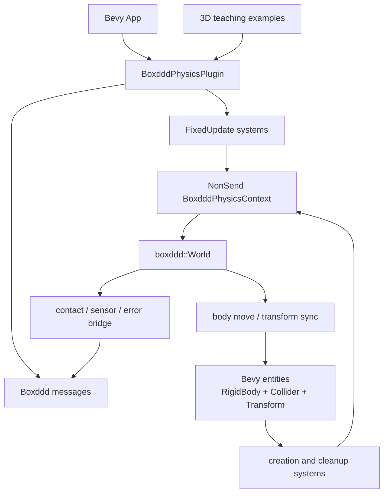
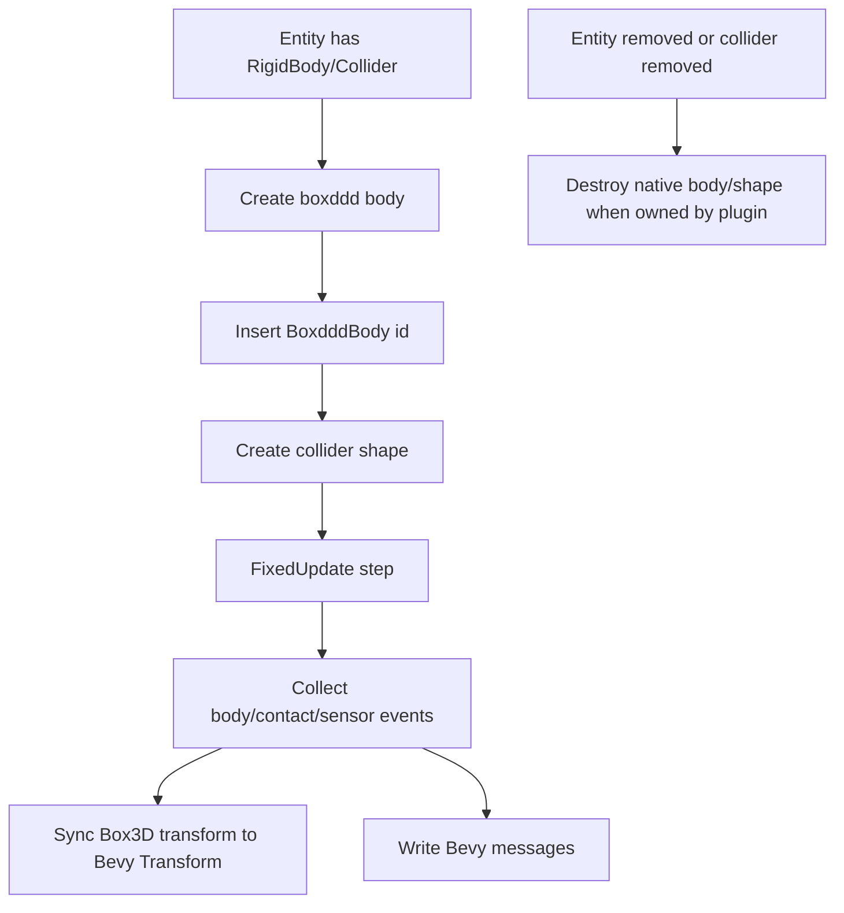

# Bevy Boxddd Plugin

## Goal Capsule

Build `bevy_boxddd` as a first-party workspace crate that integrates `boxddd` with Bevy while keeping the core binding crate engine-agnostic.
The goal is a practical Bevy plugin, real 3D teaching examples, and release-ready README/CI/package metadata that match this repository's Rust FFI binding identity.

The authoritative scope is the maintainer's request to keep this in the same workspace, use `repo-ref/bevy` as local reference material, follow the mature example style from `boxdd`, and borrow CI/README/build metadata discipline from `dear-imgui-rs`.
Stop and re-scope only if Bevy 0.19 APIs differ enough from the local references to invalidate the planned plugin boundary, or if `boxddd` itself lacks a safe API required for the first plugin slice.

---

## Product Contract

### Summary

`bevy_boxddd` should be a sibling crate inside this repository, not a feature flag on `boxddd`.
The first version should let a Bevy app add one plugin, spawn simple physics bodies and colliders, step Box3D in Bevy's fixed schedule, sync transforms into Bevy entities, and learn integration through visible 3D examples.

### Problem Frame

The current Bevy example is a headless ECS smoke test inside `boxddd`.
That proves `NonSend` ownership and transform copying, but it does not teach real Bevy usage because it has no window, camera, lighting, meshes, messages, or plugin API.

At the same time, making `boxddd` depend on full Bevy would pollute the core binding crate and couple its release surface to Bevy's fast-moving API.
The better boundary is a workspace plugin crate that can evolve with Bevy while the core crate remains a safe Box3D binding.

### Requirements

**Crate boundary**

- R1. Add a workspace member named `bevy_boxddd` that depends on `boxddd` and Bevy ECS/app/time/transform crates, while leaving `boxddd` free of Bevy runtime dependencies.
- R2. Remove or migrate the current `boxddd` `bevy-example` feature and headless Bevy example so Bevy integration lives in the plugin crate.
- R3. Keep `repo-ref/` reference clones out of package/workspace churn through ignore/exclude metadata.

**Plugin behavior**

- R4. Provide a `BoxdddPhysicsPlugin` with a configurable fixed-step setup, gravity/world definition, sub-step count, and error policy.
- R5. Store the native `boxddd::World` in a Bevy `NonSend` resource because `World` and owned native resources are intentionally `!Send` and `!Sync`.
- R6. Provide ECS components for body creation, collider creation, Box3D ids, transform sync mode, velocity/control inputs, and simple material/filter settings.
- R7. Step physics in `FixedUpdate`, create/destroy Box3D bodies as entities are added/removed, and sync Box3D transforms back into Bevy `Transform`.
- R8. Surface recoverable failures as Bevy messages and optional log output rather than panicking from normal systems.
- R9. Forward Box3D body/contact/sensor signals into Bevy-readable messages where the current `boxddd` safe API supports them.

**Examples and documentation**

- R10. Replace the current headless Bevy example with real Bevy windowed 3D examples using `DefaultPlugins`, camera, light, PBR meshes, and visible falling/colliding bodies.
- R11. Keep examples instructional like `boxdd`: start with a simple falling stack, then add contact/sensor messages and debug/gizmo visualization.
- R12. Update README, example catalog, package metadata, license files, and CI so users understand `boxddd`, `boxddd-sys`, `bevy_boxddd`, build modes, Bevy compatibility, and the sibling `boxdd` project.

### Acceptance Examples

- AE1. A user can add `BoxdddPhysicsPlugin`, spawn a dynamic cube with a collider and a static ground collider, run a Bevy app, and see the cube fall in a 3D window.
- AE2. A user can read a `BoxdddBody` component after plugin setup and use it as the stable link from Bevy entity to `boxddd::BodyId`.
- AE3. A plugin system error caused by invalid configuration produces a Bevy message and does not unwind through Bevy's scheduler.
- AE4. A contact-focused example shows how to enable Box3D contact events and read the corresponding Bevy messages.
- AE5. `cargo check` can validate the Bevy plugin and examples in CI without opening a window.

### Scope Boundaries

#### In Scope

- A same-repository workspace crate `bevy_boxddd`.
- Core Bevy ECS plugin systems for bodies, colliders, stepping, transform sync, cleanup, and messages.
- Real Bevy 3D teaching examples that compile under Bevy 0.19.
- README/CI/license/package metadata cleanup needed for a publishable multi-crate FFI binding workspace.

#### Deferred to Follow-Up Work

- Full Rapier-level feature parity, broad joint authoring components, scene serialization, editor inspectors, picking integration, and Bevy asset pipeline integration.
- WASM/browser Bevy support.
- A reusable visual testbed with many selectable scenes; first deliver focused examples.
- Safe Box3D task-system worker callbacks; the plugin keeps Box3D world ownership on one Bevy thread.

#### Non-Goals

- Moving Bevy integration into the core `boxddd` crate.
- Making `boxddd::World` `Send` or `Sync`.
- Wrapping Bevy's renderer or replacing Bevy's transform hierarchy.
- Hiding all `boxddd` APIs behind Bevy abstractions; advanced users can still access the physics context.

---

## Planning Contract

### Key Technical Decisions

- KTD1. `bevy_boxddd` is a workspace crate, not a feature on `boxddd`.
  This keeps the core binding stable for non-Bevy users and lets the plugin follow Bevy's release cadence.
- KTD2. The plugin crate should use granular Bevy library dependencies for its library surface and full `bevy` only for dev/examples.
  The library needs app/ECS/time/transform/message APIs; the examples need rendering, windowing, PBR, camera, light, and gizmos.
- KTD3. `boxddd::World` is stored as a `NonSend` resource.
  Bevy 0.19 supports `App::insert_non_send`, and systems accessing `NonSend` data run on the main thread.
- KTD4. The first sync model is physics-authoritative for dynamic bodies.
  Box3D updates Bevy transforms after stepping; Bevy-to-Box3D transform writes are limited to explicit static/kinematic/control paths.
- KTD5. Bevy messages are the plugin's failure and physics-notification channel.
  Bevy 0.19 uses `#[derive(Message)]`, `add_message`, `MessageReader`, and `MessageWriter`; avoid older `EventReader` examples for this crate.
- KTD6. The plugin should create Box3D resources from declarative ECS components and then attach id components.
  Users spawn Bevy entities with `RigidBody` and `Collider`; the plugin owns native creation and cleanup in the `BoxdddPhysicsContext`.
- KTD7. Examples should be visually real but not testbed-sized.
  Use PBR meshes, `Mesh3d`, `MeshMaterial3d`, `Camera3d`, `PointLight`, and optional gizmos; keep each example focused on one teaching goal.
- KTD8. CI should check Bevy examples, not run windowed examples.
  Windowed examples are compile-checked in CI; headless plugin tests exercise behavior with minimal Bevy schedules.
- KTD9. README should lead with official Box3D and `boxddd` scope, then show crate layout and Bevy integration.
  Mention the official Box3D GitHub project, the official announcement, and the sibling `boxdd` Box2D binding.
- KTD10. Package metadata and licensing should mirror the dual-license workspace convention.
  Add workspace authors, docs/homepage fields, `LICENSE-MIT`, `LICENSE-APACHE`, and package includes where missing.

### High-Level Technical Design





### Output Structure

```text
bevy_boxddd/
  Cargo.toml
  README.md
  src/
    lib.rs
    prelude.rs
    plugin.rs
    components.rs
    resources.rs
    systems.rs
    messages.rs
    errors.rs
  examples/
    falling_stack_3d.rs
    contact_messages_3d.rs
    debug_gizmos_3d.rs
  tests/
    plugin_lifecycle.rs
    transform_sync.rs
    messages.rs

boxddd/
  examples/
  Cargo.toml

docs/
  plans/

.github/
  workflows/
```

### Assumptions

- Bevy version target is `0.19.0`, matching the current dependency baseline and the locally cached crate sources.
- `repo-ref/bevy` is a reference clone and may be ahead of Bevy 0.19; implementation must compile against the Cargo dependency rather than copying unreleased APIs blindly.
- The first plugin slice supports sphere, capsule, and box hull colliders because those are already straightforward in `boxddd`.
- Contact/sensor bridge coverage follows the current `boxddd` safe event API; deeper collision manifolds and debug draw conversion can follow later.

### System-Wide Impact

- The workspace expands from two crates to three crates.
- `boxddd` loses its current Bevy optional dependencies and becomes cleaner as a core binding crate.
- `Cargo.lock` will grow because the new plugin examples pull full Bevy for rendering.
- Linux CI needs windowing/rendering development packages for Bevy compile checks.
- README and CI become multi-crate rather than `boxddd`/`boxddd-sys` only.

### Risks And Mitigations

| Risk | Impact | Mitigation |
|---|---|---|
| Bevy API churn | Plugin breaks across Bevy releases | Pin 0.19, add compatibility table, keep Bevy integration in its own crate |
| `World` thread affinity is hidden | Unsound or flaky scheduler behavior | Use `NonSend` resource and test that physics systems run through non-send access |
| Plugin overpromises engine features | Users expect Rapier-level coverage | Document first-slice scope and keep examples focused |
| CI becomes too heavy | Slow or flaky checks | Run headless tests and `cargo check` windowed examples; do not run Bevy windows in CI |
| Version mismatch between `repo-ref/bevy` and Bevy 0.19 | Copied sample code fails | Use cached `bevy-0.19.0` examples/docs as implementation authority |
| Native Box3D errors in Bevy systems panic | Bad app experience | Systems call `try_*`, publish error messages, and optionally log |

### Sources And Research

- Current project files: `Cargo.toml`, `boxddd/Cargo.toml`, `boxddd/src/lib.rs`, `boxddd/src/events.rs`, `boxddd/src/world/body_api.rs`, `boxddd/examples/bevy_ecs_integration.rs`, `boxddd/examples/common/mod.rs`, `.github/workflows/ci.yml`, `README.md`.
- Existing roadmap: `docs/plans/2026-07-02-001-feat-box3d-binding-roadmap-plan.md`.
- Local Bevy references: `repo-ref/bevy/examples/3d/3d_scene.rs`, `repo-ref/bevy/examples/ecs/fixed_timestep.rs`, `repo-ref/bevy/examples/gizmos/3d_gizmos.rs`.
- Version authority for implementation: locally cached `bevy-0.19.0`, `bevy_app-0.19.0`, and `bevy_ecs-0.19.0` sources.
- Prior art: `boxdd` example catalog and testbed organization; `dear-imgui-rs` workspace metadata, Bevy backend CI gates, README structure, and licensing convention.
- External references: https://github.com/erincatto/box3d, https://box2d.org/posts/2026/06/announcing-box3d/, https://github.com/Latias94/boxdd, https://bevy.org.

---

## Implementation Units

### U1. Workspace And Metadata Foundation

**Goal:** Add `bevy_boxddd` as a first-party workspace crate and clean the workspace metadata around authorship, licensing, and reference clones.

**Requirements:** R1, R3, R12

**Dependencies:** None

**Files:** `Cargo.toml`, `.gitignore`, `LICENSE-MIT`, `LICENSE-APACHE`, `bevy_boxddd/Cargo.toml`, `bevy_boxddd/README.md`, `bevy_boxddd/src/lib.rs`, `bevy_boxddd/src/prelude.rs`

**Approach:** Add the new workspace member, add workspace authors/documentation metadata, add `boxddd` as a workspace dependency, add granular Bevy workspace dependency entries for the plugin, and ignore/exclude `repo-ref/` clones.
Create the new crate with a tiny public prelude and no behavior beyond compiling.

**Execution note:** This is mostly packaging/config; prefer compile/package smoke verification over unit coverage.

**Patterns to follow:** `dear-imgui-rs` workspace metadata and reference-clone exclusion style; current `boxddd-sys` package metadata.

**Test scenarios:**

- Test expectation: none for behavior because this unit only scaffolds metadata and an empty crate.
- Verify the workspace resolves with `bevy_boxddd` included.
- Verify `repo-ref/bevy` no longer appears as untracked package content after ignore/exclude changes.
- Verify license files exist and match the dual-license metadata.

**Verification:** The workspace recognizes `bevy_boxddd`, the crate compiles as an empty library, and repository/package metadata no longer conflicts with the reference clone.

### U2. Core Plugin Context And Configuration

**Goal:** Implement the Bevy plugin shell, non-send physics context, settings resource, and error/message vocabulary.

**Requirements:** R4, R5, R8

**Dependencies:** U1

**Files:** `bevy_boxddd/src/plugin.rs`, `bevy_boxddd/src/resources.rs`, `bevy_boxddd/src/messages.rs`, `bevy_boxddd/src/errors.rs`, `bevy_boxddd/src/lib.rs`, `bevy_boxddd/src/prelude.rs`, `bevy_boxddd/tests/plugin_lifecycle.rs`

**Approach:** Define `BoxdddPhysicsPlugin`, `BoxdddPhysicsSettings`, `BoxdddPhysicsContext`, `BoxdddErrorMessage`, and the plugin build method.
The plugin should initialize a `boxddd::World` through `App::insert_non_send`, register Bevy messages with `add_message`, and schedule empty or minimal systems in `FixedUpdate`.

**Execution note:** Start with tests that fail because the plugin does not yet register the non-send context and messages.

**Patterns to follow:** Bevy 0.19 `Plugin` trait, `App::insert_non_send`, `FixedUpdate`, `Time::<Fixed>`, and `add_message` usage from locally cached Bevy sources.

**Test scenarios:**

- Create a minimal `App`, add the plugin, and confirm the non-send physics context exists.
- Configure custom gravity and sub-step count, then confirm the created `boxddd::World` observes the setting through a readback or simulation effect.
- Register the plugin twice or add it with default settings and confirm behavior is deterministic according to Bevy plugin rules.
- Inject an invalid world/body operation through a test-only system and confirm a `BoxdddErrorMessage` is written rather than a panic.

**Verification:** The plugin can be added to a Bevy app, owns a non-send Box3D world, registers messages, and has a tested recoverable error path.

### U3. Body And Collider Components

**Goal:** Add declarative Bevy components that create and track Box3D bodies and simple colliders.

**Requirements:** R6, R7, AE1, AE2

**Dependencies:** U2

**Files:** `bevy_boxddd/src/components.rs`, `bevy_boxddd/src/systems.rs`, `bevy_boxddd/src/resources.rs`, `bevy_boxddd/src/errors.rs`, `bevy_boxddd/src/prelude.rs`, `bevy_boxddd/tests/plugin_lifecycle.rs`

**Approach:** Define `RigidBody`, `Collider`, `BoxdddBody`, `BoxdddShape`, `PhysicsMaterial`, and ownership metadata.
Systems create a Box3D body for entities with `RigidBody` and no `BoxdddBody`, attach supported colliders, insert id components, and clean up native resources when plugin-owned entities are despawned or collider components are removed.
Define explicit control components such as `LinearVelocity`, `AngularVelocity`, `ExternalForce`, and `ExternalImpulse`; U4 owns applying them to Box3D before stepping.

**Execution note:** Implement behavior test-first because lifecycle and cleanup are the core safety contract of the plugin.

**Patterns to follow:** Current `boxddd/examples/common/mod.rs` scene creation, `World::try_create_body`, `World::try_create_hull_shape`, `World::try_create_sphere_shape`, and `World::try_destroy_body`.

**Test scenarios:**

- Spawn a dynamic entity with cube collider and confirm `BoxdddBody` and `BoxdddShape` components are inserted after an app update.
- Spawn a static ground entity and confirm it creates a static Box3D body.
- Spawn a sphere collider and confirm shape creation succeeds with the expected id component.
- Spawn a capsule collider and confirm shape creation succeeds with the expected id component.
- Despawn a body entity and confirm the Box3D body id becomes invalid or no longer appears in plugin-owned state.
- Configure invalid collider dimensions and confirm an error message is produced and no id component is inserted.
- Spawn multiple colliders on related entities if the chosen first-slice model supports it; otherwise document and test that unsupported multi-collider shape emits a clear error.

**Verification:** Bevy components create and clean up native bodies/shapes through the plugin without exposing raw FFI or leaking stale ids into normal app code.

### U4. Fixed Step And Transform Synchronization

**Goal:** Step Box3D from Bevy's fixed schedule and synchronize physics transforms into Bevy transforms.

**Requirements:** R4, R5, R7, AE1

**Dependencies:** U2, U3

**Files:** `bevy_boxddd/src/systems.rs`, `bevy_boxddd/src/components.rs`, `bevy_boxddd/src/resources.rs`, `bevy_boxddd/tests/transform_sync.rs`

**Approach:** Add fixed-step systems that call `World::try_step`, collect body move events or body transforms, and update Bevy `Transform` for physics-authoritative bodies.
Add a `TransformSyncMode` component or field that distinguishes dynamic physics-authoritative bodies from static/kinematic Bevy-authored transforms.
Apply `LinearVelocity`, `AngularVelocity`, `ExternalForce`, and `ExternalImpulse` components before stepping through the existing `boxddd::World` body control APIs; one-shot impulse components should be removed after application.

**Execution note:** Use a headless Bevy app test with manual updates and fixed time resource configuration; do not require a render window.

**Patterns to follow:** Bevy 0.19 fixed timestep example, current `boxddd/examples/bevy_ecs_integration.rs`, and `boxddd::World::try_body_transform`.

**Test scenarios:**

- Spawn a dynamic body above a static ground, run fixed updates, and confirm the Bevy transform y-position changes downward.
- Confirm a static body transform does not drift after stepping.
- Confirm a disabled or sleeping body does not produce unnecessary transform writes if body-move events are available.
- Configure a kinematic or Bevy-authored sync mode and confirm Bevy transform changes are applied to Box3D through the intended safe API.
- Add a linear velocity or impulse component and confirm the Box3D body receives the control before transform sync.
- Force `World::try_step` to return an error in a test path and confirm transform sync does not run on a failed step.

**Verification:** Physics stepping is deterministic in Bevy's fixed schedule and Bevy transforms reflect Box3D state without violating `World` thread ownership.

### U5. Physics Messages And Event Bridge

**Goal:** Forward Box3D body/contact/sensor data into Bevy-readable messages.

**Requirements:** R8, R9, AE3, AE4

**Dependencies:** U2, U3, U4

**Files:** `bevy_boxddd/src/messages.rs`, `bevy_boxddd/src/systems.rs`, `bevy_boxddd/src/components.rs`, `bevy_boxddd/src/prelude.rs`, `bevy_boxddd/tests/messages.rs`

**Approach:** Register message types for step errors, body moves, contacts, and sensors.
Bridge from `boxddd::World` event APIs after each successful step, mapping Box3D ids to Bevy entities where the plugin owns the id mapping.
Keep raw `boxddd` event values accessible in the message where they are already safe Rust types.

**Execution note:** Callback/event integration should use real Box3D stepping tests, not mocked systems.

**Patterns to follow:** Current `boxddd/src/events.rs` owned event snapshot APIs and Bevy 0.19 message APIs.

**Test scenarios:**

- Enable contact events on colliders, create a falling body that hits ground, step until contact, and confirm a contact message is readable.
- Enable sensor events, move a dynamic body through a sensor, and confirm begin/end sensor messages are readable.
- Confirm messages include both Box3D ids and Bevy entities when entity mapping exists.
- Confirm messages for unmapped ids are either skipped with an error message or represented without a Bevy entity according to the chosen API.
- Confirm a reader that runs after the physics system can consume messages in the same app tick or the next tick according to Bevy message retention rules.

**Verification:** Users can observe physics results through Bevy systems without polling `boxddd::World` directly for common app workflows.

### U6. Real 3D Teaching Examples

**Goal:** Replace the headless Bevy example with visible Bevy 3D examples that teach integration patterns.

**Requirements:** R10, R11, AE1, AE4, AE5

**Dependencies:** U2, U3, U4, U5

**Files:** `bevy_boxddd/examples/falling_stack_3d.rs`, `bevy_boxddd/examples/contact_messages_3d.rs`, `bevy_boxddd/examples/debug_gizmos_3d.rs`, `bevy_boxddd/README.md`, `boxddd/examples/README.md`, `boxddd/Cargo.toml`

**Approach:** Add examples using full Bevy `DefaultPlugins`, a window title, camera, point light, static ground mesh, dynamic cube/sphere meshes, and plugin-driven transforms.
Move the old `boxddd/examples/bevy_ecs_integration.rs` content into either plugin tests or delete it after the new examples cover the ownership lesson.
Use optional gizmo/debug rendering only in the example crate path, not in the plugin core unless a `debug-gizmos` feature is added.

**Execution note:** Compile-check examples in CI; manual visual verification is acceptable for actual window rendering.

**Patterns to follow:** Bevy 0.19 `3d_scene`, `fixed_timestep`, and `3d_gizmos` examples; `boxdd` example catalog naming and grouping.

**Test scenarios:**

- Compile the falling stack example with Bevy rendering enabled.
- Compile the contact messages example and confirm it uses the plugin message API rather than raw Box3D polling.
- Compile the debug gizmos example and confirm it renders simple collider outlines or axes without requiring a custom renderer.
- Manually run the falling stack example and confirm a window opens with camera, light, ground, and falling bodies.
- Confirm the old headless Bevy example is removed or converted so `boxddd` itself has no Bevy feature.

**Verification:** Users have visible, copyable Bevy integration examples and the core crate no longer carries Bevy example dependencies.

### U7. README, CI, And Publish Readiness

**Goal:** Make the expanded workspace understandable, testable, and publishable.

**Requirements:** R3, R12, AE5

**Dependencies:** U1 through U6

**Files:** `README.md`, `CHANGELOG.md`, `Cargo.toml`, `boxddd/Cargo.toml`, `boxddd-sys/Cargo.toml`, `bevy_boxddd/Cargo.toml`, `bevy_boxddd/README.md`, `boxddd/examples/README.md`, `.github/workflows/ci.yml`

**Approach:** Rewrite README top matter with badges, official Box3D links, crate map, quickstart, Bevy plugin quickstart, examples, build strategy, compatibility table, related projects, acknowledgments, and license.
Update CI with Rust cache env, Linux Bevy deps, multi-platform core checks, Bevy plugin checks, docs/features/package gates, sys bindgen/default checks, and package dry-runs that patch unpublished workspace crates where needed.

**Execution note:** This is docs/config-heavy; verification should emphasize `cargo check`, docs, packaging, and CI parity rather than unit tests.

**Patterns to follow:** `dear-imgui-rs` README sections and CI job separation; current `boxddd` package/build gates; `boxdd` README example grouping.

**Test scenarios:**

- Test expectation: none for README prose, because behavior is covered by compile/package gates.
- Verify README first paragraph links official Box3D GitHub and explains `boxddd`/`boxddd-sys`/`bevy_boxddd`.
- Verify README mentions sibling `boxdd` with its GitHub URL.
- Verify docs build for all public crates with warnings denied.
- Verify CI checks Bevy plugin library/tests/examples without running windowed examples.
- Verify package dry-runs work before crates are published by using local patch config for unpublished workspace dependencies.
- Verify default `boxddd-sys` builds do not require bindgen/libclang unless the bindgen refresh path is requested.

**Verification:** The workspace can be checked, documented, packaged, and understood as a three-crate Rust binding ecosystem with a separate Bevy integration crate.

---

## Verification Contract

| Gate | Applies to | Done signal |
|---|---|---|
| `cargo fmt --all --check` | Workspace | Formatting is clean |
| `cargo nextest run --workspace` | Core and plugin tests | Unit/integration tests pass |
| `cargo check -p bevy_boxddd --no-default-features` | Plugin core | Library compiles without rendering stack |
| `cargo check -p bevy_boxddd --examples` | Bevy examples | Windowed examples compile |
| `cargo check -p boxddd --examples` | Core examples | Core examples still compile after Bevy feature removal |
| `cargo check -p boxddd --all-features --tests --examples` | Core feature matrix | Existing optional integrations remain intact |
| `RUSTDOCFLAGS="-D warnings" cargo doc --workspace --no-deps` | Public docs | Docs render without warnings |
| `cargo package -p boxddd-sys --allow-dirty` | Sys package | Vendored C files and pregenerated bindings are packaged |
| `cargo package -p boxddd --allow-dirty --config 'patch.crates-io.boxddd-sys.path="boxddd-sys"'` | Core package | Pre-publish package dry-run works |
| `cargo package -p bevy_boxddd --allow-dirty --config 'patch.crates-io.boxddd.path="boxddd"' --config 'patch.crates-io.boxddd-sys.path="boxddd-sys"'` | Bevy package | Plugin package dry-run works before upstream publishing |
| `BOXDDD_SYS_FORCE_BINDGEN=1 cargo check -p boxddd-sys --features bindgen` | Binding refresh | Forced bindgen path compiles generated bindings |

---

## Definition of Done

- `bevy_boxddd` exists as a workspace crate with a documented public prelude and plugin.
- `boxddd` no longer exposes a Bevy example feature or carries Bevy app/ECS/transform dependencies for examples.
- The plugin owns `boxddd::World` through a Bevy `NonSend` resource and steps it from `FixedUpdate`.
- Bevy entities can create Box3D dynamic/static bodies and simple sphere/capsule/box colliders declaratively.
- Physics transforms sync into Bevy `Transform` for dynamic bodies, with a tested static/kinematic boundary.
- Recoverable plugin errors and physics notifications are exposed as Bevy 0.19 messages.
- At least one visible 3D falling/collision example and one message/debug-focused example compile; the falling stack is manually runnable in a Bevy window.
- README, example catalog, CI, license files, and workspace metadata describe the three-crate layout and the Bevy compatibility story.
- Verification contract gates pass or any remaining failure is documented as a blocker rather than hidden.
