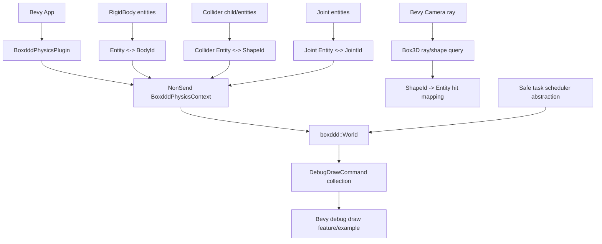
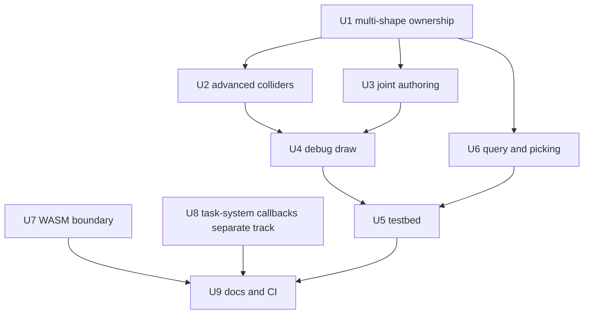

# Bevy Boxddd Advanced Integration - Plan

## Goal Capsule

Expand `bevy_boxddd` from the first usable plugin slice into a richer Bevy integration layer while keeping `boxddd` itself engine-agnostic.
The Bevy milestone covers the deferred surface from the first plugin plan: joint authoring, multi-collider and compound authoring, debug rendering and a reusable testbed, Box3D-backed picking/query integration, and WASM posture.
The Box3D task-system callback work is a separate core `boxddd` concurrency track in this plan; it must not block shipping the Bevy integration milestone.

The authority hierarchy is the existing committed plugin, the current `boxddd` safe API, Bevy 0.19 APIs, and the upstream Box3D C callback contract.
Stop and re-plan only if the safe `boxddd` API lacks an operation required for a unit, or if Bevy 0.19's public plugin surface makes a proposed integration impossible without making `boxddd::World` `Send` or `Sync`.

---

## Product Contract

### Summary

The next milestone should make Bevy usage feel like a real physics integration instead of a body-and-collider demo.
Users should be able to author joints and multi-shape bodies in ECS, inspect and debug the simulated world visually, run a small testbed of examples, and use Box3D queries for game interaction and editor-style picking.
Core `boxddd` should separately expose a constrained task-system callback API so advanced users can integrate Box3D stepping with their own worker systems without unsound thread sharing, but that core concurrency track is release-independent from the Bevy authoring and example work.

### Problem Frame

The current `bevy_boxddd` plugin owns `World` correctly through a Bevy `NonSend` resource, creates one body and one collider per entity, steps in `FixedUpdate`, syncs transforms, and forwards common messages.
That is enough to prove the boundary, but it leaves normal game usage gaps: articulated bodies need joints, practical collision setups often use several colliders per actor, debug draw needs direct Box3D command rendering, and editor/testbed workflows need picking and scene switching.

The riskiest follow-up is not Bevy rendering; it is the Box3D task-system callback.
Upstream requires `finishTask` to block until each spawned task completes, and warns that blocking from inside an incompatible job system can deadlock.
That work belongs in `boxddd` core behind a small safe contract before any Bevy-facing worker configuration exposes it.

### Requirements

**Bevy authoring model**

- R1. Support multiple plugin-owned shapes per Bevy body without stale id leaks when colliders are added, removed, or reparented.
- R2. Support Box3D compound, mesh, height-field, created-hull, and transformed-hull authoring where the current safe `boxddd` API allows it, with static-body restrictions surfaced as Bevy error messages.
- R3. Support declarative ECS joint creation for the Box3D joint families already wrapped by `boxddd`.
- R4. Track joint ids and body/shape ownership in `BoxdddPhysicsContext` so cleanup remains deterministic across despawn, component removal, and body recreation.
- R5. Keep the core plugin renderer-free by default; Box3D query helpers may be default library API, while camera/cursor picking integration and rendering-specific helpers must sit behind an explicit `physics-picking` or rendering feature.

**Debugging, testbed, and interaction**

- R6. Provide a reusable debug draw bridge from `boxddd::DebugDrawCommand` into Bevy `Gizmos` or mesh-backed rendering.
- R7. Add a reusable Bevy testbed example with selectable scenes for stacks, joints, compound shapes, sensors, queries, and debug draw.
- R8. Provide Box3D-backed ray/shape query helpers and a picking example that maps hits back to Bevy entities.
- R9. Keep examples instructional and compile-checkable in CI; windowed runtime execution remains manual smoke validation.

**Platform and concurrency**

- R10. Document and test the crate's WASM support boundary with explicit tiers: supported, compile-only, native-only, and unsupported.
- R11. Add a safe core `boxddd` task-system callback abstraction that prevents Rust panics from crossing FFI and documents blocking/deadlock constraints.
- R12. Defer Bevy worker-count and custom task-system exposure until the core API has landed and can be reviewed as a separate Bevy settings change.

### Acceptance Examples

- AE1. A Bevy entity can own several collider children or collider components, and all native shape ids are removed when the entity despawns.
- AE2. A static terrain entity can create a mesh, height-field, compound, created-hull, or transformed-hull Box3D shape from an explicit Bevy-safe descriptor and still map query hits back to the Bevy entity.
- AE3. Two Bevy bodies can be connected by a distance or revolute joint, and removing either body destroys the native joint without leaking a stale id.
- AE4. A windowed example can toggle Box3D debug draw and show shapes, joints, contacts, and bounds through Bevy rendering primitives.
- AE5. A testbed example lets a user switch between at least five scenes without editing code.
- AE6. A pointer/camera ray can be cast through Box3D and return the nearest Bevy entity hit, independent of visual mesh picking.
- AE7. `docs/platforms/wasm.md` declares the expected tier for `boxddd-sys`, `boxddd`, minimal `bevy_boxddd`, and windowed examples on `wasm32-unknown-unknown`, and CI checks match that matrix.
- AE8. In the separate core concurrency track, a task-system example can step a world through the safe scheduler abstraction and proves that task panics become `boxddd::Error` rather than unwinding through C.

### Scope Boundaries

#### In Scope

- New `bevy_boxddd` authoring components, resources, messages, systems, tests, examples, and docs.
- Small core `boxddd` additions required for missing ID/event readback needed by Bevy.
- A separate optional core `boxddd` concurrency track for safe task-system callbacks.
- Optional Bevy features for debug rendering, picking, and testbed examples.
- CI gates for examples, docs, package dry-runs, and supported target checks.

#### Deferred to Later

- Full Bevy editor integration, inspector UI, asset importers, and scene serialization beyond plain ECS authoring components.
- Runtime hot-reload of arbitrary mesh or height-field physics resources.
- Rapier-level feature parity across every collision, query, solver, and editor workflow.
- A custom renderer or GPU debug renderer; this plan starts from Bevy `Gizmos` and simple meshes.
- Production-grade browser demo deployment; this plan only establishes WASM support boundaries and compile gates.

#### Non-Goals

- Moving Bevy dependencies into `boxddd`.
- Making `boxddd::World` `Send` or `Sync`.
- Running Box3D physics directly inside Bevy's parallel ECS systems.
- Using Bevy mesh picking as the physics picking source of truth.

---

## Planning Contract

### Key Technical Decisions

- KTD1. Multi-collider authoring uses one plugin-owned shape entity per collider, not a single `BoxdddShape` component on the body entity.
  This aligns with Bevy hierarchy patterns and avoids overloading one component with a variable-length native resource list.
- KTD2. Compound, mesh, height-field, created-hull, and transformed-hull colliders are explicit advanced collider variants with static-body validation.
  The current `boxddd::World::try_create_mesh_shape`, `try_create_height_field_shape`, and `try_create_compound_shape` reject non-static bodies, so the Bevy layer should report that directly instead of hiding the restriction.
- KTD3. Joint authoring starts with entity references to two Bevy bodies and stores one `BoxdddJoint` id on the joint entity.
  A joint is not owned by either body component because removing either endpoint must destroy the native joint and the Bevy joint entity is the natural authoring handle.
- KTD4. Debug drawing is an optional Bevy feature layered on top of core `DebugDrawCommand` collection.
  The library should compile without Bevy rendering dependencies, while examples can depend on full `bevy`.
- KTD5. Physics picking is Box3D query based, not Bevy mesh-picking based.
  Bevy `MeshPickingPlugin`, `MeshRayCast`, and `viewport_to_world` are useful references, but the hit source for physics selection should be `boxddd::World::cast_ray_closest` or related query APIs.
- KTD6. The reusable testbed is an example first, not a public framework.
  It should teach scene composition and validate plugin coverage without freezing a large public testbed API too early.
- KTD7. WASM support is capability-scoped.
  Core `boxddd` and `bevy_boxddd` library compilation should be measured separately from windowed native examples, because rendering, native C compilation, threading, and browser scheduling have different constraints.
- KTD8. Task-system callbacks are core `boxddd` work and a separate release track.
  The upstream callback contract mentions worker threads, blocking `finishTask`, and deadlock risk; Bevy worker configuration should remain deferred until a reviewed core abstraction lands.
- KTD9. Keep first follow-up execution in dependency order rather than parallel fan-out.
  The units share ownership maps, id cleanup, tests, and README examples; serializing the architectural units reduces merge risk.

### High-Level Technical Design

### Assumptions

- Bevy target remains `0.19.0` until a separate compatibility plan upgrades the plugin.
- `repo-ref/bevy` may be newer than the crate dependency, so implementation must compile against `bevy = "0.19.0"` and local cargo registry sources.
- `boxddd` already owns safe APIs for joints, debug draw, queries, mesh, height-field, and compound shapes; implementation should add only missing bridges, not duplicate raw FFI.
- The task-system callback abstraction may require new tests under `boxddd/tests/` and possibly internal modules under `boxddd/src/core/`.

### System-Wide Impact

- `bevy_boxddd` will gain optional feature surfaces for debug draw, picking, and possibly testbed helpers.
- `BoxdddPhysicsContext` will need maps for body, shape, joint, and reverse lookup ownership.
- Existing first-slice tests must be updated to cover both body-attached and child-collider authoring.
- README and CI will need a compatibility matrix for native-only examples, optional Bevy features, and WASM compile gates.
- Core `boxddd` may gain a small scheduler abstraction that touches `WorldDef`, world creation, panic handling, and feature-gated examples, but that work must not block the Bevy feature release.

### Risks And Mitigations

| Risk | Impact | Mitigation |
|---|---|---|
| Shape ownership becomes ambiguous | Native shape leaks or stale Bevy ids | Store every plugin-owned shape by collider entity and body id; add removal/recreation tests |
| Joint cleanup misses endpoint despawn | Stale native joint ids or invalid Box3D access | Track joint endpoints and remove joints before destroying bodies |
| Advanced colliders overpromise dynamic support | Users try mesh terrain on dynamic bodies | Validate body type before creation and emit `BoxdddErrorMessage` |
| Debug draw feature drags rendering into core plugin | `bevy_boxddd` no longer compiles in minimal apps | Gate rendering-specific code behind optional features and keep examples dev-only |
| Picking competes with Bevy mesh picking semantics | Users get mismatched visual and physics hits | Name the API physics picking and document that it uses Box3D shapes |
| WASM target fails for native C/threading reasons | CI noise and unclear support story | Publish a tiered support matrix and split core library, plugin library, feature, and example target gates |
| Task callback deadlocks with incompatible executors | Hard-to-debug hangs | Start with a blocking-safe scoped scheduler contract and document that `World::step` must run on a thread allowed to block |
| Panic crossing FFI in task callbacks | Undefined behavior risk | Wrap scheduler calls and task callbacks in `catch_unwind`, report `CallbackPanicked`, and test it |

### Sources And Research

- Prior plan: `docs/plans/2026-07-02-002-feat-bevy-boxddd-plugin-plan.md`.
- Current Bevy plugin files: `bevy_boxddd/src/components.rs`, `bevy_boxddd/src/resources.rs`, `bevy_boxddd/src/systems.rs`, `bevy_boxddd/src/plugin.rs`, `bevy_boxddd/src/messages.rs`.
- Core APIs: `boxddd/src/joints/defs.rs`, `boxddd/src/joints/world_api.rs`, `boxddd/src/world/creation.rs`, `boxddd/src/world/runtime.rs`, `boxddd/src/debug_draw.rs`, `boxddd/src/query.rs`, `boxddd/src/shapes.rs`.
- Upstream task contract: `boxddd-sys/third-party/box3d/include/box3d/types.h`.
- Bevy references: `repo-ref/bevy/examples/3d/mesh_ray_cast.rs`, `repo-ref/bevy/examples/3d/contact_shadows.rs`, `repo-ref/bevy/examples/3d/3d_viewport_to_world.rs`.

---

## Implementation Units

### U1. Multi-Shape Ownership Model

**Goal:** Replace the first-slice one-shape-per-body assumption with deterministic multi-shape ownership.

**Requirements:** R1, R4, AE1

**Dependencies:** None

**Files:** `bevy_boxddd/src/components.rs`, `bevy_boxddd/src/resources.rs`, `bevy_boxddd/src/systems.rs`, `bevy_boxddd/src/messages.rs`, `bevy_boxddd/src/prelude.rs`, `bevy_boxddd/tests/plugin_lifecycle.rs`

**Approach:** Introduce a collider authoring model that permits collider components on the body entity and child collider entities.
Track shape ownership by collider entity and parent body id in `BoxdddPhysicsContext`.
Destroy plugin-owned shapes when a collider component is removed, a collider entity despawns, the parent body changes, or the body entity despawns.
Keep the existing single-entity authoring path working as the compatibility path.

**Execution note:** Start from lifecycle tests because id cleanup is the safety contract.

**Patterns to follow:** Existing `cleanup_removed_bodies`, `cleanup_removed_colliders`, `create_missing_shapes`, and the stale-shape regression test in `bevy_boxddd/tests/plugin_lifecycle.rs`.

**Test scenarios:**

- Spawn a dynamic body with two collider children and confirm two distinct `BoxdddShape` ids map to the same `BoxdddBody`.
- Remove one collider child and confirm only that shape id is invalidated.
- Despawn the body entity and confirm all child shape ids and the body id are invalidated.
- Remove and re-add a collider component on the same entity and confirm the replacement shape id is valid and the old id is stale.
- Preserve the current body-entity collider path and confirm existing first-slice tests still pass.

**Verification:** `cargo nextest run -p bevy_boxddd --test plugin_lifecycle`.

### U2. Advanced Collider Authoring

**Goal:** Add Bevy authoring for Box3D compound, mesh, height-field, and created/transformed hull shapes where supported by `boxddd`.

**Requirements:** R2, AE2

**Dependencies:** U1

**Files:** `bevy_boxddd/src/components.rs`, `bevy_boxddd/src/resources.rs`, `bevy_boxddd/src/systems.rs`, `bevy_boxddd/src/errors.rs`, `bevy_boxddd/src/prelude.rs`, `bevy_boxddd/tests/plugin_lifecycle.rs`, `bevy_boxddd/examples/advanced_colliders_3d.rs`, `bevy_boxddd/README.md`

**Approach:** Extend `Collider` or introduce advanced collider components that store only Bevy-safe declarative descriptors or handles.
Native-backed `boxddd` resources such as `MeshData`, `HeightField`, `Compound`, and hull data must live in a `NonSend` registry owned by `BoxdddPhysicsContext`, not directly inside Bevy components.
Use `World::try_create_mesh_shape`, `try_create_height_field_shape`, `try_create_compound_shape`, `try_create_created_hull_shape`, and `try_create_transformed_hull_shape`.
Emit Bevy error messages when users attach static-only shapes to dynamic or kinematic bodies.
Add a visible example with static terrain and a compound obstacle.

**Execution note:** Do not parse arbitrary Bevy `Mesh` assets into Box3D mesh data in this unit unless a small deterministic conversion already exists; prefer explicit Bevy-safe descriptors that the plugin converts into `boxddd::MeshData`, `HeightField`, `Compound`, and hull resources inside the `NonSend` context.

**Patterns to follow:** `boxddd/src/world/creation.rs` resource ownership, `boxddd/src/shapes.rs` constructors, and `bevy_boxddd/examples/debug_gizmos_3d.rs`.

**Test scenarios:**

- Create a static mesh collider and confirm shape creation succeeds.
- Create a static height-field collider and confirm shape creation succeeds.
- Create a static compound collider and confirm shape creation succeeds.
- Create static created-hull and transformed-hull colliders and confirm shape creation succeeds.
- Attach a mesh, height-field, compound, created-hull, or transformed-hull collider to a dynamic body and confirm `BoxdddErrorMessage` is emitted.
- Confirm advanced collider Bevy components compile as `Send + Sync + 'static` descriptors and native-backed resources stay in the `NonSend` physics context.
- Compile and run-check the advanced collider example.

**Verification:** `cargo nextest run -p bevy_boxddd --test plugin_lifecycle` and `cargo check -p bevy_boxddd --example advanced_colliders_3d`.

### U3. Declarative Joint Authoring

**Goal:** Add ECS components and systems for creating, tracking, updating, and destroying Box3D joints from Bevy entities.

**Requirements:** R3, R4, AE3

**Dependencies:** U1

**Files:** `bevy_boxddd/src/components.rs`, `bevy_boxddd/src/resources.rs`, `bevy_boxddd/src/systems.rs`, `bevy_boxddd/src/messages.rs`, `bevy_boxddd/src/prelude.rs`, `bevy_boxddd/tests/joints.rs`, `bevy_boxddd/examples/joint_gallery_3d.rs`, `bevy_boxddd/README.md`

**Approach:** Add `JointTarget`, `Joint`, and `BoxdddJoint` components.
Support at least distance, revolute, spherical, weld, prismatic, and wheel joints in the first pass, with remaining joint families following the same enum shape if coverage is straightforward.
Resolve Bevy endpoint entities to `BoxdddBody` ids after bodies are created, then call the corresponding `boxddd::World::try_create_*_joint` API.
Destroy joints before endpoint body teardown and when the joint component or entity is removed.

**Execution note:** Use real Box3D stepping tests, not mocked id insertion, because joint body-world validation is a core safety path.

**Patterns to follow:** `boxddd/src/joints/defs.rs`, `boxddd/src/joints/world_api.rs`, `bevy_boxddd/src/systems.rs` resource creation systems, and `boxddd/tests/joints.rs`.

**Test scenarios:**

- Create a distance joint between two dynamic bodies and confirm a valid `BoxdddJoint` appears.
- Remove the joint component and confirm the native joint id becomes invalid.
- Despawn body A and confirm the joint is removed before the body destruction path completes.
- Configure an invalid endpoint entity and confirm an error message is produced without creating a joint id.
- Compile a joint gallery example with visible connected bodies.

**Verification:** `cargo nextest run -p bevy_boxddd --test joints` and `cargo check -p bevy_boxddd --example joint_gallery_3d`.

### U4. Debug Draw Bridge

**Goal:** Render Box3D debug draw output through Bevy while keeping rendering dependencies optional.

**Requirements:** R5, R6, AE4

**Dependencies:** U1, U2, U3

**Files:** `bevy_boxddd/Cargo.toml`, `bevy_boxddd/src/debug_draw.rs`, `bevy_boxddd/src/plugin.rs`, `bevy_boxddd/src/prelude.rs`, `bevy_boxddd/tests/debug_draw.rs`, `bevy_boxddd/examples/debug_draw_overlay_3d.rs`, `bevy_boxddd/README.md`

**Approach:** Add an optional `debug-gizmos` feature that depends on the Bevy crates required for `Gizmos`.
Collect `boxddd::DebugDrawCommand` from `World::try_debug_draw_collect_into` after stepping or on demand.
Convert shapes, segments, points, capsules, bounds, boxes, transforms, and strings into Bevy gizmo calls where Bevy supports them; represent unsupported commands as documented no-ops or simple fallback geometry.

**Execution note:** Keep debug draw collection separate from transform sync so apps can enable it without changing physics behavior.

**Patterns to follow:** `boxddd/src/debug_draw.rs`, `bevy_boxddd/examples/debug_gizmos_3d.rs`, and Bevy `Gizmos` examples under `repo-ref/bevy/examples/`.

**Test scenarios:**

- Collect debug draw commands from a simple scene and confirm the bridge receives shape and joint commands.
- Enable draw-joints and confirm joint debug commands appear when U3-created joints exist.
- Ensure `cargo check -p bevy_boxddd --no-default-features` still passes without the debug feature.
- Compile `debug_draw_overlay_3d` with the debug feature enabled.

**Verification:** `cargo nextest run -p bevy_boxddd --test debug_draw`, `cargo check -p bevy_boxddd --no-default-features`, and `cargo check -p bevy_boxddd --features debug-gizmos --example debug_draw_overlay_3d`.

### U5. Reusable Bevy Testbed Example

**Goal:** Add a windowed Bevy testbed example that demonstrates the expanded integration through switchable scenes.

**Requirements:** R7, R9, AE5

**Dependencies:** U2, U3, U4, U6

**Files:** `bevy_boxddd/examples/testbed_3d/`, `bevy_boxddd/Cargo.toml`, `bevy_boxddd/README.md`, `boxddd/examples/README.md`

**Approach:** Build the testbed as an example directory with scene modules rather than a public library API.
Include scenes for falling stack, compound terrain, joints, sensors/contact events, ray picking, and debug draw.
Use keyboard or simple UI controls for scene switching, pause, single-step, gravity toggle, debug draw toggle, and reset.

**Execution note:** Compile-check the testbed in CI but keep manual visual validation documented.

**Patterns to follow:** `bevy_boxddd/examples/falling_stack_3d.rs`, `bevy_boxddd/examples/contact_messages_3d.rs`, `bevy_boxddd/examples/debug_gizmos_3d.rs`, and the `boxdd` example catalog style.

**Test scenarios:**

- Compile the testbed example and every scene module.
- Run a headless scene factory test that spawns each scene into a minimal app and verifies no setup system panics.
- Confirm scene switching despawns old physics entities and does not leave stale Box3D ids in the context.
- Confirm debug draw toggle can be enabled without changing physics results.

**Verification:** `cargo check -p bevy_boxddd --example testbed_3d` and `cargo nextest run -p bevy_boxddd --test testbed`.

### U6. Physics Query And Picking Integration

**Goal:** Provide Box3D-backed query helpers and a picking example that maps camera rays to Bevy entities through physics shapes.

**Requirements:** R8, AE6

**Dependencies:** U1

**Files:** `bevy_boxddd/Cargo.toml`, `bevy_boxddd/src/query.rs`, `bevy_boxddd/src/plugin.rs`, `bevy_boxddd/src/prelude.rs`, `bevy_boxddd/tests/query.rs`, `bevy_boxddd/examples/physics_picking_3d.rs`, `bevy_boxddd/README.md`

**Approach:** Add default helper APIs or systems that accept Bevy-space rays and call `boxddd::World::cast_ray_closest`, `cast_ray`, `cast_shape`, or `overlap_aabb`.
Convert hit `ShapeId` values through `BoxdddPhysicsContext::shape_entity`.
Gate camera/cursor picking helpers and the windowed picking example behind a `physics-picking` feature if they require Bevy rendering or window crates.
Use Bevy camera `viewport_to_world` for cursor-to-ray conversion under that feature, and keep Bevy `MeshPickingPlugin` optional or absent from the physics path.

**Execution note:** Avoid adding a hard dependency on full Bevy rendering to the default library; examples can use `DefaultPlugins` through the picking feature.

**Patterns to follow:** `boxddd/src/query.rs`, `repo-ref/bevy/examples/3d/3d_viewport_to_world.rs`, `repo-ref/bevy/examples/3d/mesh_ray_cast.rs`, and `repo-ref/bevy/examples/3d/contact_shadows.rs`.

**Test scenarios:**

- Spawn two physics shapes along a ray and confirm closest-hit mapping returns the nearer Bevy entity.
- Cast a ray that misses all shapes and confirm `None` without an error.
- Use a query filter and confirm masked shapes are ignored.
- Confirm default query helpers compile with `--no-default-features`.
- Compile a windowed physics picking example that highlights the hit entity.

**Verification:** `cargo nextest run -p bevy_boxddd --test query`, `cargo check -p bevy_boxddd --no-default-features`, and `cargo check -p bevy_boxddd --features physics-picking --example physics_picking_3d`.

### U7. WASM Support Boundary

**Goal:** Define, document, and test the supported WASM compile surface for the workspace.

**Requirements:** R10, AE7

**Dependencies:** U1 through U6 where target checks touch the plugin

**Files:** `README.md`, `bevy_boxddd/README.md`, `.github/workflows/ci.yml`, `Cargo.toml`, `boxddd/Cargo.toml`, `boxddd-sys/Cargo.toml`, `bevy_boxddd/Cargo.toml`, `docs/platforms/wasm.md`

**Approach:** Add an explicit support-tier matrix for `boxddd-sys`, `boxddd`, minimal `bevy_boxddd`, feature-gated `bevy_boxddd`, and windowed examples on `wasm32-unknown-unknown`.
Use the tiers `supported`, `compile-only`, `native-only`, and `unsupported`.
Add explicit docs for native-only examples, plugin library target support, and Box3D C build assumptions on `wasm32-unknown-unknown`.
Add CI target checks only for combinations that are expected to compile.
If the native C build cannot support the target yet, mark the affected crate or feature as `unsupported` or `native-only`, document the blocker, and add a narrower compile guard only for the supported or compile-only subset.

**Execution note:** Treat this as a platform contract, not a browser demo.

**Patterns to follow:** Existing package and docs.rs gates in `.github/workflows/ci.yml`, `boxddd-sys/build.rs`, and package metadata for feature scopes.

**Test scenarios:**

- Check the support-tier matrix for `wasm32-unknown-unknown`.
- Check the supported or compile-only crate subset for `wasm32-unknown-unknown`.
- Confirm native Bevy window examples are not included in WASM CI gates unless they are explicitly browser-ready.
- Confirm docs describe unsupported target combinations and the reason.
- Confirm package dry-runs still work for native targets after target-gated changes.

**Verification:** A target-specific cargo check command recorded in `docs/platforms/wasm.md`, plus the existing workspace package/doc gates.

### U8. Core Task-System Callback Abstraction

**Goal:** Add a safe `boxddd` core abstraction for Box3D task-system callbacks as a release-independent concurrency track.

**Requirements:** R11, R12, AE8

**Dependencies:** None for core implementation; Bevy worker settings remain deferred to a later plan after this unit lands.

**Files:** `boxddd/src/world.rs`, `boxddd/src/world/runtime.rs`, `boxddd/src/core/`, `boxddd/src/error.rs`, `boxddd/src/prelude.rs`, `boxddd/tests/task_system.rs`, `boxddd/examples/task_system.rs`, `README.md`

**Approach:** Extend `WorldDefBuilder` with a task-system configuration that stores an owned scheduler context for the lifetime of `World`.
The callback bridge must call the upstream task exactly once per enqueue, pass the original task context through unchanged, block in finish until completion, and catch panics from Rust scheduler code.
Any scheduler context and task handle crossing Box3D callbacks must be thread-safe, using `Send + Sync + 'static` or stricter bounds if the callback bridge requires them.
Rust-owned non-thread-safe resources must not cross worker boundaries.
Worker-side panic state must propagate back to `World::try_step` through thread-safe state such as an atomic flag or mutex-owned result.
Start with a scoped thread or blocking executor adapter whose semantics are easy to prove before adding integrations for external runtimes.
Do not expose worker-count configuration in `bevy_boxddd::BoxdddPhysicsSettings` in this plan; document it as a follow-up once the core abstraction has passing tests.

**Execution note:** This is the highest-risk unit; implement it behind a feature or clearly named API until reviewed.

**Patterns to follow:** `boxddd/src/debug_draw.rs` panic containment, callback guards under `boxddd/src/core/`, `boxddd/src/world.rs` ownership of debug-shape registry, and upstream `types.h` task callback comments.

**Test scenarios:**

- Create a world with the safe scheduler and worker count greater than one, step a scene, and confirm tasks execute.
- Force a scheduler panic and confirm `World::try_step` returns `Error::CallbackPanicked`.
- Compile-test that scheduler contexts and task handles crossing callbacks satisfy the chosen thread-safety bounds.
- Confirm each enqueued task is finished exactly once.
- Confirm dropping `World` drops the scheduler context after Box3D no longer needs callbacks.
- Confirm the default no-custom-task path remains unchanged.

**Verification:** `cargo nextest run -p boxddd --test task_system`, `cargo check -p boxddd --all-features --tests --examples`, and forced bindgen checks.

### U9. Documentation, CI, And Compatibility Matrix

**Goal:** Keep the expanded feature set teachable and release-ready.

**Requirements:** R5, R9, R10, R12

**Dependencies:** U1 through U8

**Files:** `README.md`, `bevy_boxddd/README.md`, `boxddd/examples/README.md`, `.github/workflows/ci.yml`, `bevy_boxddd/Cargo.toml`, `boxddd/Cargo.toml`, `docs/platforms/wasm.md`

**Approach:** Update documentation with authoring patterns, feature flags, examples, supported targets, and concurrency constraints.
Add CI gates for new examples and optional features without running windowed examples.
Keep package dry-runs patched for unpublished workspace dependencies.

**Execution note:** This unit lands last because docs should describe the final API, not intended API.

**Patterns to follow:** Current `README.md`, `bevy_boxddd/README.md`, `.github/workflows/ci.yml`, and the first Bevy plugin plan's publish-readiness gates.

**Test scenarios:**

- Confirm README documents multi-collider, advanced collider, joint, debug, query, WASM, and task-system boundaries.
- Confirm all new examples appear in the example catalog with run commands.
- Confirm CI checks each new example and feature combination without opening a window.
- Confirm package dry-runs still pass for `boxddd-sys`, `boxddd`, and `bevy_boxddd`.

**Verification:** Full verification contract below.

---

## Verification Contract

| Gate | Applies to | Done signal |
|---|---|---|
| `cargo fmt --all --check` | Workspace | Formatting is clean |
| `cargo nextest run --workspace` | Core and Bevy plugin | All unit and integration tests pass |
| `cargo check -p bevy_boxddd --no-default-features` | Minimal Bevy plugin | Library remains renderer-free by default |
| `cargo check -p bevy_boxddd --examples` | Windowed examples | Existing and new examples compile |
| `cargo check -p bevy_boxddd --features debug-gizmos --examples` | Debug draw feature | Debug/testbed examples compile with rendering bridge enabled |
| `cargo check -p bevy_boxddd --features physics-picking --example physics_picking_3d` | Physics picking feature | Camera/cursor picking example compiles without making picking a default dependency |
| `cargo check -p boxddd --all-features --tests --examples` | Core feature matrix | Existing optional integrations still compile |
| `RUSTDOCFLAGS="-D warnings" cargo doc --workspace --no-deps` | Public docs | Docs build without warnings |
| `DOCS_RS=1 RUSTDOCFLAGS="--cfg docsrs -D warnings" cargo doc -p boxddd --no-deps` | Core docs.rs path | Native build skip path remains documented and working |
| `DOCS_RS=1 RUSTDOCFLAGS="--cfg docsrs -D warnings" cargo doc -p bevy_boxddd --no-deps` | Bevy docs.rs path | Plugin docs.rs path remains working |
| `cargo package -p boxddd-sys --allow-dirty` | Sys package | Vendored C package still verifies |
| `cargo package -p boxddd --allow-dirty --config 'patch.crates-io.boxddd-sys.path="boxddd-sys"'` | Core package | Local unpublished dependency patch works |
| `cargo package -p bevy_boxddd --allow-dirty --config 'patch.crates-io.boxddd.path="boxddd"' --config 'patch.crates-io.boxddd-sys.path="boxddd-sys"'` | Bevy package | Plugin package verifies before publish |
| `BOXDDD_SYS_FORCE_BINDGEN=1 cargo check -p boxddd-sys --features bindgen` | Binding refresh | Default precision bindgen path compiles |
| `BOXDDD_SYS_FORCE_BINDGEN=1 cargo check -p boxddd-sys --features "bindgen double-precision"` | Binding refresh | Double precision bindgen path compiles |
| WASM target checks documented in `docs/platforms/wasm.md` | WASM support boundary | Support-tier matrix names `boxddd-sys`, `boxddd`, minimal `bevy_boxddd`, feature-gated `bevy_boxddd`, and windowed examples as supported, compile-only, native-only, or unsupported; CI matches the supported and compile-only subset |

---

## Definition of Done

- `bevy_boxddd` supports multi-shape body authoring and cleans up every plugin-owned native shape deterministically.
- `bevy_boxddd` supports advanced Box3D collider resources where the core safe API supports them, with clear error messages for invalid body types.
- `bevy_boxddd` supports declarative joint authoring for the wrapped Box3D joint families and cleans up joints before endpoint body destruction.
- Debug draw can render Box3D debug output in Bevy through an optional feature without making the minimal plugin depend on rendering.
- A reusable windowed testbed example demonstrates stacks, joints, advanced colliders, sensors/contact events, physics picking, and debug draw.
- Physics query and picking helpers map Box3D shape hits back to Bevy entities.
- WASM support is documented and guarded by CI for the supported target subset.
- The Bevy integration milestone can ship without the core task-system callback abstraction.
- If the separate core concurrency track is executed in the same work cycle, `boxddd` exposes a reviewed safe task-system callback abstraction or documents a blocker with tests proving the default path remains safe.
- README, Bevy README, example catalog, CI, and package metadata describe the expanded feature set and platform/concurrency boundaries.
- All verification contract gates pass, or any remaining failure is recorded as a blocker before execution is considered complete.
