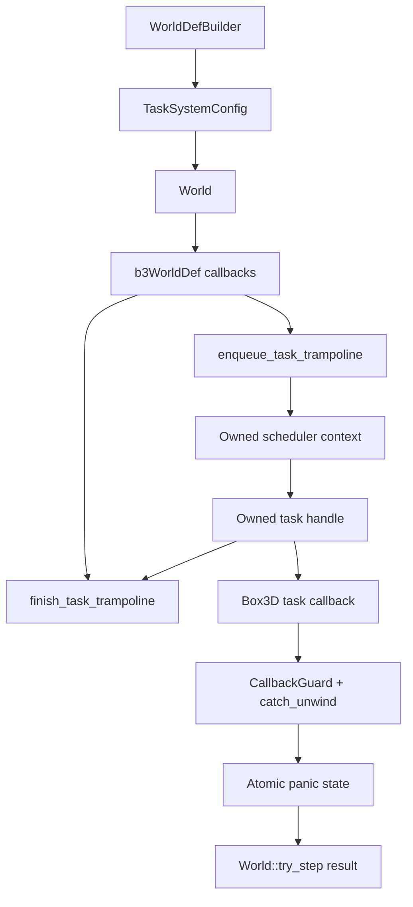

# Core Task-System Callback - Plan

## Goal Capsule

Add a safe core `boxddd` abstraction for Box3D task-system callbacks without changing the conservative `World: !Send + !Sync` ownership model.
The plan covers the core concurrency track split out of `docs/plans/2026-07-03-001-feat-bevy-boxddd-advanced-integration-plan.md`.

The authority hierarchy is the upstream task callback contract in `boxddd-sys/third-party/box3d/include/box3d/types.h`, current `WorldDef` and `World::try_step` behavior, existing callback panic containment, and the public safety promise in `README.md`.
Stop and re-plan if Box3D requires task callbacks to call arbitrary public world APIs from worker threads, or if a proposed scheduler design requires making `boxddd::World` `Send` or `Sync`.

---

## Product Contract

### Summary

Advanced users need a reviewed way to drive Box3D with a Rust-owned scheduler or an explicitly documented built-in fallback.
The first safe API should prove the FFI boundary, panic containment, thread-safety bounds, and blocking semantics before Bevy or async runtime integrations expose worker configuration.

### Problem Frame

`WorldDefBuilder::worker_count` and `World::try_set_worker_count` already expose worker counts, and Box3D can use an internal scheduler when no task callbacks are supplied.
What is missing is a safe Rust-owned path for `enqueueTask`, `finishTask`, and `userTaskContext`.

The hard part is the finish contract.
Upstream requires each enqueued Box3D task to run exactly once with the original task context, and `finishTask` must block until that task completes.
Upstream also warns that calling `b3World_Step` inside an incompatible job system can deadlock when a job blocks on its own sub-jobs.

The safe Rust API must therefore be narrower than "plug in any executor".
It should start with a blocking-safe scheduler contract and make async/job-system integrations explicit follow-ups.

### Requirements

**FFI safety**

- R1. Store task scheduler state for at least the full `World` lifetime and clear or drop it only after Box3D no longer holds callback pointers.
- R2. Ensure every non-null user task returned by `enqueueTask` is completed by `finishTask`, and every Box3D task callback is invoked exactly once by Rust unless `enqueueTask` returns null after executing the task synchronously.
- R3. Catch panics from enqueue, worker execution, and finish paths before they cross the C ABI boundary.
- R4. Return `Error::CallbackPanicked` from `World::try_step` when any task-system callback or worker task panics.

**Threading contract**

- R5. Require scheduler contexts and task handles crossing Box3D callbacks to satisfy thread-safe ownership bounds.
- R6. Mark every task trampoline invocation as a Box3D callback so public `boxddd` API calls from worker tasks hit the existing callback guard.
- R7. Document that `World::try_step` must run on a thread that is allowed to block in `finishTask`.
- R8. Keep `World`, native resources, and replay players `!Send` and `!Sync`.

**Public API and rollout**

- R9. Add an explicit safe scheduler API on `WorldDefBuilder` rather than exposing raw callback pointers.
- R10. Start with one reviewed scheduler mode whose semantics are easy to prove; user-provided runtime adapters remain deferred unless the same safety contract can be tested.
- R11. Keep existing no-custom-task behavior unchanged when no scheduler is configured.
- R12. Document that Bevy worker settings are a later integration after this core API lands.

### Acceptance Examples

- AE1. A world created with the safe scheduler and `worker_count > 1` can step a non-trivial scene and report task execution.
- AE2. A scheduler panic during enqueue makes `World::try_step` return `Error::CallbackPanicked`.
- AE3. A worker task panic makes `World::try_step` return `Error::CallbackPanicked` without unwinding through C.
- AE4. A finish panic makes `World::try_step` return `Error::CallbackPanicked`.
- AE5. Each task handle is finished exactly once in tests that count enqueue, run, and finish operations.
- AE6. Calling a public `boxddd` API from inside a worker task returns `Error::InCallback` or panics through the existing terse API path before crossing FFI.
- AE7. Dropping `World` releases scheduler state after native world destruction has cleared callback use.
- AE8. The default path with no configured scheduler still steps and passes existing callback, query, and world runtime tests.

### Scope Boundaries

#### In Scope

- Safe core API for task-system callback configuration at world creation time.
- Internal callback bridge, scheduler context ownership, task handle ownership, panic-state propagation, and callback guard integration.
- Tests and examples that prove the safe contract.
- Documentation for blocking, deadlock, async, and Bevy integration boundaries.

#### Deferred to Later

- Bevy-facing worker-count or task-system settings.
- Tokio, Rayon, Bevy Tasks, or arbitrary executor adapters.
- Making `World` or native resource wrappers `Send` or `Sync`.
- Removing the global Box3D lock or making concurrent independent worlds a public guarantee.
- Safe wrappers for allocator/assert/log process-global hooks.

#### Non-Goals

- Replacing Box3D's internal scheduler.
- Supporting `b3World_Step` from inside a non-blocking job system that cannot park or yield its worker.
- Allowing task callbacks to mutate application state through non-thread-safe captures.

---

## Planning Contract

### Key Technical Decisions

- KTD1. Configure task callbacks only through `WorldDefBuilder`.
  Box3D reads `enqueueTask`, `finishTask`, and `userTaskContext` from `b3WorldDef` at world creation, so the safe API should not imply callbacks can be swapped at runtime.
- KTD2. Keep scheduler context owned by `World`.
  The context pointer passed to Box3D must remain stable until native world destruction, matching how debug shape registry and world callbacks are already owned by `World`.
- KTD3. Use thread-safe state for panic reporting.
  Task callbacks may run on worker threads, so panic state must use atomics or mutex-protected state rather than the stack-local query callback pattern.
- KTD4. Resolve `WorldDef` cloning before adding scheduler state.
  `WorldDef` is currently cloneable, so scheduler configuration must either be clone-safe through `Arc`-owned context or make the task-system variant explicitly non-clonable by changing the public type contract in one reviewed step.
- KTD5. Mark task execution as callback depth.
  Existing `callback_state::CallbackGuard` is the right safety boundary because Box3D worker tasks are inside a Box3D step and must not reenter public world APIs.
- KTD6. Start with a reviewed built-in blocking scheduler before accepting arbitrary external schedulers.
  A built-in scoped worker pool or blocking adapter has testable ownership and finish semantics; arbitrary runtime adapters risk deadlock without runtime-specific contracts.
- KTD7. Do not hold Rust scheduler locks while invoking the Box3D task callback.
  The task function may do substantial native work; holding scheduler bookkeeping locks across it can create avoidable lock inversions with `finishTask`.
- KTD8. Treat worker-count validation as API safety, not a native afterthought.
  Builder validation should reject or clamp invalid counts consistently with existing runtime worker-count behavior.

### High-Level Technical Design

### Assumptions

- Box3D may call task callbacks from threads other than the caller of `World::try_step`.
- Box3D will only call `finishTask` for non-null task handles returned by `enqueueTask`.
- `World::try_step` can inspect scheduler panic state after `b3World_Step` returns, just as it already checks `WorldCallbacks::panicked`.
- Existing `box3d_lock` remains in place during this plan; removing it is a separate concurrency project.

### System-Wide Impact

- `WorldDef` may need to become a small owned object that carries both raw `b3WorldDef` fields and safe Rust task-system state.
- `World` will gain an owned task-system context alongside `callbacks`, `_debug_shapes`, and shape resources.
- `World::new`, `World::drop`, and `World::try_step` will need to coordinate scheduler lifecycle and panic-state checks.
- Public docs must distinguish worker count, Box3D internal scheduler, and Rust custom task-system callbacks.
- Existing tests for callbacks, determinism, world runtime, and docs.rs build paths become regression gates for the default path.

### Risks And Mitigations

| Risk | Impact | Mitigation |
|---|---|---|
| `finishTask` deadlocks with the chosen scheduler | `World::try_step` can hang | Start with a blocking-safe scheduler and add timeout-free deterministic tests that finish all handles |
| Panic crosses C ABI | Undefined behavior | Wrap enqueue, worker task execution, and finish in `catch_unwind`; return fallback values to C |
| Scheduler state is dropped too early | Native callback dereferences stale pointer | Store scheduler context in `World`; destroy native world before dropping Rust context |
| Worker task reenters public `boxddd` API | Lock reentry or invalid mutation during step | Enter `CallbackGuard` around task invocation and test `Error::InCallback` |
| External executor adapter looks safe but cannot park jobs | Runtime-specific deadlock | Defer arbitrary adapters until they have executor-specific contracts and tests |
| Global Box3D lock serializes work unexpectedly | Users overestimate parallelism | Document that this plan proves safe callbacks, not multi-world parallel execution |

### Sources And Research

- Upstream task callback contract: `boxddd-sys/third-party/box3d/include/box3d/types.h`.
- Current world creation and ownership: `boxddd/src/world.rs`, `boxddd/src/world/creation.rs`.
- Current step and worker-count APIs: `boxddd/src/world/runtime.rs`.
- Existing callback guard: `boxddd/src/core/callback_state.rs`.
- Existing panic containment patterns: `boxddd/src/callbacks.rs`, `boxddd/src/query.rs`, `boxddd/tests/panic_across_ffi_is_caught.rs`, `boxddd/tests/world_callbacks.rs`.
- Prior split decision: `docs/plans/2026-07-03-001-feat-bevy-boxddd-advanced-integration-plan.md`.

---

## Implementation Units

### U1. Task-System API Contract

**Goal:** Define the public safe API and internal data model for task-system configuration.

**Requirements:** R1, R5, R8, R9, R10, R11

**Dependencies:** None

**Files:** `boxddd/Cargo.toml`, `boxddd/src/world.rs`, `boxddd/src/core/task_system.rs`, `boxddd/src/error.rs`, `boxddd/src/prelude.rs`, `boxddd/tests/task_system.rs`, `README.md`

**Approach:** Add a task-system configuration type owned by `WorldDefBuilder`.
The public API should avoid raw callback pointers and should make worker count, scheduler mode, and blocking requirements explicit.
Use thread-safe trait bounds for any scheduler context that crosses callback boundaries.
Resolve the existing `WorldDef: Clone` contract before storing scheduler state by choosing either clone-safe shared ownership or a deliberate non-clonable task-system definition.
Add a dev-only compile assertion dependency if the existing test stack cannot express the required `Send` and `Sync` negative assertions directly.
Keep the default builder path identical when no scheduler is configured.

**Execution note:** Land compile-level API tests before implementing the callback bridge so the safety contract is fixed first.

**Patterns to follow:** `WorldDefBuilder::worker_count`, existing callback setter bounds in `boxddd/src/callbacks.rs`, and `World` non-send marker in `boxddd/src/world.rs`.

**Test scenarios:**

- Build a default `WorldDef` and confirm no task callbacks are installed.
- Build a `WorldDef` with the safe scheduler and `worker_count > 1`.
- Compile-test that the scheduler context requires thread-safe ownership.
- Confirm the chosen `WorldDef` clone behavior is documented and tested for task-system configuration.
- Confirm `World` remains `!Send` and `!Sync`.

**Verification:** `cargo nextest run -p boxddd --test task_system`.

### U2. Callback Bridge And Panic State

**Goal:** Implement enqueue and finish trampolines that uphold the C ABI and report failures through `World::try_step`.

**Requirements:** R1, R2, R3, R4, R6

**Dependencies:** U1

**Files:** `boxddd/src/world.rs`, `boxddd/src/world/runtime.rs`, `boxddd/src/core/task_system.rs`, `boxddd/src/error.rs`, `boxddd/tests/task_system.rs`

**Approach:** Add internal enqueue and finish trampolines that cast `userTaskContext` back to an owned Rust context.
Wrap enqueue, task execution, and finish in `catch_unwind`.
Return a null task handle only when work was executed synchronously and no finish call is required.
Store panic state in thread-safe context and check it from `World::try_step` after `b3World_Step`.
Enter `CallbackGuard` around the actual Box3D task callback.

**Execution note:** Do not hold scheduler bookkeeping locks while invoking the Box3D task function.

**Patterns to follow:** Panic flags in `boxddd/src/callbacks.rs`, stack callback containment in `boxddd/src/query.rs`, and debug shape callback ownership in `boxddd/src/debug_draw.rs`.

**Test scenarios:**

- Force enqueue panic and confirm `World::try_step` returns `Error::CallbackPanicked`.
- Force task execution panic and confirm `World::try_step` returns `Error::CallbackPanicked`.
- Force finish panic and confirm `World::try_step` returns `Error::CallbackPanicked`.
- From inside a task callback, call a public checked API and confirm `Error::InCallback`.
- Confirm a null task handle path does not trigger `finishTask`.

**Verification:** `cargo nextest run -p boxddd --test task_system` and `cargo nextest run -p boxddd --test panic_across_ffi_is_caught`.

### U3. Built-In Blocking Scheduler

**Goal:** Provide one reviewed scheduler mode that can execute Box3D tasks safely with blocking finish semantics.

**Requirements:** R2, R5, R7, R10, AE1, AE5

**Dependencies:** U2

**Files:** `boxddd/src/core/task_system.rs`, `boxddd/src/world.rs`, `boxddd/tests/task_system.rs`, `boxddd/examples/task_system.rs`

**Approach:** Implement a small built-in scheduler whose task handles own completion state and whose finish path blocks until completion.
Prefer a design that can be reasoned about locally over a general executor abstraction.
Count enqueued, started, completed, and finished tasks in tests to prove exactly-once behavior.
Document that `World::try_step` must not be called from a job that cannot block or park.

**Execution note:** Keep the scheduler private or feature-gated if the API surface needs review before stabilization.

**Patterns to follow:** `boxddd/examples/physics_thread.rs` for thread ownership messaging and `boxddd/examples/tokio_async_bridge.rs` for documenting async boundaries without moving `World`.

**Test scenarios:**

- Step a scene with `worker_count > 1` and confirm at least one task ran through the scheduler.
- Confirm each non-null task handle is finished exactly once.
- Confirm dropping `World` after a scheduler-backed step drops every task-system allocation.
- Confirm repeated steps reset panic state and do not reuse stale task handles.

**Verification:** `cargo nextest run -p boxddd --test task_system` and `cargo check -p boxddd --example task_system`.

### U4. World Lifecycle Integration

**Goal:** Integrate the task-system context into world creation, stepping, and destruction without regressing the default path.

**Requirements:** R1, R4, R11, AE7, AE8

**Dependencies:** U2, U3

**Files:** `boxddd/src/world.rs`, `boxddd/src/world/runtime.rs`, `boxddd/tests/world_runtime.rs`, `boxddd/tests/world_callbacks.rs`, `boxddd/tests/task_system.rs`

**Approach:** Extend `World::new` to install task callbacks only when the builder owns a scheduler configuration.
Keep debug shape callbacks and world callback setup in the same create path.
Clear or invalidate callback use during `Drop` before Rust-owned scheduler state is dropped.
Reset task-system panic state before each step and include it in the post-step panic check.

**Execution note:** Preserve existing behavior for internal Box3D scheduling when only `worker_count` is configured and no Rust scheduler is installed.

**Patterns to follow:** `World::new` debug shape registry setup, `World::drop` callback clearing, and `WorldCallbacks::reset_panics`.

**Test scenarios:**

- Existing `World::new(WorldDef::default())` tests keep passing.
- Existing `WorldDefBuilder::worker_count` without custom scheduler still steps.
- Scheduler-backed world drops without use-after-free or leaked callback context.
- Callback panic tests still return `Error::CallbackPanicked`.

**Verification:** `cargo nextest run -p boxddd --test world_runtime`, `cargo nextest run -p boxddd --test world_callbacks`, and `cargo nextest run -p boxddd --test task_system`.

### U5. Documentation And Release Gates

**Goal:** Make the concurrency contract understandable and release-safe.

**Requirements:** R7, R8, R10, R12

**Dependencies:** U1 through U4

**Files:** `README.md`, `boxddd/examples/README.md`, `boxddd/examples/task_system.rs`, `docs/upstream-parity/box3d-api-matrix.md`, `.github/workflows/ci.yml`

**Approach:** Document the distinction between worker count, Box3D internal scheduler, and Rust custom scheduler callbacks.
Add a task-system example that explains the blocking finish contract and shows safe ownership.
Update the parity matrix from deferred to wrapped or partially wrapped with clear notes.
Add CI checks for the new test and example without adding Bevy integration.

**Execution note:** Do not advertise Bevy support for task-system configuration in this plan.

**Patterns to follow:** Existing Threading And Async README section, `boxddd/examples/README.md`, and the release policy language in `docs/upstream-parity/box3d-api-matrix.md`.

**Test scenarios:**

- README explains that `World` remains `!Send` and `!Sync`.
- README explains that `finishTask` blocks and can deadlock in incompatible job systems.
- Example compiles and demonstrates the safe scheduler path.
- Parity matrix no longer claims safe task callbacks are wholly deferred if the API lands.

**Verification:** `cargo check -p boxddd --example task_system`, `RUSTDOCFLAGS="-D warnings" cargo doc -p boxddd --no-deps`, and the workspace CI gates below.

---

## Verification Contract

| Gate | Applies to | Done signal |
|---|---|---|
| `cargo fmt --all --check` | Workspace | Formatting is clean |
| `cargo nextest run -p boxddd --test task_system` | New task-system contract | All scheduler, panic, callback guard, and lifecycle tests pass |
| `cargo nextest run -p boxddd --test world_runtime` | Existing worker-count behavior | Runtime world APIs still pass |
| `cargo nextest run -p boxddd --test world_callbacks` | Existing callback behavior | Contact/filter/material callbacks still pass |
| `cargo nextest run -p boxddd --test panic_across_ffi_is_caught` | Panic containment | Query callback panic containment still passes |
| `cargo nextest run -p boxddd` | Core crate | Existing core tests pass |
| `cargo check -p boxddd --example task_system` | New example | Example compiles |
| `cargo check -p boxddd --all-features --tests --examples` | Feature matrix | Optional integrations still compile |
| `RUSTDOCFLAGS="-D warnings" cargo doc -p boxddd --no-deps` | Public docs | Core docs build without warnings |
| `BOXDDD_SYS_FORCE_BINDGEN=1 cargo check -p boxddd-sys --features bindgen` | Binding refresh | Default precision bindgen path still compiles |
| `BOXDDD_SYS_FORCE_BINDGEN=1 cargo check -p boxddd-sys --features "bindgen double-precision"` | Binding refresh | Double precision bindgen path still compiles |

---

## Definition of Done

- `boxddd` exposes a safe task-system configuration path that does not expose raw callback pointers.
- Scheduler context and task handles crossing Box3D callbacks use thread-safe ownership bounds.
- Enqueue, worker task execution, and finish paths catch Rust panics before the C ABI boundary.
- `World::try_step` reports task-system panics as `Error::CallbackPanicked`.
- Task callbacks enter `CallbackGuard`, and public `boxddd` API calls from worker tasks are blocked by the existing callback guard.
- The default no-custom-task path remains unchanged.
- `World`, native resources, and replay players remain `!Send` and `!Sync`.
- Documentation explains worker count, internal scheduler behavior, blocking finish semantics, deadlock risks, and Bevy deferral.
- The task-system example compiles and demonstrates the safe path.
- All verification contract gates pass, or a blocker is documented before execution is considered complete.
