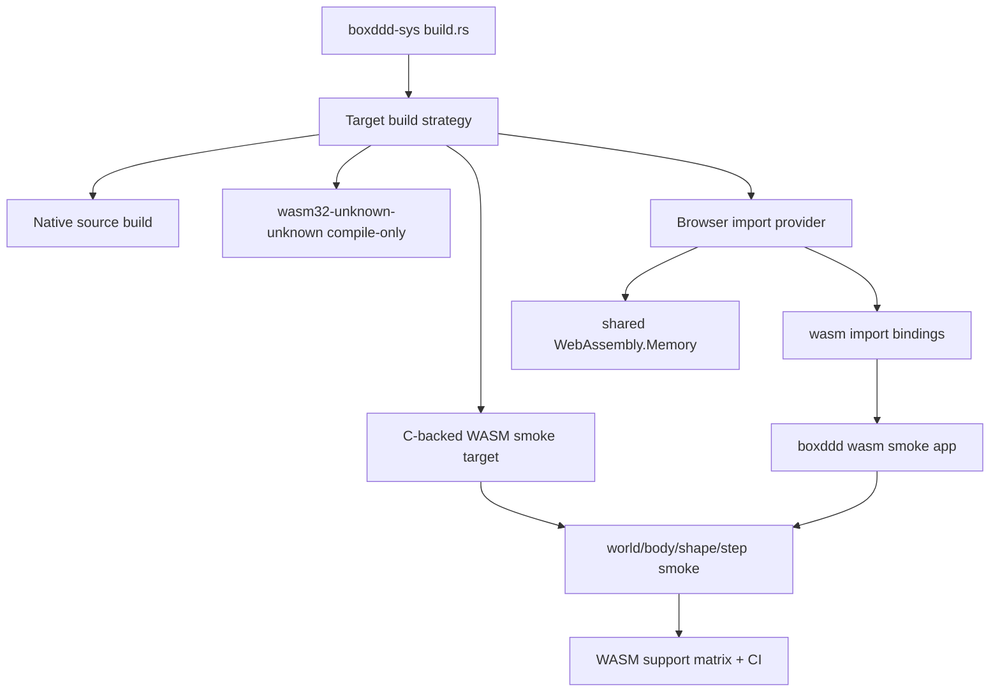

# WASM Runtime Tier 1 - Plan

## Goal Capsule

Move `boxddd` from WASM compile-only claims to a reviewed single-thread runtime foundation for core physics.
The first delivery proves Box3D C code can execute in WebAssembly, keeps the browser path compatible with the `dear-imgui-rs` import-provider model, and avoids promising Bevy Web or threaded physics before their platform contracts are designed.

Authority order is current `boxddd-sys` source-build behavior, upstream Box3D task/thread constraints, Rust target support constraints, and the proven `dear-imgui-rs` native-binding workflow pattern.
Stop and re-plan if Box3D requires background threads for the core smoke scene, if provider/shared-memory linkage requires changing public safe APIs, or if a CI runner cannot install the required WASM C toolchain reproducibly.

---

## Product Contract

### Summary

This plan adds Tier 1 WASM runtime support for `boxddd` core, not for Bevy rendering.
It keeps `wasm32-unknown-unknown` honest as either compile-only or import-provider-backed, adds a C-backed executable smoke gate, and uses the `dear-imgui-rs` build/CI style where it fits a C binding crate.

### Problem Frame

The current workspace checks `wasm32-unknown-unknown`, but `boxddd-sys/build.rs` returns before compiling Box3D C sources for `wasm32`.
That makes the surface useful as a type-check sentinel, but it does not prove that `World::new`, shape creation, stepping, query APIs, or native resource cleanup work in WASM.

Box3D also has platform code for timers, mutexes, semaphores, and an internal scheduler.
On browser-style WASM the safe baseline must be single-threaded, because the current `TaskSystem::blocking_threads()` implementation uses OS threads and upstream Box3D's `finishTask` contract is blocking.
The first supported runtime must therefore clamp or reject worker-thread paths and prove serial stepping before adding web workers, Bevy Web, or provider packaging polish.

### Requirements

**Runtime Contract**

- R1. Add a C-backed WASM runtime path where a core `boxddd` world can be created, stepped, inspected, and dropped.
- R2. Keep the first supported WASM runtime single-threaded and reject or disable task-system paths that require OS threads.
- R3. Preserve current native target behavior and existing `TaskSystem::blocking_threads()` semantics outside WASM.
- R4. Keep `wasm32-unknown-unknown` compile-only unless the build is explicitly using import-style provider bindings.

**Binding And Build Contract**

- R5. Refactor `boxddd-sys/build.rs` around a target/build strategy object so native, docs.rs, skip-cc, WASI, and browser-provider paths are explicit.
- R6. Continue using checked-in pregenerated bindings for normal builds and avoid requiring bindgen/libclang for end users.
- R7. Add WASM-specific binding output or import annotations only when the provider path needs them, following the `dear-imgui-rs` pattern rather than mutating native bindings.
- R8. Keep `BOXDDD_SYS_SKIP_CC` as a check-only escape hatch and add narrowly named WASM build toggles for provider/toolchain experiments.

**Verification And Documentation**

- R9. Add CI that distinguishes compile-only WASM checks from runnable C-backed WASM smoke checks.
- R10. Document local commands, required tools, target tiers, and unsupported features in `docs/platforms/wasm.md`.
- R11. Add a minimal WASM teaching smoke that exercises physics without Bevy, rendering, browser input, async, or threads.
- R12. Record browser-provider work as the route toward web apps, while keeping Bevy Web and threaded WASM outside this plan.

### Acceptance Examples

- AE1. A WASM smoke creates a world with gravity, creates static and dynamic bodies, steps the world, and observes the dynamic body moving downward.
- AE2. A WASM smoke can call a query or body-inspection API after stepping and then drop the world without leaking native callback context.
- AE3. On WASM, requesting `worker_count > 1` or `TaskSystem::blocking_threads()` cannot silently start an unsupported OS-thread path.
- AE4. `wasm32-unknown-unknown` compile-only checks still pass without compiling Box3D C when provider mode is not selected.
- AE5. A provider-mode browser build imports Box3D symbols from a stable module name and does not use native linking assumptions.
- AE6. CI labels the runnable WASM gate separately from the compile-only gate.
- AE7. README and WASM docs show exact user-facing commands for the supported tier and name Bevy Web as deferred.

### Scope Boundaries

#### In Scope

- Core `boxddd-sys` and `boxddd` WASM runtime foundation.
- Single-thread platform contract and worker/task-system gating for WASM.
- `wasm32-wasip1` or equivalent C-backed smoke as the first CI-runnable proof.
- `dear-imgui-rs`-style browser-provider architecture for `wasm32-unknown-unknown`, including binding/provider scaffolding when needed for the smoke.
- Documentation and CI matrix updates.

#### Deferred to Follow-Up Work

- Bevy Web examples, Bevy renderer/browser input setup, and visual browser demos.
- Web worker, atomics, pthread, COOP/COEP, or Box3D task-system parallelism in browsers.
- Prebuilt Box3D provider release packages.
- Full browser testbed with UI controls and graphics.
- Replacing all compile-only mobile/cross-target sentinels with runnable native C builds.

#### Non-Goals

- Treating `wasm32-unknown-unknown` as a normal C source-build target without provider glue.
- Making `World`, native resources, or replay players `Send` or `Sync`.
- Running `TaskSystem::blocking_threads()` in browser WASM.
- Changing Box3D upstream semantics or vendoring a large fork when a small platform shim is enough.

---

## Planning Contract

### Key Technical Decisions

- KTD1. Split WASM into target tiers instead of a single yes/no support flag.
  `wasm32-unknown-unknown` is the browser application target, but it needs import-provider glue for C symbols; a C-backed WASM smoke target is the lower-risk CI proof that Box3D actually executes.
- KTD2. Follow `dear-imgui-rs` for browser architecture, not for every packaging feature.
  The useful pattern is main Rust module plus provider module, checked-in WASM bindings, explicit tool commands, and clear docs; prebuilt downloads are deferred because Box3D is small enough to build from source for now.
  Borrow its `BuildConfig`-style target selection, explicit sys-crate env vars, separate native and WASM pregenerated bindings, provider import module, shared-memory smoke, `xtask`-managed repeatable commands, and split CI jobs.
  Do not borrow its prebuilt-binary distribution model, renderer examples, or browser packaging surface until the core Box3D runtime proof is stable.
- KTD3. Keep Tier 1 single-threaded.
  Box3D can step with `workerCount = 1`, and this avoids browser pthread/Atomics requirements while still proving core physics, FFI, memory, and safe wrapper behavior.
- KTD4. Gate unsupported thread APIs at the safe wrapper boundary.
  The build should not let WASM users configure `TaskSystem::blocking_threads()` and discover unsupported threads only at runtime.
- KTD5. Use a minimal physics smoke before rendering.
  A world/body/shape/step/query smoke proves the binding contract without Bevy, wgpu, asset loading, canvas sizing, or browser event-loop noise.
- KTD6. Keep native CI and docs.rs behavior stable.
  WASM changes must not pull libclang, Emscripten, wasm-bindgen, or wasmtime into default native user builds.
- KTD7. Prefer a small Box3D platform shim over broad upstream edits.
  The likely friction is `timer.c` selecting pthread/semaphore code for Emscripten and no-thread stubs for unknown platforms; the plan should isolate single-thread WASM behavior rather than rewriting scheduler internals.

### High-Level Technical Design

### Assumptions

- A single-thread Box3D world can run the minimal scene without creating internal scheduler threads when `workerCount = 1`.
- The provider route can use a stable import module name such as `box3d-sys-v0`.
- `wasm32-wasip1` is acceptable as the first non-browser executable smoke if browser provider execution needs a second implementation slice.
- Browser examples can remain non-visual until Bevy Web or a renderer-specific plan exists.

### System-Wide Impact

- `boxddd-sys/build.rs` becomes a more deliberate native-binding build orchestrator rather than a sequence of early returns.
- `boxddd` public docs and APIs gain platform-specific constraints for worker counts and task systems.
- CI gains a runnable WASM job that may need WASI SDK, wasmtime, Emscripten, wasm-bindgen CLI, or wasm-tools depending on which execution gate the implementation selects.
- `docs/platforms/wasm.md` becomes the canonical platform contract rather than a note that all WASM is compile-only.

### Risks And Mitigations

| Risk | Impact | Mitigation |
|---|---|---|
| `wasm32-unknown-unknown` cannot link C objects directly | Browser runtime work stalls | Use `dear-imgui-rs` import-provider pattern instead of direct native linking |
| Emscripten path selects pthread code by default | Browser provider may require COOP/COEP or fail without pthreads | Add a single-thread Box3D platform mode and keep threaded provider work deferred |
| WASI smoke proves WASM but not browser | Users may overread support | Document the tier split and add provider work as a separate browser acceptance gate |
| Provider path consumes more effort than core runtime proof | Tier 1 slips while browser packaging is debugged | Land U3 as the first mergeable runtime milestone, keep provider mode behind explicit opt-in tooling, and re-plan if U5 needs invasive public safe API changes |
| Build script changes regress native linking | Existing users break | Keep native matrix unchanged and add tests for skip-cc, docs.rs, bindgen, double precision, and Windows GNU |
| Worker-count clamping changes behavior silently | Users misunderstand performance | Prefer recoverable errors for checked APIs and explicit docs where builder APIs cannot return errors |
| Provider shared memory is miswired | Browser smoke reads invalid pointers | Add a smoke that passes structs/pointers across the boundary and validates simulation output |

### Sources And Research

- Current WASM contract and CI: `docs/platforms/wasm.md`, `.github/workflows/ci.yml`.
- Current sys build behavior: `boxddd-sys/build.rs`, `boxddd-sys/Cargo.toml`.
- Current task-system and worker-count behavior: `boxddd/src/core/task_system.rs`, `boxddd/src/world.rs`, `boxddd/src/world/runtime.rs`, `boxddd/tests/task_system.rs`.
- Upstream Box3D platform and scheduler code: `boxddd-sys/third-party/box3d/src/timer.c`, `boxddd-sys/third-party/box3d/src/core.h`, `boxddd-sys/third-party/box3d/src/physics_world.c`, `boxddd-sys/third-party/box3d/src/scheduler.c`, `boxddd-sys/third-party/box3d/include/box3d/types.h`.
- Binding-crate reference: `dear-imgui-rs` uses checked-in native and WASM bindings, explicit `*_SYS_SKIP_CC` / force-build env vars, a wasm provider module, and CI jobs that separate native, feature, mobile, and WASM gates.

---

## Implementation Units

### U1. WASM Target Contract And Build Strategy

**Goal:** Refactor `boxddd-sys` build selection so every WASM path has an explicit contract.

**Requirements:** R4, R5, R6, R8, R9

**Dependencies:** None

**Files:** `boxddd-sys/build.rs`, `boxddd-sys/Cargo.toml`, `boxddd-sys/README.md`, `docs/platforms/wasm.md`, `.github/workflows/ci.yml`

**Approach:** Introduce a small build configuration object modeled after the `dear-imgui-rs` sys build script.
It should capture manifest directory, output directory, target triple, target OS, target env, target arch, profile, docs.rs, skip-cc, force-bindgen, and WASM mode.
Keep default native source builds unchanged.
Replace the unconditional `target_arch == "wasm32"` return with a strategy branch that can choose compile-only, C-backed WASM smoke, or browser provider imports.
Use narrowly named env vars for any experimental branch so users can tell check-only and runtime-capable builds apart.

**Patterns to follow:** Existing `boxddd-sys` docs.rs/skip-cc/bindgen branches, the workspace `sys-bindgen-defaults` CI job, and the `dear-imgui-rs` BuildConfig/env-var pattern.

**Test scenarios:**

- Default native build still compiles vendored Box3D C sources.
- `BOXDDD_SYS_SKIP_CC=1` still type-checks with pregenerated bindings and does not try to link Box3D.
- docs.rs path still skips native C compilation.
- `wasm32-unknown-unknown` without provider mode still reports compile-only behavior.
- Invalid combinations such as skip-cc plus runtime smoke mode fail with a clear build error.

**Verification:** The sys build branches are covered by CI commands in the Verification Contract.

### U2. Single-Thread WASM Platform Guardrails

**Goal:** Make WASM runtime behavior safe by preventing unsupported thread and scheduler paths.

**Requirements:** R1, R2, R3, R11

**Dependencies:** U1

**Files:** `boxddd/src/core/task_system.rs`, `boxddd/src/world.rs`, `boxddd/src/world/runtime.rs`, `boxddd/src/error.rs`, `boxddd/tests/task_system.rs`, `boxddd/tests/world_runtime.rs`, `docs/platforms/wasm.md`

**Approach:** Add WASM-specific guardrails in the safe wrapper.
Checked runtime APIs should reject worker counts above one on WASM if Box3D would otherwise create scheduler threads.
The `TaskSystem::blocking_threads()` constructor should be unavailable or explicitly unsupported on WASM targets.
Native APIs and tests must keep current behavior.
If a new error variant is needed, make it recoverable and document when users should expect it.

**Patterns to follow:** Existing `Error::InvalidArgument`, callback guard checks, `WorldDefBuilder::worker_count`, and task-system panic containment tests.

**Test scenarios:**

- Native task-system tests still pass.
- WASM-target compile checks do not expose a usable blocking thread scheduler.
- A WASM-target smoke cannot silently configure `worker_count > 1`.
- Existing native `try_set_worker_count` behavior remains unchanged.

**Verification:** Platform-specific compile checks plus native `cargo nextest run -p boxddd --test task_system` and `cargo nextest run -p boxddd --test world_runtime`.

### U3. C-Backed WASM Runtime Smoke

**Goal:** Add the first executable WASM proof that Box3D C code and the safe wrapper work together.

**Requirements:** R1, R2, R9, R11, AE1, AE2

**Dependencies:** U1, U2

**Files:** `boxddd/examples/wasm_smoke.rs`, `boxddd/Cargo.toml`, `boxddd-sys/build.rs`, `.github/workflows/ci.yml`, `docs/platforms/wasm.md`

**Approach:** Add a minimal physics smoke that avoids renderer, async, file IO, task callbacks, and Bevy.
The smoke should create a world, add a static floor and a dynamic body, step several frames, read position or velocity, run one query or inspection API, and return a failure if motion is not observed.
The implementation may use `wasm32-wasip1` plus a runner for CI if that is the fastest C-backed executable target.
If WASI needs a C sysroot, install it explicitly in CI rather than relying on host compiler accidents.

**Execution note:** Treat this as a runtime smoke first; unit-test breadth can grow after the first executable proof is stable.

**Patterns to follow:** `boxddd/examples/hello_world.rs`, `boxddd/tests/world_runtime.rs`, and the current cross-target CI job shape.

**Test scenarios:**

- The smoke observes the dynamic body's Y position decreasing after stepping.
- The smoke reads a body property or query result after stepping.
- The smoke uses `worker_count = 1`.
- The smoke links native Box3D symbols from WASM C objects or a provider, not from skipped C compilation.

**Verification:** The runnable WASM CI gate executes the smoke under the chosen WASM runner.

### U4. Browser Import-Provider Binding Path

**Goal:** Scaffold the `dear-imgui-rs`-style browser route without making it the default native build path.

**Requirements:** R4, R6, R7, R11, R12, AE4, AE5

**Dependencies:** U1, U2

**Files:** `boxddd-sys/src/ffi.rs`, `boxddd-sys/src/wasm_bindings_pregenerated.rs`, `boxddd-sys/build.rs`, `Cargo.toml`, `xtask/Cargo.toml` and `xtask/src/main.rs` if provider generation needs maintained tooling, `docs/platforms/wasm.md`

**Approach:** Add a provider-mode binding branch only for browser-style WASM.
The Rust module should import Box3D C symbols from a stable provider module rather than pretending `wasm32-unknown-unknown` can link C source objects like a native target.
Checked-in WASM bindings should be generated or maintained separately from native pregenerated bindings when import annotations differ.
Add an internal `xtask` only if the binding/provider generation flow needs repeatable commands.

**Patterns to follow:** `dear-imgui-rs` checked-in `wasm_bindings_pregenerated.rs`, import module naming, and xtask-managed WASM flows.

**Test scenarios:**

- Normal native builds still use native pregenerated bindings.
- `wasm32-unknown-unknown` provider mode uses WASM import bindings.
- The import module name is stable and documented.
- Binding regeneration for native and WASM modes cannot silently overwrite the wrong file.

**Verification:** Provider-mode `cargo check` and binding-regeneration checks pass in CI or are documented as maintainer-only commands until CI prerequisites are added.

### U5. Box3D Provider Build And Shared Memory Smoke

**Goal:** Prove the browser-provider route can pass Box3D structs and pointers across the Rust/provider boundary.

**Requirements:** R1, R4, R7, R11, AE1, AE2, AE5

**Dependencies:** U4

**Files:** `xtask/src/main.rs` if added by U4, `examples-wasm/boxddd-wasm-smoke/Cargo.toml`, `examples-wasm/boxddd-wasm-smoke/src/lib.rs`, `examples-wasm/boxddd-wasm-smoke/web/index.html`, `docs/platforms/wasm.md`, `.github/workflows/ci.yml`

**Approach:** Add a minimal browser or headless JS smoke modeled after the `dear-imgui-rs` provider flow.
The provider build should compile Box3D C as a single-thread module, export the needed `b3*` symbols, and share memory with the Rust wasm-bindgen module.
The smoke should be non-visual and should call one exported Rust function that runs the same world/body/shape/step assertion as U3.
If shared-memory patching is required, keep it inside `xtask` and document the generated artifacts.

**Execution note:** Do not add Bevy, wgpu, or web UI in this unit; the output is a runtime proof, not a demo.

**Patterns to follow:** `dear-imgui-rs` provider module, shared memory wiring, generated import map, and troubleshooting docs.

**Test scenarios:**

- Provider exports every Box3D symbol imported by the Rust wasm module.
- Rust and provider modules use the same `WebAssembly.Memory`.
- The smoke passes a Box3D definition struct from Rust to provider and receives valid simulation output.
- Missing provider artifacts fail with an actionable error.

**Verification:** The browser-provider smoke builds locally and the CI build gate either runs it headlessly or produces all artifacts deterministically.

### U6. WASM CI Matrix And Tooling Gates

**Goal:** Make CI prove the support tiers instead of blurring compile-only and runtime-capable WASM.

**Requirements:** R8, R9, R10, AE4, AE6

**Dependencies:** U1 through U5

**Files:** `.github/workflows/ci.yml`, `README.md`, `docs/platforms/wasm.md`, `boxddd-sys/README.md`

**Approach:** Rename the existing WASM job to compile-only or split it into separate jobs.
Add a runnable C-backed WASM job for U3.
Add a browser-provider build job for U5 when prerequisites are stable enough for GitHub Actions.
Keep heavyweight tools isolated to WASM jobs so native users and native CI do not pay the cost.
Document exact local prerequisites and troubleshooting.

**Patterns to follow:** Existing native, windows-gnu, mobile, and sys-bindgen-defaults jobs; `dear-imgui-rs` CI separation for native builds, sys-without-bindgen checks, mobile compile sentinels, and WASM bindings.

**Test scenarios:**

- Compile-only WASM checks still run for `boxddd-sys`, `boxddd`, and minimal `bevy_boxddd`.
- Runnable WASM smoke fails if `boxddd-sys` skips C compilation.
- Provider build job fails on missing imports, wrong module name, or missing shared memory artifacts.
- Native CI jobs do not install Emscripten, wasm-bindgen CLI, wasm-tools, or wasmtime.

**Verification:** GitHub Actions has green native, compile-only WASM, and runnable WASM gates on `main`.

### U7. Documentation, Examples, And Support Matrix

**Goal:** Teach users exactly what WASM support means after Tier 1 lands.

**Requirements:** R10, R11, R12, AE6, AE7

**Dependencies:** U1 through U6

**Files:** `README.md`, `docs/platforms/wasm.md`, `boxddd/examples/README.md`, `boxddd-sys/README.md`, `examples-wasm/README.md`

**Approach:** Update the support matrix to distinguish compile-only, C-backed runtime smoke, browser-provider runtime, native-only examples, and deferred Bevy Web.
Add local commands for the smoke and for provider artifact generation.
Explain why `wasm32-unknown-unknown` without a provider remains compile-only for this C binding.
Document single-thread behavior, task-system limitations, and the follow-up path for Bevy Web.

**Patterns to follow:** Current README target support table, `docs/platforms/wasm.md`, and `dear-imgui-rs` WASM documentation structure.

**Test scenarios:**

- README target table names the runnable WASM tier separately from compile-only targets.
- `docs/platforms/wasm.md` includes local setup commands for Rust target, WASM runner, and provider tools.
- Example index includes the non-visual WASM smoke and explains that Bevy Web is deferred.
- `boxddd-sys` README describes WASM build env vars and skip-cc behavior.

**Verification:** Documentation commands and CI names match; `RUSTDOCFLAGS="-D warnings" cargo doc --workspace --no-deps` passes.

---

## Verification Contract

| Gate | Applies to | Done signal |
|---|---|---|
| `cargo fmt --all --check` | Workspace | Formatting is clean |
| `cargo nextest run --workspace` | Native behavior | Existing Windows/Linux/macOS native tests remain green |
| `cargo nextest run -p boxddd --test task_system` | Thread/task guardrails | Native task-system behavior remains green |
| `cargo nextest run -p boxddd --test world_runtime` | Worker-count/runtime behavior | Native runtime behavior remains green |
| `cargo check -p boxddd-sys --target wasm32-unknown-unknown` | Compile-only browser target | Existing compile-only sentinel still passes without provider mode |
| `cargo check -p boxddd --target wasm32-unknown-unknown` | Safe wrapper compile-only target | Safe wrapper still type-checks for browser target |
| `cargo check -p bevy_boxddd --target wasm32-unknown-unknown --no-default-features` | Minimal Bevy library compile-only target | Minimal Bevy plugin surface still type-checks |
| Runnable WASM smoke command chosen by U3 | C-backed WASM runtime | Smoke executes Box3D C and observes physics motion |
| Provider build command chosen by U5 | Browser import-provider route | Provider artifacts build and match imported symbols |
| Provider smoke command chosen by U5 | Browser runtime route | Rust wasm module and provider share memory and pass the physics smoke |
| `BOXDDD_SYS_SKIP_CC=1 cargo check -p boxddd-sys` | Check-only escape hatch | Skip-cc remains available and clearly not runtime-capable |
| `BOXDDD_SYS_FORCE_BINDGEN=1 cargo check -p boxddd-sys --features bindgen` | Native binding regeneration | Native pregenerated binding path still regenerates |
| `RUSTDOCFLAGS="-D warnings" cargo doc --workspace --no-deps` | Public docs | Docs build without warnings |

---

## Definition of Done

- `boxddd-sys` has explicit build strategies for native, docs.rs, skip-cc, compile-only WASM, C-backed WASM smoke, and browser provider mode.
- A single-thread WASM runtime smoke executes Box3D C code and validates world creation, shape creation, stepping, inspection, and teardown.
- WASM users cannot silently configure unsupported OS-thread or Box3D internal scheduler paths.
- Native behavior, native CI, docs.rs, skip-cc, bindgen, double precision, Windows GNU, mobile compile sentinels, and Bevy native examples remain unaffected.
- `wasm32-unknown-unknown` is documented as compile-only unless provider mode is selected.
- Browser provider architecture is scaffolded or delivered with a stable import module name and clear local commands.
- README, `docs/platforms/wasm.md`, sys README, and example docs explain target tiers, prerequisites, commands, limitations, and deferred Bevy Web/threaded WASM work.
- CI has separate names for compile-only WASM and runnable WASM so users can see what is actually tested.
- Experimental dead-end code and generated artifacts not meant for source control are removed or ignored before completion.
