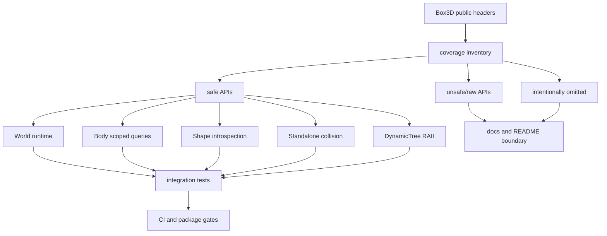
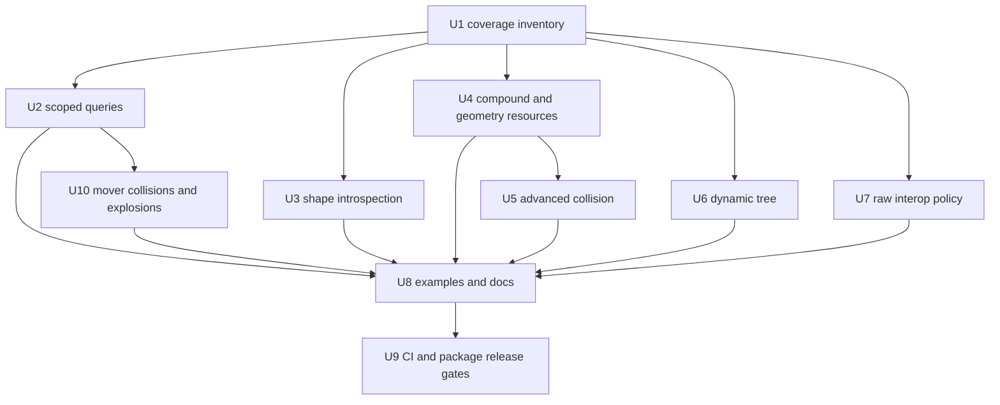

# Safe API Completion - Plan

## Goal Capsule

Complete the `boxddd` safe Rust API surface for Box3D's public `v0.1.0` API enough that the crate can honestly describe itself as safe bindings for the primary and advanced Box3D runtime APIs, while keeping unsuitable process-global C hooks behind explicit raw or unsafe boundaries.
The work may break public Rust APIs, remove thin or misleading wrappers, and reorganize modules when that produces a clearer long-term API.

Authority order is upstream Box3D public headers in `boxddd-sys/third-party/box3d/include/box3d`, current `boxddd` safety invariants, existing tests and examples, current CI and package constraints, then README wording.
Stop and re-plan only if upstream C APIs require ownership semantics that cannot be made sound without a new crate-level resource model, or if a proposed safe API would hide process-global mutation behind an apparently ordinary method.

---

## Product Contract

### Summary

`boxddd` should move from a strong core-physics wrapper to a broad Box3D wrapper with a documented coverage boundary.
Users should get safe, tested APIs for body and shape scoped queries, shape introspection, compound/mesh/height-field authoring, dynamic tree utilities, advanced narrowphase collision, explosions, mover collisions, and replay/debug support.
Low-level global allocator, assert, log, timer, file IO, and raw user-data hooks should be deliberately classified instead of accidentally omitted or unsafely normalized.

### Problem Frame

The current safe wrapper already covers the everyday flow: create worlds, bodies, shapes, joints, step physics, receive events, run world queries, record/replay, debug draw, and integrate with Bevy.
The coverage audit found roughly 130 public `B3_API` functions still FFI-only or partially covered.
Many of these missing APIs are not essential for simple demos, but several are user-visible capabilities that advanced Box3D users will naturally expect.

The risk is not just missing functions.
A full-coverage push can easily turn unsafe C concepts into misleading safe APIs: process-global allocators, raw `void*` user data, and callback-heavy dynamic tree queries need explicit boundaries.
The correct outcome is a broad safe API plus a clear `raw/unsafe` policy, not a one-to-one C function mirror.

### Requirements

**Coverage and API policy**

- R1. Add a machine-checkable coverage inventory that maps Box3D public `B3_API` symbols to `safe`, `unsafe/raw`, `intentionally omitted`, or `deferred` categories.
- R2. Keep safe APIs ownership-aware: borrowed C pointers must not outlive the `World` or resource that owns them, and crate-owned resources must continue using RAII.
- R3. Break or rename existing Rust APIs when the current naming would become inconsistent with the completed API surface.
- R4. Document low-level process-global functions and raw user-data hooks as unsafe or raw interop, not as ordinary safe convenience APIs.

**User-visible runtime APIs**

- R5. Add body and shape scoped query APIs for closest point, ray cast, shape cast, overlap, mover collide, local/world point velocity, shape mass, and world mover collision.
- R6. Add `ExplosionDef` and `World::explode` so force-field style Box3D runtime behavior is accessible safely.
- R7. Add shape event-state getters, shape contact/sensor data APIs, mesh material readback, shape geometry readback, and `Shape::apply_wind` style behavior.
- R8. Complete compound, mesh, and height-field authoring with safe builders, introspection, byte conversion where sound, and tests that protect resource lifetime rules.

**Advanced utilities**

- R9. Add advanced standalone collision APIs for GJK distance, shape cast pair inputs, time of impact, sweep transforms, and missing hull/capsule/sphere/triangle collision pairs.
- R10. Add a safe RAII `DynamicTree` module for Box3D's broadphase data structure, including callback query APIs with panic containment.
- R11. Preserve WASM provider boundaries for callback-heavy APIs by returning `UnsupportedOnWasm` where cross-module callbacks are not yet sound.

**Release readiness**

- R12. Update README, crate docs, examples, and CI so the public claims match the implemented safe coverage boundary.
- R13. Keep `cargo package` clean for all publishable crates and avoid shipping generated audit scratch files.

### Acceptance Examples

- AE1. A user can cast a ray against one body or one shape and get a typed hit result without scanning the whole world.
- AE2. A user can query shape contacts and sensors from a `ShapeId` and receives typed `ContactData` or `ShapeId` values with invalid/foreign handles rejected.
- AE3. A user can create a compound with multiple child kinds, inspect its children, and create a static compound shape without leaking child resources.
- AE4. A user can run `shape_distance` or `time_of_impact` against typed inputs and gets validated outputs instead of raw FFI structs.
- AE5. A user can create a `DynamicTree`, insert proxies, query/raycast it with Rust closures, and a panic inside a callback returns `Error::CallbackPanicked`.
- AE6. A user can trigger `World::explode` with a validated `ExplosionDef` and observe affected dynamic bodies changing velocity.
- AE7. Public docs no longer imply every Box3D public function has a safe wrapper unless the coverage inventory marks it safe.
- AE8. Package verification shows the publishable crates include source, tests, docs, and vendored Box3D files intentionally, without `repo-ref`, `target`, or planning artifacts.

### Scope Boundaries

#### In Scope

- `boxddd` safe API additions, breaks, renames, module organization, tests, examples, docs, and README updates.
- `boxddd-sys` test or documentation updates required to support coverage inventory and publish verification.
- `bevy_boxddd` adjustments only when public `boxddd` API changes break it or when examples should teach a new core API.
- CI and packaging gates that prove the completed API remains releasable.

#### Deferred to Follow-Up Work

- Browser UI demos for the new APIs.
- Bevy editor tooling for every new shape or query primitive.
- Upstreaming local Box3D platform patches.
- Prebuilt Box3D binary distribution.
- Making callback-heavy WASM provider mode fully runtime-capable across every API.

#### Non-Goals

- Mirroring every C function as a safe method when the C function is process-global, file-system specific, or pointer-ownership ambiguous.
- Making `World`, native resources, dynamic trees, recordings, or replay players `Send` or `Sync`.
- Hiding `void*` user data behind unsound typed references.
- Replacing `boxddd-sys::ffi`; raw FFI remains available for users who need unsupported C surface area.

---

## Planning Contract

### Key Technical Decisions

- KTD1. Coverage is tracked as a first-class artifact under source control.
  A small audit file or test fixture should classify missing symbols so future upstream syncs do not silently widen the gap.
- KTD2. Complete high-value safe APIs before low-level utilities.
  Body/shape queries, shape introspection, explosions, compound authoring, and advanced collision change user capability; allocator/log/timer/file IO are lower-value and riskier.
- KTD3. Resource readback APIs return owned Rust values or short-lived borrowed views tied to `&World`.
  Any C pointer readback such as hull, mesh, or height-field data must be copied or lifetime-bound so safe Rust cannot outlive Box3D-owned memory.
- KTD4. Callback APIs follow the existing query/debug/task pattern.
  Closures must be guarded with `CallbackGuard`, panics become `Error::CallbackPanicked`, and provider-mode WASM returns `UnsupportedOnWasm` for callback paths not yet supported.
- KTD5. Dynamic tree is a separate RAII type, not a world method.
  Box3D exposes it as an independent broadphase structure; keeping it independent avoids confusing it with the world's internal tree.
- KTD6. Raw user-data support is explicit and unsafe-adjacent.
  World/body/shape/joint `void*` should either be exposed through `unsafe fn set_raw_user_data` style APIs or replaced by a crate-owned typed sidecar; ordinary safe methods must not bless arbitrary pointers.
- KTD7. Examples teach integration, not just smoke.
  At least one core example should show scoped queries or advanced collision, and one Bevy example may be updated if the new API simplifies picking or shape inspection.
- KTD8. Publishing remains a verification gate.
  Every unit that changes public crate content must keep `cargo package` and package lists clean because this is a C binding crate intended for crates.io.

### High-Level Technical Design

### Assumptions

- The current vendored Box3D headers are the authoritative public API for this plan.
- It is acceptable to break Rust API names where consistency improves because the crate is pre-`1.0`.
- Low-level process-global C APIs are not automatically safe-wrapper requirements.
- Provider-mode WASM remains opt-in and callback-limited until a separate shared-table design exists.

### Sources and Research

- API coverage audit compared `boxddd-sys/third-party/box3d/include/box3d/*.h` against direct `ffi::b3*` use in `boxddd/src`.
- Existing safe wrapper patterns are in `boxddd/src/query.rs`, `boxddd/src/world/body_api.rs`, `boxddd/src/world/shape_api.rs`, `boxddd/src/collision.rs`, `boxddd/src/debug_draw.rs`, `boxddd/src/recording.rs`, and `boxddd/src/core/task_system.rs`.
- Existing verification patterns are in `boxddd/tests/world_and_queries.rs`, `boxddd/tests/shape_runtime.rs`, `boxddd/tests/collision_aabb.rs`, `boxddd/tests/events_and_sensors.rs`, `boxddd/tests/panic_across_ffi_is_caught.rs`, and `boxddd/tests/task_system.rs`.

---

## Implementation Units

### U1. Coverage Inventory And Public API Policy

- **Goal:** Create a durable coverage map and policy that classifies every upstream `B3_API` symbol before broad implementation begins.
- **Requirements:** R1, R2, R3, R4, R12
- **Dependencies:** None
- **Files:**
  - `boxddd/src/lib.rs`
  - `boxddd/src/error.rs`
  - `boxddd/tests/fixtures/api_coverage_symbols.txt`
  - `boxddd/tests/api_coverage.rs`
  - `docs/api-coverage.md`
  - `README.md`
- **Approach:** Add a source-controlled coverage table or test fixture that groups symbols by safe wrapper module, raw/unsafe policy, intentional omission, and deferred status.
  Treat `docs/api-coverage.md` as the human-readable policy and `boxddd/tests/fixtures/api_coverage_symbols.txt` or an equivalent deterministic fixture as the machine-checkable source.
  Define naming and safety rules for raw user-data, process-global APIs, callback APIs, and borrowed C memory.
  Keep the test lightweight: it should fail when a new public `B3_API` symbol appears unclassified, not when normal implementation code changes.
- **Execution note:** Start with the coverage test failing on at least one unclassified known-missing symbol, then classify the current API surface.
- **Patterns to follow:** `boxddd-sys/tests/layout.rs` for ABI sentinel style; `boxddd/src/core/wasm.rs` and `boxddd/src/error.rs` for explicit unsupported-path errors.
- **Test scenarios:**
  - The coverage test detects a representative unclassified symbol added to the fixture.
  - The coverage test passes when known missing symbols are classified as safe, raw, omitted, or deferred.
  - README and crate docs use coverage language that matches `docs/api-coverage.md`.
- **Verification:** The coverage test passes, and the plan's high-priority missing symbols are represented in the inventory.

### U2. Body And Shape Scoped Queries

- **Goal:** Add safe APIs for body-scoped and shape-scoped query functions missing from the world query surface.
- **Requirements:** R5, R11, AE1
- **Dependencies:** U1
- **Files:**
  - `boxddd/src/query.rs`
  - `boxddd/src/world/body_api.rs`
  - `boxddd/src/world/shape_api.rs`
  - `boxddd/src/types/math.rs`
  - `boxddd/src/lib.rs`
  - `boxddd/tests/world_and_queries.rs`
- **Approach:** Extend the existing query result types or introduce scoped result types for `b3Body_CastRay`, `b3Body_CastShape`, `b3Body_OverlapShape`, `b3Body_GetClosestPoint`, `b3Shape_RayCast`, `b3Shape_GetClosestPoint`, and `b3Shape_ComputeMassData`.
  Use `World` methods where handle ownership checks are required.
  Keep callback-heavy scoped query provider-WASM behavior aligned with existing query callback gates.
- **Execution note:** Use proof-first tests for invalid handles and callback panic containment before exposing the public API.
- **Patterns to follow:** `boxddd/src/query.rs` closure trampolines; `boxddd/src/world/body_api.rs` handle validation; `boxddd/src/body.rs` and `boxddd/src/shapes.rs` builder style.
- **Test scenarios:**
  - A body-scoped ray cast returns a hit for a body containing a sphere and no hit for a different body.
  - A body-scoped overlap query respects `QueryFilter` category and mask bits.
  - Shape ray cast and closest point reject foreign or destroyed shape ids.
  - Shape mass data matches mass computed from its geometry and density.
  - Callback panic in a scoped query returns `Error::CallbackPanicked` without unwinding through C.
- **Verification:** Focused query tests prove body and shape scoped APIs on native targets.

### U10. Mover Collisions And Explosions

- **Goal:** Add safe APIs for mover collision helpers and explosion runtime behavior.
- **Requirements:** R5, R6, R11, AE6
- **Dependencies:** U1, U2
- **Files:**
  - `boxddd/src/query.rs`
  - `boxddd/src/world/body_api.rs`
  - `boxddd/src/world/runtime.rs`
  - `boxddd/src/types/math.rs`
  - `boxddd/src/lib.rs`
  - `boxddd/tests/world_and_queries.rs`
  - `boxddd/tests/world_runtime.rs`
- **Approach:** Add typed wrappers for `b3Body_CollideMover` and `b3World_CollideMover` using existing filter, plane, and result conventions from world queries.
  Add `ExplosionDef` and `World::explode` with builder validation, finite-vector checks, radius validation, and handle/world-state checks before FFI.
  Keep callback-heavy mover collision provider-WASM behavior aligned with existing query callback gates.
- **Execution note:** Use proof-first tests for invalid explosion input and callback panic containment before exposing the public API.
- **Patterns to follow:** Mover and query result conversion in `boxddd/src/query.rs`; runtime stepping APIs in `boxddd/src/world/runtime.rs`; builder validation in `boxddd/src/body.rs` and `boxddd/src/shapes.rs`.
- **Test scenarios:**
  - World and body mover collision return typed plane results with capacity handling.
  - `World::explode` changes a nearby dynamic body's velocity and leaves a far body unaffected.
  - Invalid explosion radius, non-finite position, and invalid handles return `Error::InvalidArgument` or the correct invalid-id error.
  - Callback panic in a mover collision query returns `Error::CallbackPanicked` without unwinding through C.
- **Verification:** Focused runtime tests prove mover collision and explosion behavior on native targets.

### U3. Shape Introspection, Contact Data, Sensor Data, And Wind

- **Goal:** Complete safe shape readback and event-state APIs needed for inspection, editor tooling, and advanced examples.
- **Requirements:** R2, R7, R11, AE2
- **Dependencies:** U1
- **Files:**
  - `boxddd/src/world/shape_api.rs`
  - `boxddd/src/events.rs`
  - `boxddd/src/types/contact.rs`
  - `boxddd/src/shapes.rs`
  - `boxddd/tests/shape_runtime.rs`
  - `boxddd/tests/events_and_sensors.rs`
  - `boxddd/tests/shape_resources.rs`
- **Approach:** Add safe getters for shape event enablement, shape contact capacity/data, shape sensor capacity/data, mesh surface material readback, and `apply_wind`.
  For `b3Shape_GetHull`, `b3Shape_GetMesh`, and `b3Shape_GetHeightField`, choose owned snapshots or lifetime-bound views so safe callers cannot retain dangling pointers.
  Reuse existing `ContactData`, `ShapeId`, `SurfaceMaterial`, and resource-retention patterns.
- **Execution note:** Characterize current body-level contact data behavior before adding shape-level readback so the two APIs stay consistent.
- **Patterns to follow:** `try_body_contacts_into` in `boxddd/src/world/body_api.rs`; event vector conversion in `boxddd/src/events.rs`; resource ownership in `boxddd/src/world/creation.rs`.
- **Test scenarios:**
  - Event enablement getters reflect calls to enable sensor, contact, pre-solve, and hit events.
  - Shape contact data returns contacts for a colliding shape and clears/reuses caller-provided buffers.
  - Shape sensor data returns visitor shape ids for a sensor after stepping.
  - Mesh material readback returns the material set on a valid mesh material index and rejects out-of-range indexes.
  - Geometry readback for hull, mesh, and height field cannot outlive the owning world/resource through safe APIs.
  - `apply_wind` affects a dynamic shape and rejects invalid wind, drag, lift, and max-speed inputs.
- **Verification:** Shape runtime and event tests cover both owned-vector and buffer-reuse APIs.

### U4. Compound, Mesh, And Height-Field Authoring Completion

- **Goal:** Complete safe authoring and introspection for complex geometry resources.
- **Requirements:** R2, R8, AE3
- **Dependencies:** U1, U3
- **Files:**
  - `boxddd/src/shapes.rs`
  - `boxddd/src/collision.rs`
  - `boxddd/src/world/creation.rs`
  - `boxddd/src/world/shape_api.rs`
  - `boxddd/tests/shape_resources.rs`
  - `boxddd/tests/shape_geometry_validation.rs`
  - `boxddd/tests/manifold_collision.rs`
- **Approach:** Replace narrow compound helpers with a builder that supports sphere, capsule, hull, and mesh children using crate-owned resources.
  Add safe wrappers for arbitrary mesh creation, hollow box/platform/torus/wave mesh helpers, custom height-field creation or loading where file IO can be avoided or clearly marked, compound byte conversion when ownership can be proven, and compound child/material queries.
  Preserve static-body restrictions for mesh, height-field, and compound shapes.
- **Execution note:** Use resource lifetime tests before broad helper additions; complex geometry bugs are more likely to be dangling pointer bugs than scalar validation bugs.
- **Patterns to follow:** `MeshData`, `HeightField`, `Compound`, and `ShapeResource` ownership in `boxddd/src/shapes.rs` and `boxddd/src/world/creation.rs`.
- **Test scenarios:**
  - A compound with multiple child kinds can be created, attached to a static body, queried, and destroyed without leaking resources.
  - Creating mesh, height-field, or compound shapes on non-static bodies returns the existing invalid-body-path error.
  - Arbitrary mesh creation rejects empty vertices, invalid triangle indices, and non-finite scale.
  - Height-field creation rejects invalid dimensions and non-finite samples.
  - Compound child introspection returns correct child count, type, transform, and material data.
  - Byte conversion round-trips a compound where Box3D exposes stable data, or is marked raw/deferred in the coverage inventory if not sound.
- **Verification:** Resource lifetime tests and geometry validation tests pass under default and double-precision feature paths where applicable.

### U5. Advanced Standalone Collision And Geometry Algorithms

- **Goal:** Wrap Box3D's advanced collision helpers with typed inputs and validated outputs.
- **Requirements:** R9, AE4
- **Dependencies:** U1, U4
- **Files:**
  - `boxddd/src/collision.rs`
  - `boxddd/src/types/math.rs`
  - `boxddd/src/shapes.rs`
  - `boxddd/tests/manifold_collision.rs`
  - `boxddd/tests/collision_validation.rs`
  - `boxddd/tests/collision_aabb.rs`
- **Approach:** Add typed wrappers for `b3ShapeDistance`, `b3ShapeCast`, `b3TimeOfImpact`, `b3GetSweepTransform`, `b3SolvePlanes`, missing collide pair functions, and segment/line distance helpers where they fit existing math types.
  Keep low-level simplex caches and diagnostic arrays hidden unless a safe advanced-user type is needed.
  Validate all inputs before FFI and convert zero-hit or failure outputs into explicit Rust result structs.
- **Execution note:** Add focused mathematical characterization tests with simple spheres/capsules/hulls before adding more complex mesh/height-field cases.
- **Patterns to follow:** Existing `CastOutput`, `LocalManifold`, `ShapeProxy`, and `RayCastInput` conversions in `boxddd/src/collision.rs`.
- **Test scenarios:**
  - Shape distance between separated spheres returns positive distance and nearest points.
  - Shape distance between overlapping proxies reports overlap or zero distance according to Box3D semantics.
  - Pair shape cast hits a known target with expected fraction and misses when translation points away.
  - Time of impact returns a hit fraction for two moving simple shapes and a non-hit state when no collision occurs.
  - Missing collision pair wrappers produce non-empty manifolds for simple overlapping hull/sphere/capsule cases.
  - Invalid proxies, transforms, and non-finite sweep values return `Error::InvalidArgument`.
- **Verification:** Standalone collision tests exercise happy paths, invalid input, and at least one resource-backed shape path.

### U6. DynamicTree RAII Module

- **Goal:** Add a safe wrapper around Box3D's independent dynamic tree broadphase API.
- **Requirements:** R2, R10, R11, AE5
- **Dependencies:** U1
- **Files:**
  - `boxddd/src/dynamic_tree.rs`
  - `boxddd/src/collision.rs`
  - `boxddd/src/query.rs`
  - `boxddd/src/lib.rs`
  - `boxddd/tests/dynamic_tree.rs`
- **Approach:** Introduce `DynamicTree`, `DynamicTreeProxyId`, and query result types.
  Manage `b3DynamicTree_Create` and `b3DynamicTree_Destroy` with RAII, validate proxy ids before destructive operations when possible, and expose create, destroy, move, enlarge, category bits, root bounds, proxy count, byte count, height, area ratio, rebuild, validate, query, closest query, ray cast, and box cast.
  Treat save/load file APIs as raw or deferred unless a clear safe file-path contract is added.
- **Execution note:** Implement callback query tests first, including panic containment, because callback safety is the main soundness risk.
- **Patterns to follow:** `Recording` RAII in `boxddd/src/recording.rs`; query trampolines in `boxddd/src/query.rs`; `CallbackGuard` in `boxddd/src/core/callback_state.rs`.
- **Test scenarios:**
  - Creating and dropping a dynamic tree releases native resources without requiring manual destroy.
  - A proxy inserted with an AABB is found by AABB query and not found after destroy.
  - Moving and enlarging proxies changes query results.
  - Category masks and require-all-bits behavior filter expected proxies.
  - Ray cast and box cast callbacks can shorten traversal by returning a smaller fraction.
  - Panic inside any dynamic tree callback returns `Error::CallbackPanicked`.
  - Invalid proxy ids return `Error::InvalidArgument` or a dedicated invalid-proxy error if introduced.
- **Verification:** Dynamic tree tests pass in native CI and provider-mode WASM callback paths are gated or tested according to the coverage policy.

### U7. Raw Interop, User Data, And Process-Global Utilities

- **Goal:** Define and implement the safe boundary for low-level C APIs that should not look like normal safe Rust calls.
- **Requirements:** R1, R4, R12
- **Dependencies:** U1
- **Files:**
  - `boxddd/src/lib.rs`
  - `boxddd/src/raw.rs`
  - `boxddd/src/world.rs`
  - `boxddd/src/world/body_api.rs`
  - `boxddd/src/world/shape_api.rs`
  - `boxddd/src/joints/world_api.rs`
  - `boxddd/src/types/math.rs`
  - `boxddd/tests/raw_interop.rs`
  - `docs/api-coverage.md`
- **Approach:** Introduce a `raw` or `unsafe_interop` module for APIs such as raw user-data pointers, global log/assert hooks, timers, hash, global length units, and stall threshold when they are kept.
  Make unsafe preconditions visible in function names and docs.
  Decide whether joint raw user-data methods remain, are renamed, or move under the same raw policy.
  Prefer not to wrap allocator replacement safely unless the plan discovers a sound global allocator contract.
- **Execution note:** Treat this as a cleanup/refactor unit: remove misleading safe methods if needed and update downstream tests/examples immediately.
- **Patterns to follow:** Existing `unsafe fn with_*_raw` event APIs in `boxddd/src/events.rs`; crate-private raw accessors in `boxddd/src/world.rs`.
- **Test scenarios:**
  - Raw user-data round-trips for world/body/shape/joint only through APIs marked raw or unsafe.
  - Safe APIs do not expose arbitrary mutable pointers without an unsafe boundary.
  - Global scalar utilities validate finite/non-negative inputs where exposed.
  - Provider-mode and docs.rs builds do not require file IO, allocator hooks, or platform timer behavior.
- **Verification:** Public docs and coverage inventory classify every low-level global API; tests prove raw interop does not pollute the safe prelude.

### U8. Examples, README, And Teaching Docs

- **Goal:** Update user-facing material so the new coverage is discoverable without overstating safety.
- **Requirements:** R12, AE1, AE2, AE3, AE4, AE5, AE7
- **Dependencies:** U2, U3, U4, U5, U6, U7, U10
- **Files:**
  - `README.md`
  - `boxddd/README.md`
  - `boxddd/examples/advanced_collision.rs`
  - `boxddd/examples/dynamic_tree.rs`
  - `boxddd/examples/shape_queries.rs`
  - `bevy_boxddd/examples/physics_picking_3d.rs`
  - `docs/api-coverage.md`
  - `docs/platforms/wasm.md`
- **Approach:** Add concise examples for scoped shape/body queries, dynamic tree usage, and advanced collision.
  Update README claim language from primary API coverage to documented safe coverage.
  Link `docs/api-coverage.md`, keep the Box3D version compatibility table, and update any Bevy examples that can now use better core APIs.
  Avoid dumping internal coverage tables into the README; keep README as a user landing page.
  Individual API units may add minimal examples while landing their API; this unit owns the final teaching pass and consistency sweep.
- **Execution note:** Prefer compile-checkable examples and short README snippets over large tutorial prose.
- **Patterns to follow:** Existing examples in `boxddd/examples/hello_world.rs`, `boxddd/examples/error_handling.rs`, `boxddd/examples/task_system.rs`, and Bevy examples under `bevy_boxddd/examples`.
- **Test scenarios:**
  - New core examples compile under their required features.
  - README quickstart still uses crates.io-style installation text.
  - Documentation names raw/deferred APIs consistently with `docs/api-coverage.md`.
  - Bevy picking example still compiles if updated to use scoped query helpers.
- **Verification:** Example compile checks pass and README no longer claims unsupported full-safe coverage.

### U9. CI, Package, And Release Validation

- **Goal:** Keep the completed API surface publishable and continuously checked.
- **Requirements:** R13, AE8
- **Dependencies:** U1, U2, U3, U4, U5, U6, U7, U8, U10
- **Files:**
  - `.github/workflows/ci.yml`
  - `.github/workflows/release-preflight.yml`
  - `xtask/src/main.rs`
  - `boxddd-sys/Cargo.toml`
  - `boxddd/Cargo.toml`
  - `bevy_boxddd/Cargo.toml`
  - `docs/development/ci.md`
  - `docs/api-coverage.md`
- **Approach:** Add or extend CI gates so coverage inventory, new examples, native tests, WASM compile/provider boundaries, docs, and package dry-runs keep passing.
  If the coverage inventory needs generation, put the command behind `xtask` and ensure generated output is deterministic.
  Re-run package list audits for `boxddd-sys`, `boxddd`, and `bevy_boxddd`; update include lists only when the new tests/docs should ship.
- **Execution note:** This is mostly packaging/config; use package and CI smoke verification as the proof, not new unit tests unless `xtask` gains logic.
- **Patterns to follow:** Current CI package/bindgen jobs and release workflows; package include adjustment in `boxddd-sys/Cargo.toml`.
- **Test scenarios:**
  - CI package job fails if a publishable crate excludes a required new test or doc file.
  - Coverage gate fails on an unclassified `B3_API` symbol.
  - New examples are included in the examples CI job.
  - Package list scans show no `target`, `repo-ref`, `.github`, or planning docs in publishable crates.
- **Verification:** Local package dry-runs succeed for all publishable crates, and CI remains green after pushing to `origin/main`.

---

## Verification Contract

| Gate | Applies to | Done signal |
|---|---|---|
| `cargo fmt --all --check` | All units | Formatting is clean. |
| `cargo nextest run -p boxddd` | U1-U7, U10 | Core safe wrapper tests pass. |
| `cargo nextest run -p boxddd --features serde,mint,cgmath,nalgebra,glam` | U2-U7, U10 | Optional interop and serde surfaces still compile and test. |
| `cargo nextest run -p boxddd-sys` | U1, U9 | FFI ABI sentinel tests still pass. |
| `cargo nextest run -p boxddd-sys --features double-precision` | U4, U9 | Double-precision ABI sentinels still pass. |
| `cargo check -p boxddd --examples` | U8 | Core examples compile. |
| `cargo check -p bevy_boxddd --examples --features debug-gizmos,physics-picking` | U8 | Bevy examples still compile after API changes. |
| `cargo doc -p boxddd --no-deps --all-features` | U1, U7, U8 | Public docs build with the documented coverage and raw interop boundary. |
| `cargo package -p boxddd-sys --locked` | U9 | Sys crate package verifies cleanly. |
| `cargo package -p boxddd --locked --config 'patch.crates-io.boxddd-sys.path="boxddd-sys"'` | U9 | Core crate package verifies cleanly against local sys crate. |
| `cargo package -p bevy_boxddd --locked --config 'patch.crates-io.boxddd.path="boxddd"' --config 'patch.crates-io.boxddd-sys.path="boxddd-sys"'` | U9 | Bevy crate package verifies cleanly against local workspace crates. |
| GitHub CI | All units | Main branch CI is green after push. |

---

## Definition of Done

- Every upstream `B3_API` symbol is classified in the coverage inventory.
- All high-priority missing runtime APIs from the audit are safe-wrapped, raw-classified, or explicitly deferred with rationale.
- New safe APIs validate handles and scalar/vector inputs before FFI.
- Callback-based APIs catch panics and return `Error::CallbackPanicked`.
- Resource-backed APIs do not expose dangling Box3D-owned pointers through safe Rust.
- Public docs describe the coverage boundary and raw interop policy accurately.
- Examples compile and teach at least scoped queries, advanced collision, and dynamic tree usage.
- Publishable crate package dry-runs pass and package contents remain intentional.
- Abandoned experimental code, scratch audit output, and obsolete wrappers are removed before final commit.
