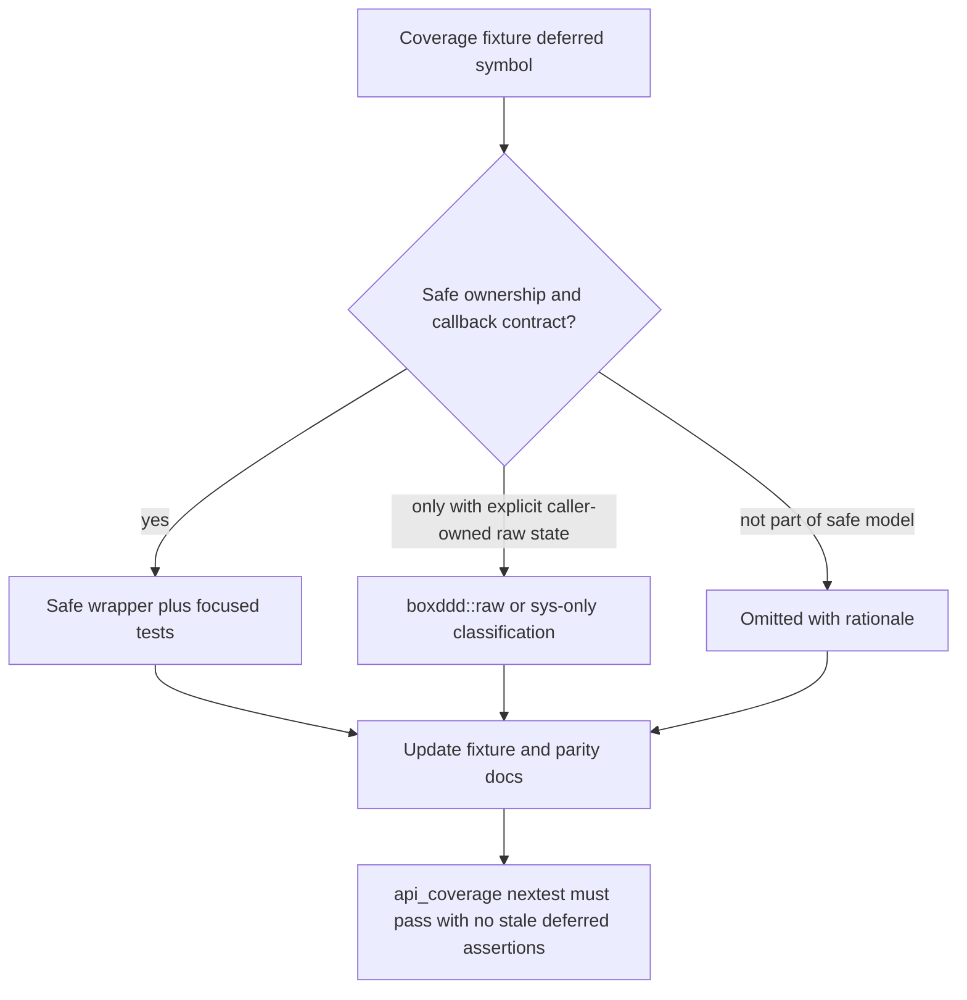
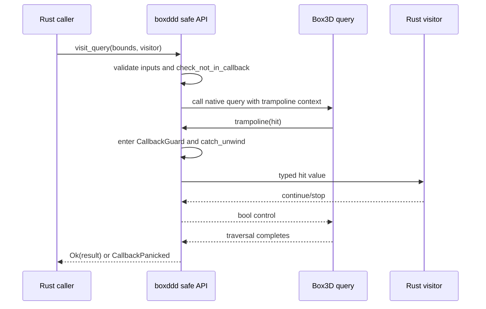
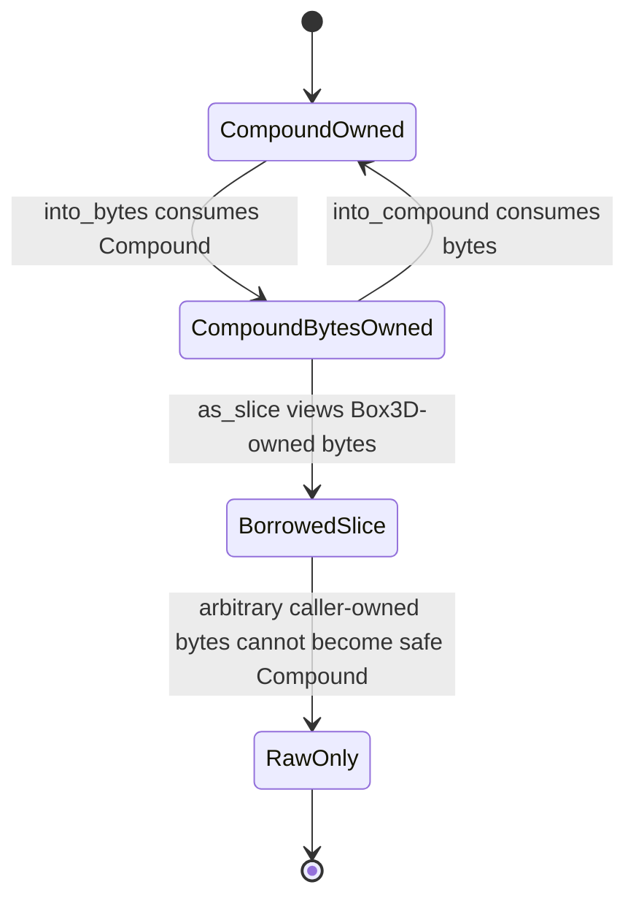

# Deferred API And Math Interop Completion - Plan

## Goal Capsule

| Field | Content |
|---|---|
| Objective | Finish the remaining deliberately deferred Box3D public API design work that is appropriate for safe Rust, and harden the optional math-crate interop surface so users can integrate `boxddd` with common Rust math stacks without leaking FFI types. |
| Authority | The vendored Box3D headers and implementation define memory and callback contracts; `boxddd` safe API policy outranks mechanical public-symbol coverage; user preference allows breaking API cleanup when it produces the right long-term wrapper. |
| Execution profile | Deep cross-cutting library work over safe API, FFI ownership, optional dependencies, docs, examples, CI, and package validation. |
| Stop conditions | Stop and ask only if upstream behavior contradicts a planned safe ownership model, or if a required safe API would need unsound lifetime or allocator assumptions. |
| Landing strategy | Land as local `main` commits in logical units after focused nextest verification. |

---

## Product Contract

### Summary

This plan turns the remaining `deferred` coverage bucket into concrete safe APIs or explicit raw-only policy, with special care around callback containment and compound byte ownership.
It also makes math interop a documented, tested surface for `mint`, `glam`, `nalgebra`, and `cgmath` while keeping the engine-independent `boxddd` API centered on crate-owned types.

### Problem Frame

The previous safe API completion pass moved `boxddd` from a thin binding toward a usable Rust crate, but the coverage inventory still exposes a small deferred tail: contact data, redundant world-handle getters, hull and box helpers, compound query and byte conversion, mesh and height-field query callbacks, and selected deterministic math helpers.
Those are not equal-risk items.
Query callbacks can follow existing world and dynamic-tree visitor patterns, while compound byte conversion is a state-transfer API whose upstream implementation mutates pointers and changes ownership shape.

The math story is also partially complete.
The crate already exposes feature-gated conversions for common crates, but the conversion matrix is uneven across `Vec2`, `Vec3`, `Pos`, `Quat`, `Transform`, `WorldTransform`, `Matrix3`, `Aabb`, and `Plane`.
Users integrating Bevy, `glam`, `nalgebra`, simulation tools, or serialization pipelines need predictable conversions without turning every physics API into a generic math abstraction.

### Requirements

**Coverage And Safety Boundary**

- R1. Every vendored upstream `B3_API` symbol must be classified as `safe`, `raw`, or `omitted`, with `deferred` removed unless implementation discovers a newly justified follow-up that is documented before landing.
- R2. Safe wrappers must contain Rust panics before they cross C callbacks and must reject callback reentry through the existing callback guard model.
- R3. Public APIs must not expose `boxddd_sys::ffi` types except through explicit raw/unsafe surfaces.
- R4. APIs that depend on process-global state, file IO, raw allocator ownership, or caller-owned raw pointers must stay outside the ordinary safe prelude.

**Deferred Geometry APIs**

- R5. Compound overlap queries must expose child indices and child shape data in a lifetime-safe visitor and collection API.
- R6. Mesh and height-field AABB queries must expose triangle vertices and triangle indices through visitor and collection APIs that validate bounds and callback behavior.
- R7. Compound byte conversion must use an ownership model that reflects upstream pointer mutation; exported bytes are not a general serialization format, and arbitrary caller-owned byte buffers must not be accepted as safe `Compound` storage unless allocator compatibility is proven.

**Math Helpers And Interop**

- R8. Deterministic Box3D math helpers that return values and have no process-global state should be available as safe Rust functions or constructors with input validation.
- R9. `mint`, `glam`, `nalgebra`, and `cgmath` support must be feature-gated, optional, and compatible when enabled together.
- R10. Conversion APIs must be loss-aware around `double-precision` position builds and fallible when quaternion, transform, AABB, or finite-value invariants can fail.
- R11. The ordinary physics APIs should keep accepting crate-owned `Vec3`, `Pos`, `Quat`, `Transform`, and `Aabb` shapes, plus existing `impl Into<_>` convenience where it does not obscure errors.

**Documentation, Examples, And Release Readiness**

- R12. README and API coverage docs must describe the resulting support level from the user's perspective, not as internal smoke-test detail.
- R13. Examples must show real integration use: query traversal over compound/mesh/height-field data plus direct `glam` and `nalgebra` math interop paths.
- R14. CI must prove focused callback APIs, math interop feature combinations, docs, package contents, and WASM provider compile boundaries.

### Acceptance Examples

- AE1. Given a `Compound` containing multiple children, when a user queries an overlapping AABB, then the visitor receives each matching child index and shape metadata without holding raw FFI pointers.
- AE2. Given a mesh or height-field query visitor that panics, when the query runs, then the Rust API returns `Error::CallbackPanicked` and no panic unwinds into Box3D.
- AE3. Given a `Compound`, when it is converted to bytes, then the original Rust value cannot be used again and the returned bytes owner can expose a read-only slice of the same Box3D-owned allocation or be converted back through that owner path, but no safe `from_slice` or `from_vec` is implied.
- AE4. Given `glam`, `mint`, `nalgebra`, and `cgmath` features enabled together, when interop tests run, then conversions compile without trait conflicts and invalid quaternions/AABBs fail through `Error::InvalidArgument`.

### Scope Boundaries

#### In Scope

- Finish or reclassify the currently deferred symbols listed in `boxddd/tests/fixtures/api_coverage_symbols.txt`.
- Add safe callback wrappers for compound, mesh, and height-field query APIs when they can follow existing callback containment patterns.
- Add safe deterministic math helper wrappers for the current scalar/quaternion/matrix helper tail.
- Expand and document optional math conversions without changing the core crate's dependency-free default build.
- Update examples, README, API parity docs, CI, and package validation affected by the new public surface.

#### Deferred to Follow-Up Work

- Typed application user-data registries for bodies, shapes, joints, and worlds remain outside this plan.
- Browser Bevy/WASM rendering remains outside this plan; this work only preserves existing core WASM compile/provider boundaries.
- File-backed Box3D IO helpers remain raw-only unless the implementation proves a safe allocator and path policy that does not conflict with the current raw boundary.
- Full public Box3D API completion beyond the current deferred fixture tail remains follow-up work. Body-scoped query APIs, shape-scoped query/readback gaps, explosion helpers, standalone GJK/TOI algorithms, dynamic tree APIs, and process-global allocator/log/timer hooks are not pulled into this plan unless implementation discovers they are required to complete the current deferred symbols.

---

## Planning Contract

### Key Technical Decisions

- KTD1. Resolve the current deferred bucket rather than hiding it. The implementation should either ship a safe wrapper or intentionally reclassify a symbol to `raw` or `omitted` with a precise note; `deferred` should not remain as a default release posture for the 19 symbols listed below.
- KTD2. Query callbacks follow the existing visitor pattern. `World`, `DynamicTree`, and mover collision already use `check_not_in_callback`, `CallbackGuard`, `catch_unwind`, `*_into`, and `visit_*`; compound, mesh, and height-field queries should reuse that shape.
- KTD3. Compound bytes are Box3D-owned state, not plain Rust serialization. Upstream `b3ConvertCompoundToBytes` returns the original allocation after pointer scrubbing, and `b3ConvertBytesToCompound` mutates that allocation to restore pointers. The safe API must model consuming ownership transfer, expose a borrowed byte slice only as a view of the owner, and avoid any safe `from_slice` or `from_vec` constructor.
- KTD4. Math interop remains adapter-based. Keep `boxddd` core APIs typed around `Vec3`, `Pos`, `Quat`, `Transform`, `WorldTransform`, `Matrix3`, `Aabb`, and `Plane`; add feature-gated conversions rather than genericizing the whole public API over external math traits.
- KTD5. Fallible conversions guard invariants. Quaternion, transform, AABB, matrix, finite scalar, and unit-vector-sensitive helpers must validate before returning safe values; invalid external values return `Error::InvalidArgument`.
- KTD6. `mint` is the narrow ecosystem bridge, `glam` and `nalgebra` are first-class direct integrations, and `cgmath` is compatibility support. This keeps the current feature set but clarifies priority in tests and docs.
- KTD7. WASM provider mode remains conservative. Callback-backed APIs that cannot link/run under provider mode should keep the existing `UnsupportedOnWasm` boundary while still compiling under target checks.

### Release Boundary

The deferred API tail and math interop matrix live in one plan because both define the public pre-`0.1.0` release contract.
They should still land in independent commits and can be verified separately: U1-U6 complete the current deferred fixture tail, U7 hardens optional math features, and U8-U9 publish the resulting boundary through exports, docs, examples, CI, and package checks.
If one deferred symbol proves unsound for safe Rust, U1's disposition rule reclassifies that symbol to `raw` or `omitted` instead of blocking unrelated math interop work.

### Deferred Symbol Disposition

| Symbol | Target | Unit | Rationale |
|---|---|---|---|
| `b3Shape_GetWorld` | `omitted` | U2 | World ownership is already tracked through safe IDs and membership checks; exposing a world handle getter would duplicate internal validation and leak a raw identity concept. |
| `b3Joint_GetWorld` | `omitted` | U2 | Same as `b3Shape_GetWorld`; joint APIs already validate world membership through the owning `World`. |
| `b3Contact_GetData` | `safe` | U2 | A world-scoped method can validate contact membership and return owned `ContactData`. |
| `b3CloneHull` | `safe` | U2 | A fallible `Hull::try_clone` can preserve RAII ownership without exposing the raw pointer. |
| `b3CloneAndTransformHull` | `safe` | U2 | A fallible transformed clone helper can validate transform and scale before returning a new RAII `Hull`. |
| `b3ScaleBox` | `safe` | U2 | A box scaling helper can validate scale and return a crate-owned hull or box descriptor. |
| `b3QueryCompound` | `safe` | U3 | Existing callback containment patterns can expose child hits without leaking raw `b3CompoundData`. |
| `b3QueryMesh` | `safe` | U4 | The native callback passes triangle vertices by value, so safe owned hit values are possible. |
| `b3QueryHeightField` | `safe` | U4 | Safe traversal is possible, but native implementation does not honor callback early termination. |
| `b3ConvertCompoundToBytes` | `safe` | U5 | Safe only as `Compound::into_bytes`, consuming Box3D-owned `Compound` allocation into a new owner. |
| `b3ConvertBytesToCompound` | `safe` | U5 | Safe only as `CompoundBytes::into_compound`, consuming bytes that originated from `Compound::into_bytes`; arbitrary buffers remain raw-only. |
| `b3Atan2` | `safe` | U6 | Pure deterministic math helper with finite input validation. |
| `b3ComputeCosSin` | `safe` | U6 | Pure deterministic math helper with finite input validation. |
| `b3MakeQuatFromMatrix` | `safe` | U6 | Safe constructor when matrix validation succeeds. |
| `b3ComputeQuatBetweenUnitVectors` | `safe` | U6 | Safe helper when both input vectors are finite and unit length. |
| `b3Steiner` | `safe` | U6 | Pure inertia helper with mass and origin validation. |
| `b3IsValidMatrix3` | `safe` | U6 | Exposed through `Matrix3::is_valid` and validation helpers. |
| `b3IsBoundedAABB` | `safe` | U6 | Exposed through `Aabb::is_bounded`. |
| `b3IsSaneAABB` | `safe` | U6 | Exposed through `Aabb::is_sane`. |

### Math Interop Contract

| `boxddd` type | `mint` | `glam` | `nalgebra` | `cgmath` | Conversion policy |
|---|---|---|---|---|---|
| `Vec2` | `mint::Vector2<f32>` | `glam::Vec2` | `nalgebra::Vector2<f32>` | `cgmath::Vector2<f32>` | Infallible `From` both ways for value transport; consuming APIs still validate finite values where required. |
| `Vec3` | `mint::Vector3<f32>` | `glam::Vec3` | `nalgebra::Vector3<f32>` | `cgmath::Vector3<f32>` | Keep existing value conversions and add missing direct crates where practical. |
| `Pos` | `mint::Point3<PosScalar>` | `glam::Vec3` or `glam::DVec3` under `double-precision` | `nalgebra::Point3<PosScalar>` | `cgmath::Point3<PosScalar>` | Use `PosScalar`; never silently downcast `double-precision` positions to f32-only external types. |
| `Quat` | `mint::Quaternion<f32>` | `glam::Quat` | `nalgebra::UnitQuaternion<f32>` plus explicit raw quaternion path where already supported | `cgmath::Quaternion<f32>` | `boxddd` to external is infallible; external to `boxddd` is `TryFrom` unless the external type is already unit-normalized. |
| `Transform` | `(mint::Point3<PosScalar>, mint::Quaternion<f32>)` | `(glam position, glam::Quat)` | `nalgebra::Isometry3<f32>` | `(cgmath::Point3<PosScalar>, cgmath::Quaternion<f32>)` | Fallible inbound conversion validates rotation and finite position. No `Mat4` or affine conversion. |
| `WorldTransform` | Same tuple shape as `Transform` | Same tuple shape as `Transform` | `nalgebra::Isometry3<f32>` where precision is compatible | Same tuple shape as `Transform` | Same validation as `Transform`; keep world-position precision visible in the external type. |
| `Matrix3` | `mint::ColumnMatrix3<f32>` | `glam::Mat3` | `nalgebra::Matrix3<f32>` | `cgmath::Matrix3<f32>` | Use column-major semantics and `TryFrom` inbound validation. |
| `Aabb` | `(mint::Point3<f32>, mint::Point3<f32>)` | `(glam::Vec3, glam::Vec3)` | `(nalgebra::Point3<f32>, nalgebra::Point3<f32>)` | `(cgmath::Point3<f32>, cgmath::Point3<f32>)` | Tuple order is `(lower, upper)`; inbound conversion is `TryFrom` and validates finite ordered bounds. |
| `Plane` | `(mint::Vector3<f32>, f32)` | `(glam::Vec3, f32)` | `(nalgebra::Vector3<f32>, f32)` | `(cgmath::Vector3<f32>, f32)` | Tuple order is `(normal, offset)`; inbound conversion is `TryFrom` and validates finite nonzero normal where required by existing `Plane` invariants. |

### High-Level Technical Design

#### Deferred Symbol Resolution

#### Callback Query Shape

This control-flow diagram applies to compound and mesh queries.
Height-field queries share the panic containment shape but do not expose native early termination because upstream ignores the callback return value.

#### Compound Byte Ownership

### Assumptions

- The plan proceeds without a separate scoping confirmation because the user explicitly asked the agent to decide and immediately execute.
- Public API breakage is acceptable when it removes unsound or misleading API shapes before the first published release line stabilizes.
- Upstream Box3D `v0.1.0` remains the target for this work; changing the vendored source version is not part of the plan.

### Risks And Mitigations

| Risk | Mitigation |
|---|---|
| Compound byte APIs accidentally free memory with the wrong allocator. | Only create safe compound bytes from Box3D-owned `Compound` allocations; keep arbitrary caller buffers raw-only unless allocator compatibility is proven in code and tests. |
| Query visitor values borrow data invalidated after traversal. | Tie child and mesh views to the queried resource lifetime; only expose owned triangle vertex values for mesh/height-field hits. |
| Callback panics cross FFI. | Mirror existing `query.rs` and `dynamic_tree.rs` trampoline containment and add panic tests for each new visitor family. |
| Optional math features conflict when enabled together. | Add all-math-features nextest/check gates and avoid blanket trait impls over external generic types. |
| `double-precision` position builds lose precision through external crate conversions. | Use `PosScalar` for `Pos`/`WorldTransform` conversions where the external crate supports it; keep `Vec3` and `Quat` as f32-aligned because Box3D rotation/vector math remains f32. |

### Sources And Research

- `docs/api-coverage.md` and `boxddd/tests/fixtures/api_coverage_symbols.txt` define the current safe/raw/omitted/deferred policy.
- `docs/upstream-parity/box3d-api-matrix.md` describes release-facing API parity language that must stay honest after this work.
- `boxddd-sys/third-party/box3d/include/box3d/collision.h` defines `b3QueryCompound`, `b3QueryMesh`, `b3QueryHeightField`, and compound byte conversion signatures.
- `boxddd-sys/third-party/box3d/src/height_field.c` shows `b3QueryHeightField` invokes the callback but does not use its return value for traversal control.
- `boxddd-sys/third-party/box3d/src/compound.c` shows compound byte conversion mutates the original allocation by scrubbing and restoring internal pointers.
- `boxddd/src/query.rs` and `boxddd/src/dynamic_tree.rs` are the callback containment patterns to follow.
- `boxddd/src/interop.rs` and `boxddd/tests/interop.rs` are the existing optional math conversion patterns.

---

## Implementation Units

### U1. Rebaseline Coverage Policy

- **Goal:** Convert the current deferred list into an executable inventory for this plan and update the coverage test so stale deferred assertions cannot survive.
- **Requirements:** R1, R3, R4.
- **Dependencies:** None.
- **Files:** `boxddd/tests/fixtures/api_coverage_symbols.txt`, `boxddd/tests/api_coverage.rs`, `docs/api-coverage.md`, `docs/upstream-parity/box3d-api-matrix.md`.
- **Approach:** Replace the hard-coded deferred-symbol assertions with a policy that allows zero deferred entries and checks any remaining deferred entries carry an explicit temporary rationale. Update fixture entries only after their corresponding units land, so tests prove classification changes instead of pre-claiming them.
- **Execution note:** Treat this as characterization-first work: run the existing coverage test before editing so the current deferred shape is visible, then update it as each wrapper or raw decision lands.
- **Patterns to follow:** Existing parser and policy bucket checks in `boxddd/tests/api_coverage.rs`.
- **Test scenarios:**
  - Existing fixture still matches every vendored public `B3_API` symbol after classification changes.
  - Duplicate symbols and bad statuses are still rejected.
  - A zero-deferred fixture is accepted.
  - Any remaining deferred entry, if implementation discovers one, must include a non-placeholder note.
- **Verification:** `api_coverage` nextest passes and docs counts match the fixture.

### U2. Resolve Contact, World-Handle, Hull, And Box Helper Tail

- **Goal:** Resolve the non-callback, non-byte deferred symbols that were missing from the earlier unit split.
- **Requirements:** R1, R3, R4.
- **Dependencies:** U1 policy shape.
- **Files:** `boxddd/src/events.rs`, `boxddd/src/world/runtime.rs`, `boxddd/src/shapes.rs`, `boxddd/src/lib.rs`, `boxddd/src/prelude.rs`, `boxddd/tests/contact_events.rs`, `boxddd/tests/shape_resources.rs`, `boxddd/tests/fixtures/api_coverage_symbols.txt`, `docs/api-coverage.md`, `docs/upstream-parity/box3d-api-matrix.md`.
- **Approach:** Add a world-scoped contact data accessor that validates contact membership before returning owned `ContactData`. Add fallible hull clone and transformed-clone helpers plus a safe box-scaling helper that validates transform and scale inputs before returning crate-owned values. Classify `b3Shape_GetWorld` and `b3Joint_GetWorld` as omitted because safe `World` APIs already validate membership and returning a bare world identity would weaken the ownership model.
- **Execution note:** Start from coverage and focused tests for each disposition row; this unit is the guard against leaving hidden deferred symbols behind.
- **Patterns to follow:** `World` membership checks in `world/body_api.rs`, `ContactData::from_raw` ownership conversion, and RAII resource constructors/destructors in `shapes.rs`.
- **Test scenarios:**
  - A real contact generated by stepping a world can be resolved through the owning `World` into owned `ContactData`.
  - A default, invalid, or wrong-world `ContactId` is rejected before calling unsafe data access.
  - `Hull::try_clone` returns an independent RAII hull with matching shape data.
  - Transformed hull clone and box scaling reject invalid transforms, NaN values, and non-positive scales.
  - Fixture and docs mark `b3Shape_GetWorld` and `b3Joint_GetWorld` as `omitted` with the ownership rationale.
- **Verification:** Contact, hull, box-scaling, and omitted-world-handle rows match the disposition table and focused tests pass.

### U3. Add Compound Query Visitors

- **Goal:** Wrap `b3QueryCompound` with safe visitor and collection APIs over `Compound`.
- **Requirements:** R2, R3, R5, AE1, AE2.
- **Dependencies:** U1 policy shape.
- **Files:** `boxddd/src/shapes.rs`, `boxddd/src/lib.rs`, `boxddd/src/prelude.rs`, `boxddd/tests/shape_resources.rs`, `boxddd/tests/panic_across_ffi_is_caught.rs`, `boxddd/tests/fixtures/api_coverage_symbols.txt`.
- **Approach:** Add a typed compound query hit carrying child index plus lifetime-bound child metadata. Provide collecting and visitor APIs that validate `Aabb`, reject callback reentry, catch panics, and let the visitor stop traversal. Build hits inside the trampoline before entering user code so callers never receive raw `b3CompoundData`.
- **Execution note:** Add the panic containment test before implementing the trampoline if practical.
- **Patterns to follow:** `World::visit_overlap_aabb`, `DynamicTree::visit_query`, and existing `Compound::child`.
- **Test scenarios:**
  - A compound with capsule, hull, mesh, and sphere children returns only children whose local AABB overlaps the query bounds.
  - Visitor early termination stops traversal without reporting an error.
  - A visitor panic returns `Error::CallbackPanicked`.
  - Calling a guarded `boxddd` API from inside the visitor returns `Error::InCallback` where applicable.
  - Invalid AABB returns `Error::InvalidArgument` before native traversal.
- **Verification:** Compound query symbols become `safe` in the fixture and focused shape-resource tests pass.

### U4. Add Mesh And Height-Field Query Visitors

- **Goal:** Wrap `b3QueryMesh` and `b3QueryHeightField` as safe triangle traversal APIs.
- **Requirements:** R2, R3, R6, AE2.
- **Dependencies:** U1.
- **Files:** `boxddd/src/shapes.rs`, `boxddd/src/collision.rs`, `boxddd/src/lib.rs`, `boxddd/src/prelude.rs`, `boxddd/tests/shape_resources.rs`, `boxddd/tests/collision_validation.rs`, `boxddd/tests/panic_across_ffi_is_caught.rs`, `boxddd/tests/fixtures/api_coverage_symbols.txt`.
- **Approach:** Introduce a small owned triangle hit value with vertices and triangle index. Mesh queries should accept scale because upstream queries over `b3Mesh`, and mesh visitor return values can stop native traversal. Height-field queries should use the height-field data directly, but `b3QueryHeightField` does not branch on the callback return value; safe height-field APIs must not promise native early termination. If a height-field visitor panics, record the panic, skip later Rust visitor calls in the trampoline, wait for native traversal to finish, and return `Error::CallbackPanicked`.
- **Execution note:** Prefer owned triangle hit values over borrowed triangle references; the native callback gives vertices by value.
- **Patterns to follow:** `DynamicTree` visitor controls and `collision.rs` mesh scale validation.
- **Test scenarios:**
  - A box mesh queried by a broad AABB returns at least one triangle with finite vertices and non-negative index.
  - A mesh visitor can stop traversal early without reporting an error.
  - A narrow AABB can return fewer triangles than the broad query without invalid memory access.
  - A height-field query returns triangle hits for a valid grid.
  - A height-field visitor does not expose an early-stop contract because upstream ignores callback return values.
  - Invalid AABB and invalid mesh scale are rejected before native traversal.
  - Visitor panic is converted to `Error::CallbackPanicked` for both mesh and height-field queries.
- **Verification:** Mesh and height-field query symbols become `safe` in the fixture and focused tests pass.

### U5. Model Compound Byte Ownership

- **Goal:** Provide a safe ownership transfer API for the sound part of compound byte conversion and explicitly classify unsafe byte-loading cases.
- **Requirements:** R1, R3, R4, R7, AE3.
- **Dependencies:** U1.
- **Files:** `boxddd/src/shapes.rs`, `boxddd/src/raw.rs`, `boxddd/src/lib.rs`, `boxddd/src/prelude.rs`, `boxddd/tests/shape_resources.rs`, `boxddd/tests/raw_interop.rs`, `boxddd/tests/fixtures/api_coverage_symbols.txt`, `docs/api-coverage.md`, `docs/upstream-parity/box3d-api-matrix.md`.
- **Approach:** Add a `CompoundBytes` owner only for Box3D-owned compound allocations. `Compound::into_bytes` consumes `Compound` and prevents the original destructor from running on a now-byte-mode allocation. `CompoundBytes::as_slice` is a read-only view of the owned allocation for inspection or caller-side copying, not a stable serialization promise. `CompoundBytes::into_compound` consumes the byte owner and restores a `Compound` only when the bytes came from Box3D-compatible allocation. Keep arbitrary `&[u8]` or `Vec<u8>` conversion raw-only unless implementation proves a safe allocator-compatible path.
- **Execution note:** Inspect the actual `compound.c` behavior while implementing; do not expose a convenient but unsound `from_vec`.
- **Patterns to follow:** RAII resource ownership in `Hull`, `MeshData`, `HeightField`, `Compound`, and raw policy wording in `boxddd/src/raw.rs`.
- **Test scenarios:**
  - Converting a compound to bytes consumes the compound and exposes a slice whose length equals the original byte count.
  - Converting those bytes back to a compound restores valid child/material introspection.
  - Dropping `CompoundBytes` without converting frees the Box3D allocation exactly once.
  - No safe `CompoundBytes::from_slice`, `from_vec`, or clone path exists for caller-owned bytes; raw-only helpers are unsafe and documented if retained.
  - Coverage fixture marks `b3ConvertCompoundToBytes` safe only for the safe owner path and marks `b3ConvertBytesToCompound` according to the implemented ownership boundary.
- **Verification:** Shape-resource and raw interop tests prove no double-free path and docs explain why arbitrary byte buffers are not ordinary safe input.

### U6. Wrap Deterministic Math Helpers

- **Goal:** Add safe wrappers for the remaining deterministic math helper functions that do not carry global state or raw ownership.
- **Requirements:** R1, R8, R10.
- **Dependencies:** U1.
- **Files:** `boxddd/src/types/math.rs`, `boxddd/src/lib.rs`, `boxddd/src/prelude.rs`, `boxddd/tests/math.rs`, `boxddd/tests/fixtures/api_coverage_symbols.txt`, `docs/api-coverage.md`, `docs/upstream-parity/box3d-api-matrix.md`.
- **Approach:** Add wrappers for deterministic `atan2`, cosine/sine pair computation, quaternion-from-matrix, quaternion-between-unit-vectors, and Steiner inertia helper. Add `Matrix3::is_valid`/`validate`, `Aabb::is_bounded`, and `Aabb::is_sane` wrappers for the remaining validation helpers. Validate finite scalars, valid matrices, valid quaternions, and unit-vector preconditions where upstream assumes them. Prefer descriptive Rust names over direct C spellings while keeping discoverable aliases when useful.
- **Execution note:** Add tests for invalid input before adding wrappers where existing API would otherwise accept NaN or non-unit vectors.
- **Patterns to follow:** Existing `closest_point_on_segment`, `line_distance`, `segment_distance`, and `validate` methods in `boxddd/src/types/math.rs`.
- **Test scenarios:**
  - Deterministic atan2 returns finite values for ordinary quadrants and rejects NaN.
  - Cos/sin wrapper returns finite pair values and matches basic identity angles within a small tolerance.
  - Quaternion-from-identity-matrix returns `Quat::IDENTITY`.
  - Quaternion-between-unit axes rotates one unit vector to another and rejects zero/non-unit vectors.
  - Steiner helper rejects negative mass and invalid origins.
  - Matrix and AABB validation helpers report invalid, unbounded, and unsane inputs consistently with upstream.
- **Verification:** Math helper symbols become `safe` in the fixture and `math` nextest passes.

### U7. Complete Math-Crate Interop Matrix

- **Goal:** Make optional math crate support predictable across the crate-owned math types and feature combinations.
- **Requirements:** R9, R10, R11, AE4.
- **Dependencies:** U6 for new math helper validation conventions.
- **Files:** `boxddd/src/interop.rs`, `boxddd/src/types/math.rs`, `boxddd/tests/interop.rs`, `boxddd/examples/mint_interop.rs`, `boxddd/examples/glam_interop.rs`, `boxddd/examples/nalgebra_interop.rs`, `boxddd/Cargo.toml`, `README.md`, `boxddd/examples/README.md`.
- **Approach:** Implement only the conversion cells in the Math Interop Contract. Fill missing conversions for practical value types such as `Vec2`, `WorldTransform`, `Matrix3`, `Aabb`, and `Plane` where each target crate has a natural representation. Use `TryFrom` for external values that can violate invariants. Keep `mint` as the generic bridge and add direct examples for `glam` and `nalgebra`; keep `cgmath` tested but avoid expanding docs beyond compatibility guidance.
- **Execution note:** Compile all math features together before committing; coherence conflicts are the main risk.
- **Patterns to follow:** Existing feature-gated conversion blocks in `boxddd/src/interop.rs`.
- **Test scenarios:**
  - `mint`, `glam`, `nalgebra`, and `cgmath` conversions round-trip the supported value types.
  - Invalid quaternions, invalid AABBs, invalid planes, and invalid transforms return `Error::InvalidArgument`.
  - `double-precision` builds use `PosScalar` for position-oriented conversions and continue to compile.
  - All four math features plus `serde` compile together and run interop tests.
- **Verification:** Interop nextest passes under individual features and combined math features.

### U8. Public Exports, Prelude, And API Cleanup

- **Goal:** Keep the new APIs discoverable without turning raw or niche machinery into default prelude noise.
- **Requirements:** R3, R4, R11.
- **Dependencies:** U3, U4, U5, U6, U7.
- **Files:** `boxddd/src/lib.rs`, `boxddd/src/prelude.rs`, `boxddd/src/raw.rs`, `README.md`, `boxddd/examples/README.md`.
- **Approach:** Export ordinary safe value types and visitor hit types from the crate root. Put only high-frequency safe types in the prelude. Keep raw pointer/user-data/file-IO/allocator surfaces in `boxddd::raw` or `boxddd_sys::ffi`, with `unsafe` names and docs where available.
- **Execution note:** Break old names if they imply unsafe ownership or raw-byte loading is safe.
- **Patterns to follow:** Current crate-root exports for query, collision, dynamic tree, recording, and shape resources.
- **Test scenarios:**
  - New examples compile using crate root or prelude imports without reaching into private modules.
  - Raw-only APIs are not re-exported through the prelude.
  - Deprecated or misleading aliases are removed or documented before release.
- **Verification:** `cargo check -p boxddd --all-features --tests --examples` passes.

### U9. Documentation, Examples, CI, And Package Gates

- **Goal:** Update user-facing docs and automation so the new API surface is visible, tested, and publishable.
- **Requirements:** R12, R13, R14.
- **Dependencies:** U1 through U8.
- **Files:** `README.md`, `docs/api-coverage.md`, `docs/upstream-parity/box3d-api-matrix.md`, `docs/development/ci.md`, `boxddd/examples/README.md`, `boxddd/examples/compound_query.rs`, `boxddd/examples/mesh_height_field_query.rs`, `boxddd/examples/glam_interop.rs`, `boxddd/examples/nalgebra_interop.rs`, `boxddd/Cargo.toml`, `.github/workflows/ci.yml`, `xtask/src/main.rs`.
- **Approach:** Add compact teaching examples for the new query APIs plus direct `glam` and `nalgebra` interop. Update README wording around coverage and math support without adding internal smoke-state detail. Move math feature checks to nextest where possible and extend package audits so new examples and fixture/docs are present in publish artifacts.
- **Execution note:** This is packaging/config-heavy; smoke and package verification matter as much as unit tests.
- **Patterns to follow:** Existing example catalog, CI feature matrix, package audit checks, and README best-practice shape already used in this repo.
- **Test scenarios:**
  - Example catalog commands compile for the new examples.
  - CI includes nextest checks for individual and combined math features.
  - Docs mention `boxddd` support status and Box3D version compatibility without claiming full public API completeness beyond what the coverage inventory proves.
  - Package audit verifies new examples and coverage fixture are included or intentionally excluded.
- **Verification:** Documentation, CI, and package commands in the Verification Contract pass locally where practical.

---

## Verification Contract

| Gate | Command | Applies To | Done Signal |
|---|---|---|---|
| Format | `cargo fmt --all --check` | All units | No formatting diff. |
| Coverage inventory | `cargo nextest run -p boxddd --test api_coverage` | U1-U6 | Fixture matches vendored headers, no stale deferred assertion remains, and docs counts match the fixture. |
| Contact and hull helpers | `cargo nextest run -p boxddd --test contact_events`; `cargo nextest run -p boxddd --test shape_resources` | U2 | Contact data, hull clone, transformed clone, and box-scaling tests pass. |
| Math helpers | `cargo nextest run -p boxddd --test math` | U6 | Deterministic helper and validation tests pass. |
| Math interop | `cargo nextest run -p boxddd --test interop --features mint`; `cargo nextest run -p boxddd --test interop --features glam`; `cargo nextest run -p boxddd --test interop --features nalgebra`; `cargo nextest run -p boxddd --test interop --features cgmath`; `cargo nextest run -p boxddd --test interop --features "mint glam nalgebra cgmath serde"` | U7 | Individual and combined math features compile and pass interop tests. |
| Geometry resources | `cargo nextest run -p boxddd --test shape_resources` | U3-U5 | Compound, mesh, height-field, and bytes ownership tests pass. |
| Callback containment | `cargo nextest run -p boxddd --test panic_across_ffi_is_caught` | U3-U4 | Query callback panics are contained. |
| Workspace regression | `cargo nextest run --workspace` | All units | Native workspace tests pass. |
| Full feature compile | `cargo check -p boxddd --all-features --tests --examples` | U7-U9 | Optional features and examples compile. |
| Bevy compile guard | `cargo check -p bevy_boxddd --all-features --tests --examples` | U8-U9 | Bevy integration still compiles against core API changes. |
| Docs | `RUSTDOCFLAGS="-D warnings" cargo doc --workspace --no-deps` | Public API/docs | Rustdoc has no warnings. |
| WASM core compile | `cargo check -p boxddd --target wasm32-unknown-unknown` | Callback/API gates | Core compile path remains intact. |
| WASM provider compile | `BOXDDD_SYS_WASM_MODE=provider cargo check -p boxddd --target wasm32-unknown-unknown` | Callback/API gates | Provider boundary remains compile-safe. |
| Package audit | `cargo package -p boxddd-sys --locked`; `cargo package -p boxddd --locked --config 'patch.crates-io.boxddd-sys.path="boxddd-sys"'`; `cargo package -p bevy_boxddd --locked --config 'patch.crates-io.boxddd.path="boxddd"' --config 'patch.crates-io.boxddd-sys.path="boxddd-sys"'` | U9 | Package dry-runs are correct for publish across the workspace release chain. |
| Package content | `cargo package --list -p boxddd --config 'patch.crates-io.boxddd-sys.path="boxddd-sys"'` | U9 | The list contains `boxddd/examples/compound_query.rs`, `boxddd/examples/mesh_height_field_query.rs`, `boxddd/examples/glam_interop.rs`, `boxddd/examples/nalgebra_interop.rs`, and `boxddd/tests/fixtures/api_coverage_symbols.txt`, or docs state why any item is intentionally excluded. |

---

## Definition of Done

- The coverage fixture and docs no longer carry stale deferred entries for the 19 symbols in the Deferred Symbol Disposition table.
- Any symbol not made safe has a raw-only or omitted classification with a reason grounded in ownership, allocator, file IO, process-global state, or callback safety.
- Safe query callbacks use existing panic containment and callback reentry guards.
- Compound byte APIs cannot double-free, cannot use an invalidated `Compound`, do not accept arbitrary Rust byte buffers as safe native storage, and do not advertise a stable persistence format.
- Math helper wrappers reject invalid inputs, expose matrix/AABB validation helpers, and return crate-owned value types.
- Optional `mint`, `glam`, `nalgebra`, and `cgmath` features compile individually and together.
- README, API coverage docs, parity docs, examples, and CI reflect the final API boundary.
- Local verification gates are run or any unavailable gate is explicitly reported.
- Abandoned exploratory code, temporary examples, and obsolete docs wording are removed before the final commit.
