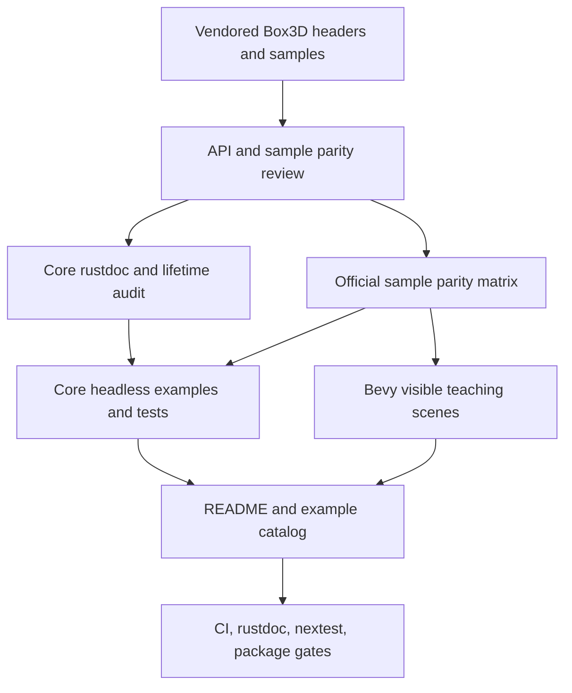

# Documentation and Official Example Parity - Plan

## Goal Capsule

| Field | Value |
|---|---|
| Objective | Finish the release-oriented documentation, lifetime-audit, and example-parity pass for `boxddd` and `bevy_boxddd`. |
| Authority | User request, vendored Box3D 0.1.0 headers and samples, existing `docs/api-coverage.md`, existing rustdoc/lifetime tracking docs, and current README/platform/CI conventions. |
| Execution profile | Documentation-first for public contracts, characterization-first for lifetime and example behavior, then visual/example polish backed by compile and smoke checks. |
| Stop conditions | Stop and surface a blocker if the audit finds an unsound safe API that cannot be fixed without changing the public product scope, or if an official sample needs upstream Box3D behavior that is not present in the vendored source. |
| Tail ownership | The implementation may break APIs, remove weak abstractions, and update examples/docs/CI together when that is the cleaner release shape. |

---

## Product Contract

### Summary

This plan completes the remaining public documentation and teaching-sample work by treating rustdoc, FFI lifetime notes, official Box3D sample parity, Bevy scenes, and release verification as one release-quality surface.
The plan does not attempt to port every upstream sample verbatim; it creates a traceable parity matrix, ports the useful teaching scenarios, and records deliberate deferrals.

### Problem Frame

`boxddd` now structurally classifies every vendored `B3_API` symbol and has substantial safe wrappers, examples, CI, package checks, and platform notes.
The remaining risk is not raw coverage count; it is whether users can trust the safe API contract from rustdoc and learn realistic integration patterns from examples.

The current rustdoc tracking file still marks events/callbacks and joints as needing semantic passes.
The example catalog is broad, but it is not yet driven by a first-class map from official Box3D sample categories to Rust examples, so users cannot see which upstream scenarios are supported, adapted, or deferred.

### Requirements

**Documentation contract**

- R1. Public rustdoc must describe Rust API semantics, invalid states, units, owner lifetimes, callback restrictions, and panic/error boundaries for the remaining core surfaces.
- R2. The FFI lifetime audit must be refreshed after the rustdoc pass and must explicitly decide whether token/drop-guard APIs are necessary for event views, recording, shape geometry views, callbacks, and task systems.
- R3. Existing tracking documents must reflect the final state and must not claim missing coverage that is already gated by tests.

**Official example parity**

- R4. The repository must contain a maintained parity matrix mapping vendored Box3D official sample categories to existing Rust examples, new ports, and deferred items with reasons.
- R5. Core `boxddd` examples must cover headless integration scenarios that do not need a renderer: events, body lifecycle/control, query/collision diagnostics, continuous-collision style checks, and character-mover style queries where the safe API supports them.
- R6. Bevy examples must provide visible 3D teaching scenes for the same high-value categories: stacking, shapes/materials, events, joints, collision/picking, mesh/compound terrain, and character/controller-style movement where feasible.
- R7. Examples must make static resource-backed collider demonstrations distinct from dynamic falling-body demonstrations so users do not misread static shapes as broken simulation.
- R8. A Bevy + egui teaching UI may be added for the testbed when it improves scene switching, pause/step controls, debug toggles, or tunable physics parameters, but it must remain example-only and not become a default `bevy_boxddd` dependency.

**Release and user guidance**

- R9. README and crate READMEs must stay user-focused: support status, version compatibility, example run commands, safety boundaries, and links to deeper docs without dumping maintainer-only detail.
- R10. CI, package checks, and documentation checks must include the new examples/docs so release artifacts prove the teaching surface is actually shipped.

### Acceptance Examples

- AE1. After the rustdoc pass, `docs/development/rustdoc-alignment.md` marks each core public module as aligned or records a precise follow-up reason that is not release-blocking.
- AE2. Event/callback docs explain transient buffers, safe owned snapshots, closure-scoped views, raw pointer limits, no-world-mutation callback rules, and `CallbackPanicked` behavior without requiring users to read Box3D headers.
- AE3. Joint docs explain family-specific APIs, wrong-family errors, limits, motors, spring frequency/damping, force/torque units, and angle/translation units.
- AE4. `docs/upstream-parity/box3d-sample-matrix.md` names every vendored official sample category and maps it to a Rust example, Bevy scene, test-only coverage, or explicit deferral.
- AE5. A Bevy user can run the documented testbed command and switch among scenes that visibly demonstrate falling stacks, advanced collider resources, events, joints, collision/picking, and debug draw.
- AE6. A release maintainer can run the documented package audit and see the new example/documentation files included in the generated crates where they are expected.

### Scope Boundaries

#### In Scope

- Finish semantic rustdoc for core `boxddd` event, callback, joint, query, debug, dynamic-tree, and lifetime-sensitive APIs.
- Add compile-time or doctest evidence for lifetime contracts where Rust can prove the guarantee.
- Add or restructure core and Bevy examples that teach high-value official Box3D sample categories.
- Update README, crate READMEs, example READMEs, platform docs, CI docs, and package inclusion checks to match the final example set.

#### Deferred to Follow-Up Work

- Exhaustive one-to-one ports of all upstream benchmark, issue-regression, and stress-test samples.
- Browser-rendered Bevy examples, WebGPU/WASM app packaging, and web-worker task integration.
- Full performance benchmarking parity with upstream Box3D samples.
- A separate `bevy_boxddd` repository or crate split outside this workspace.

#### Outside This Product's Identity

- Replacing Box3D's official sample renderer or vendoring a Rust clone of the sokol/imgui testbed.
- Treating raw `void*` user data as a typed Rust ownership API.

---

## Planning Contract

### Key Technical Decisions

- KTD1. Vendored Box3D 0.1.0 samples are the parity authority.
  The plan should not chase upstream `main` sample drift unless the vendored subtree is updated in the same work.
- KTD2. Documentation is part of the safe API, not a cosmetic pass.
  Rustdoc changes should land with tests or audit notes when they describe a lifetime, callback, panic, or invalid-handle guarantee.
- KTD3. Use a parity matrix instead of a blanket sample-port promise.
  The upstream sample suite includes benchmarks and issue repros that are valuable references but poor first-release teaching examples.
- KTD4. Keep core examples renderer-free unless the renderer is the point of the example.
  Visible 3D demonstrations belong primarily in `bevy_boxddd`; core examples should teach ownership, queries, events, deterministic replay, async/thread boundaries, and error handling.
- KTD5. Introduce token/drop-guard APIs only when the audit finds a public safe API that needs them.
  Existing closure-scoped event views and Rust borrows are acceptable until a new API needs borrowed transient data to escape a callback boundary.
- KTD6. Use Bevy + egui only as an example/testbed affordance.
  A control panel is useful for teaching pause, stepping, scene switching, debug draw toggles, and live parameters, but the library crate should stay renderer- and UI-agnostic by default.
- KTD7. Package and CI checks must move with the examples.
  Adding examples without package assertions and CI checks risks shipping docs that reference files missing from the crate archive.

### High-Level Technical Design

### Assumptions

- The plan may break public APIs if the lifetime audit finds a cleaner safe design.
- Official sample parity means "teaches the same concept in Rust" rather than "line-by-line C++ port."
- Bevy examples should favor native desktop teaching quality over early browser support.

### System-Wide Impact

This work affects public crate documentation, package contents, example commands, Bevy integration expectations, CI runtime, and release confidence.
It should be landed as cohesive commits so docs, examples, and validation do not drift.

### Sources and Research

- `boxddd-sys/third-party/box3d/include/box3d/box3d.h`
- `boxddd-sys/third-party/box3d/include/box3d/types.h`
- `boxddd-sys/third-party/box3d/samples/sample_*.cpp`
- `docs/api-coverage.md`
- `docs/development/rustdoc-alignment.md`
- `docs/development/ffi-lifetime-audit.md`
- `boxddd/examples/README.md`
- `bevy_boxddd/README.md`
- Official Box3D documentation: `https://box2d.org/documentation3d/`
- Official Box3D repository: `https://github.com/erincatto/box3d`

---

## Implementation Units

### U1. Build The Official Sample Parity Matrix

- **Goal:** Create the source-of-truth map from vendored Box3D official samples to Rust examples, Bevy scenes, test-only coverage, and explicit deferrals.
- **Requirements:** R4, R9, AE4.
- **Dependencies:** None.
- **Files:** `docs/upstream-parity/box3d-sample-matrix.md`, `boxddd/examples/README.md`, `bevy_boxddd/README.md`, `README.md`.
- **Approach:** Group upstream samples by their official category, map each category to the current Rust surface, and choose a small set of high-value ports for this plan.
  Benchmark, issue-repro, and renderer-specific samples should be marked deferred unless they expose a public API gap.
- **Patterns to follow:** `docs/upstream-parity/box3d-api-matrix.md`, `docs/api-coverage.md`, `boxddd/examples/README.md`.
- **Test scenarios:**
  - The parity matrix lists every official category found in the vendored `RegisterSample` declarations.
  - Existing Rust examples are mapped before creating new ones, so the plan does not duplicate `advanced_collision`, `dynamic_tree`, `recording_replay`, or Bevy `testbed_3d` coverage.
  - Deferred official samples include a reason such as benchmark-only, issue regression, renderer-specific, or unsupported browser/runtime surface.
- **Verification:** A reviewer can start from the matrix and explain which upstream sample concepts are covered by which Rust artifacts.

### U2. Finish Core Rustdoc Semantic Alignment

- **Goal:** Bring remaining core rustdoc from "missing-docs clean" to semantically aligned with Box3D behavior.
- **Requirements:** R1, R3, AE1, AE2, AE3.
- **Dependencies:** U1 for sample vocabulary only when examples reveal terminology.
- **Files:** `boxddd/src/events.rs`, `boxddd/src/callbacks.rs`, `boxddd/src/joints.rs`, `boxddd/src/joints/defs.rs`, `boxddd/src/joints/world_api.rs`, `boxddd/src/joints/distance.rs`, `boxddd/src/joints/motor.rs`, `boxddd/src/joints/parallel.rs`, `boxddd/src/joints/prismatic.rs`, `boxddd/src/joints/revolute.rs`, `boxddd/src/joints/spherical.rs`, `boxddd/src/joints/wheel.rs`, `boxddd/src/query.rs`, `boxddd/src/debug_draw.rs`, `boxddd/src/dynamic_tree.rs`, `docs/development/rustdoc-alignment.md`.
- **Approach:** Align docs against the vendored headers and existing safe-wrapper behavior.
  Prioritize lifetime-sensitive event APIs, callback return/panic rules, joint units and wrong-family errors, then the "mostly aligned" query/debug/tree modules.
- **Execution note:** Treat rustdoc as public API review; make small code refactors if a doc has to explain an awkward or misleading API shape.
- **Patterns to follow:** Existing aligned docs in `boxddd/src/world/runtime.rs`, `boxddd/src/world/creation.rs`, `boxddd/src/recording.rs`.
- **Test scenarios:**
  - Event view docs distinguish owned snapshots, safe closure-scoped borrowed views, and unsafe raw slices.
  - Callback docs state that world mutation inside filter/pre-solve callbacks is rejected by the safe API and that panics are caught and reported as `CallbackPanicked`.
  - Joint docs name radians, translation units, hertz, damping ratio, force, and torque where those values affect correct use.
  - Wrong joint-family calls are documented as fallible errors for `try_*` APIs and panics for convenience APIs.
- **Verification:** Core rustdoc builds with missing-docs denial and warning denial, and `docs/development/rustdoc-alignment.md` no longer leaves broad unreviewed module buckets.

### U3. Refresh FFI Lifetime Audit And Add Compile-Time Evidence

- **Goal:** Re-check lifetime-sensitive APIs after the rustdoc pass and add compile-time evidence where Rust can enforce no-escape contracts.
- **Requirements:** R2, AE2.
- **Dependencies:** U2.
- **Files:** `docs/development/ffi-lifetime-audit.md`, `boxddd/src/events.rs`, `boxddd/src/recording.rs`, `boxddd/src/shapes.rs`, `boxddd/src/core/task_system.rs`, `boxddd/tests/events_and_sensors.rs`, `boxddd/tests/recording.rs`, `boxddd/tests/shape_resources.rs`, `boxddd/tests/task_system.rs`.
- **Approach:** Audit event views, recording sessions, shape geometry views, compound bytes, callback contexts, and task-system callbacks as one ownership story.
  Prefer doctest `compile_fail` examples for no-escape borrowed event views before introducing new dependencies.
  Add RAII token APIs only if an existing safe method can otherwise be misused in safe Rust.
- **Execution note:** Characterize current safe behavior before changing public API shape.
- **Patterns to follow:** `docs/development/ffi-lifetime-audit.md`, `boxddd/tests/panic_across_ffi_is_caught.rs`, `boxddd/tests/task_system.rs`.
- **Test scenarios:**
  - A compile-fail example shows that a borrowed event view cannot be returned from `with_*_events_view`.
  - Recording bytes remain unavailable while a recording is attached to a live world.
  - Shape resource views remain tied to `&World` and cannot outlive the owning shape/world in safe Rust.
  - Task-system docs preserve the blocking `finishTask` requirement and tests still catch panics from enqueue, run, and finish.
- **Verification:** The audit document records a final token/drop-guard decision with evidence, not only intuition.

### U4. Add Core Headless Ports For High-Value Official Samples

- **Goal:** Add renderer-free Rust examples for official sample concepts that users need outside Bevy.
- **Requirements:** R5, R9, AE4.
- **Dependencies:** U1, U2.
- **Files:** `boxddd/Cargo.toml`, `boxddd/examples/events.rs`, `boxddd/examples/body_controls.rs`, `boxddd/examples/continuous_collision.rs`, `boxddd/examples/character_mover.rs`, `boxddd/examples/README.md`, `README.md`.
- **Approach:** Port concepts, not rendering.
  Use `events.rs` for sensor/contact/body/joint event flows, `body_controls.rs` for body type, kinematic, lock, and force/impulse behavior, `continuous_collision.rs` for shape-cast/time-of-impact style diagnostics available through the safe API, and `character_mover.rs` for mover-plane or capsule query workflows supported today.
- **Patterns to follow:** `boxddd/examples/shape_queries.rs`, `boxddd/examples/advanced_collision.rs`, `boxddd/examples/error_handling.rs`, `boxddd/examples/physics_thread.rs`.
- **Test scenarios:**
  - `events.rs` creates at least one sensor begin/end event, one contact or hit event, and one body move event, then reads them through safe APIs.
  - `body_controls.rs` demonstrates dynamic, kinematic, disabled/enabled, force, impulse, and transform synchronization behavior without relying on rendering.
  - `continuous_collision.rs` produces deterministic diagnostic output from shape cast or time-of-impact APIs for a fast-moving shape.
  - `character_mover.rs` gathers collision planes or mover results and explains what data an engine would feed to its controller.
- **Verification:** The new examples compile in normal example checks and at least the lightweight ones run as smoke checks during local release validation.

### U5. Expand Bevy Visible Teaching Scenes

- **Goal:** Make Bevy examples the primary visual learning path for 3D integration.
- **Requirements:** R6, R7, R8, R9, AE5.
- **Dependencies:** U1.
- **Files:** `bevy_boxddd/Cargo.toml`, `bevy_boxddd/examples/testbed_3d/main.rs`, `bevy_boxddd/examples/testbed_3d/scenes.rs`, `bevy_boxddd/examples/advanced_colliders_3d.rs`, `bevy_boxddd/examples/contact_messages_3d.rs`, `bevy_boxddd/examples/joint_gallery_3d.rs`, `bevy_boxddd/examples/support/mod.rs`, `bevy_boxddd/tests/testbed.rs`, `bevy_boxddd/README.md`, `README.md`.
- **Approach:** Expand the testbed into named scenes that mirror the parity matrix and keep standalone examples as good first-run demos.
  Split static resource-backed collider showcases from dynamic falling objects, and use labels, camera framing, lighting, and color choices that make the physics state readable.
  Add `bevy_egui` as a dev-dependency only if the testbed benefits from a visible control panel for pause, stepping, scene selection, debug draw toggles, and adjustable scene parameters.
- **Patterns to follow:** `bevy_boxddd/examples/falling_stack_3d.rs`, `bevy_boxddd/examples/testbed_3d/scenes.rs`, `bevy_boxddd/tests/testbed.rs`, Bevy 0.19 example style from `repo-ref/bevy/examples/3d`.
- **Test scenarios:**
  - Every testbed scene spawns without panic and creates valid native bodies/shapes after fixed updates.
  - Scene switching releases old native ids before new scene ids are used.
  - The advanced collider scene contains a static resource section and a separate dynamic falling-body section.
  - Contact/event scenes produce Bevy messages that can be read by example systems.
  - Joint scenes create each public declarative joint variant and visibly connect bodies.
  - If an egui panel is added, disabling the UI feature or skipping egui-specific startup still leaves the scene factories testable headlessly.
- **Verification:** Bevy example checks pass, and the documented visual commands produce native desktop windows with DX12 as the Windows default backend.

### U6. Strengthen Example And Scene Tests

- **Goal:** Add tests that prove the new examples and scene factories exercise the intended safe APIs without making CI depend on opening windows.
- **Requirements:** R5, R6, R8, R10.
- **Dependencies:** U4, U5.
- **Files:** `boxddd/tests/events_and_sensors.rs`, `boxddd/tests/world_runtime.rs`, `boxddd/tests/mover_api.rs`, `boxddd/tests/collision_validation.rs`, `bevy_boxddd/tests/testbed.rs`, `bevy_boxddd/tests/messages.rs`, `bevy_boxddd/tests/query.rs`, `bevy_boxddd/tests/joints.rs`.
- **Approach:** Keep windowed examples as compile/run documentation and add headless integration tests for the physics facts they demonstrate.
  Reuse existing world and Bevy plugin test harnesses rather than introducing a renderer test dependency.
- **Patterns to follow:** `bevy_boxddd/tests/testbed.rs`, `bevy_boxddd/tests/plugin_lifecycle.rs`, `boxddd/tests/events_and_sensors.rs`, `boxddd/tests/joint_runtime.rs`.
- **Test scenarios:**
  - Event examples have equivalent integration tests for sensor/contact/body/joint events.
  - Body-control examples have tests for dynamic motion, kinematic motion, enable/disable lifecycle, and stale id invalidation.
  - Collision/continuous examples have tests that assert hit fractions, normals, or overlap counts for deterministic inputs.
  - Bevy testbed tests cover every new scene variant and verify that native ids are released on despawn.
- **Verification:** `cargo nextest run -p boxddd` and `cargo nextest run -p bevy_boxddd` cover the example concepts without requiring a GPU.

### U7. Polish User-Facing Documentation

- **Goal:** Keep README and crate docs focused on what users need while linking detailed maintainer docs for deeper concerns.
- **Requirements:** R3, R9, AE1, AE4, AE6.
- **Dependencies:** U1, U2, U3, U4, U5.
- **Files:** `README.md`, `boxddd/examples/README.md`, `bevy_boxddd/README.md`, `docs/platforms/wasm.md`, `docs/development/ci.md`, `docs/development/rustdoc-alignment.md`, `docs/development/ffi-lifetime-audit.md`, `docs/upstream-parity/box3d-sample-matrix.md`.
- **Approach:** Keep the top-level README short and product-facing: what Box3D version is targeted, what is supported, how to run examples, how safety/errors/async/threading work, and where to read deeper docs.
  Put maintainer-only smoke details in `docs/development/ci.md`.
- **Patterns to follow:** Current top-level README structure, `dear-imgui-rs` style for binding-oriented build/release details, current `docs/development/ci.md` split.
- **Test scenarios:**
  - README includes the Box3D official repository link, compatibility table, support matrix, first-run core command, and first-run Bevy command.
  - WASM docs tell users support level and constraints without exposing internal smoke-test jargon in the top-level README.
  - Example READMEs include commands for all new examples and feature-gated commands where needed.
  - Tracking docs no longer contradict the final rustdoc and lifetime audit state.
- **Verification:** A new user can choose between core, Bevy, async/threading, math interop, and WASM docs from the README without reading CI internals.

### U8. Update CI, Package, And Release Gates

- **Goal:** Ensure CI and packaging prove the final docs/examples ship and keep compiling.
- **Requirements:** R10, AE6.
- **Dependencies:** U4, U5, U7.
- **Files:** `.github/workflows/ci.yml`, `.github/workflows/release-preflight.yml`, `.github/workflows/release-crates.yml`, `docs/development/ci.md`, `boxddd/Cargo.toml`, `bevy_boxddd/Cargo.toml`.
- **Approach:** Add new examples to cargo metadata, compile-check the relevant feature-gated examples, and extend package archive assertions to include the new public examples and parity docs.
  Keep GPU/window runtime out of CI unless a job already supports headless windowing.
- **Patterns to follow:** Existing `examples`, `docs and feature matrix`, `package`, `release-preflight`, and `release-crates` jobs.
- **Test scenarios:**
  - CI checks all non-feature-gated core examples with `cargo check -p boxddd --examples`.
  - Feature-gated core examples still have explicit check or run coverage.
  - Bevy examples compile with the features they require.
  - If the testbed gains a Bevy + egui control panel, CI compiles the egui-backed example path and package audits include any new testbed files.
  - Package audits assert that new examples and parity docs are included in generated crates where those files are part of the public release.
  - Release workflows keep using current non-deprecated actions and existing publish ordering.
- **Verification:** Local package commands and GitHub CI use the same example/doc inclusion assumptions.

---

## Verification Contract

| Gate | Applies To | Done Signal |
|---|---|---|
| `cargo fmt --all --check` | Workspace | Formatting is stable. |
| `cargo nextest run -p boxddd` | Core safe API and headless example concepts | Core integration tests pass. |
| `cargo nextest run -p bevy_boxddd` | Bevy plugin and headless scene behavior | Bevy integration tests pass. |
| `cargo test -p boxddd --doc` | Compile-fail and doctest lifetime evidence | Rustdoc examples compile or fail as documented. |
| `cargo rustdoc -p boxddd --all-features -- -D missing_docs` | Core public rustdoc | No missing public docs. |
| `cargo rustdoc -p bevy_boxddd --all-features -- -D missing_docs` | Bevy public rustdoc | No missing public docs. |
| `RUSTDOCFLAGS="-D warnings" cargo doc --workspace --no-deps` | Public documentation | Docs build warning-free. |
| `cargo check -p boxddd --examples` | Core examples | New and existing examples compile. |
| `cargo check -p bevy_boxddd --examples` plus required feature checks | Bevy examples | Windowed examples compile without opening windows. |
| Package audit commands from `docs/development/ci.md` | Release artifacts | New examples and docs are present in crate archives. |

Manual visual smoke for the final pass should include the Bevy falling stack, advanced colliders, joint gallery, contact messages, debug draw overlay, physics picking, and testbed commands documented in `bevy_boxddd/README.md`.

---

## Definition of Done

- All implementation units are complete or explicitly moved to a follow-up with a non-release-blocking reason.
- `docs/development/rustdoc-alignment.md` and `docs/development/ffi-lifetime-audit.md` reflect the final reviewed state.
- The official sample parity matrix exists and is linked from the relevant example docs.
- Core and Bevy examples compile, and the selected lightweight examples run locally as smoke checks.
- README and crate READMEs give users clear support status and example run commands without CI-internal noise.
- CI/package/release checks include the newly public examples and docs.
- Abandoned experimental code, unused examples, stale docs, and contradicted package assertions are removed before the work is considered done.
