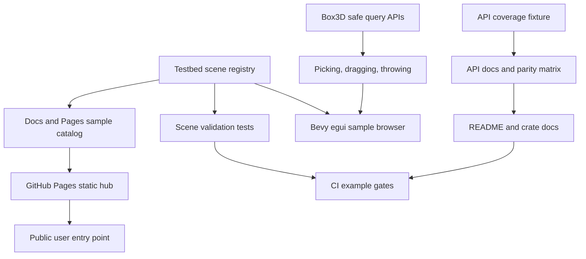

# Testbed Pages And API Polish - Plan

## Goal Capsule

| Field | Value |
|---|---|
| Objective | Turn the current safe Box3D binding release into a stronger product surface by improving the Bevy testbed, public demo story, API-boundary proof, and release-facing documentation. |
| Authority | User request and current repository state outrank older audit notes; current API coverage documents show no deferred upstream `B3_API` symbols. |
| Execution profile | Deep cross-crate work across examples, docs, CI, and public API claims. Breakage is allowed when it removes weak or misleading surfaces before the 0.1.x line settles. |
| Landing strategy | Work directly on local `main`, commit logical units after focused verification, and push `main` periodically when the tree is green. |
| Stop conditions | Stop only for a contradiction with current Box3D ownership constraints, a CI secret/Pages permission blocker, or a scope change that would turn the static demo hub into a live browser runtime project. |

---

## Product Contract

### Summary

This plan improves `boxddd` after the jBox3D comparison by borrowing its sample-browser and public-demo strengths while keeping `boxddd`'s Rust-first safety model. The active scope is a Bevy-centered teaching testbed, a GitHub Pages-ready demo hub, current API coverage proof, and documentation/CI that tell users exactly what is supported.

### Problem Frame

`boxddd` now has strong core wrapper coverage, release workflows, and a growing set of examples. The remaining product gap is that users cannot yet browse and understand the 3D physics surface as easily as they can in jBox3D's sample browser.

jBox3D's generated binding style is not a good Rust target because it leans on nullable native objects and manual disposal. Its sample registry, UI controls, web demo hub, and public example page are valuable because they reduce adoption friction and make engine capabilities inspectable.

The current `bevy_boxddd` testbed already has useful scenes and debug/picking code, but it is still keyboard-driven and not shaped like a teaching browser. The public docs also need to stay synchronized with the current API state: no deferred symbols remain, raw boundaries are intentional, and examples should be shown as part of the release artifact rather than as internal smoke details.

### Requirements

**Teaching Testbed**

- R1. The Bevy testbed must expose scenes through a metadata registry with category, display name, description, camera defaults, and spawn behavior.
- R2. The testbed must have an in-window UI for scene selection, pause/resume, stepping, substeps or time controls, gravity, sleeping, warm starting, continuous collision, debug draw presets, and reset.
- R3. The testbed must demonstrate direct physics interaction through picking, dragging, and throwing bodies without relying on Bevy mesh picking as the source of physics truth.
- R4. The scene set must include a small number of high-value visual scenes inspired by Box3D/jBox3D categories instead of trying to port every official sample.

**Public Demo And Documentation**

- R5. A GitHub Pages-ready demo hub must present crates, commands, screenshots or generated images, sample categories, and the native Bevy testbed as the recommended visual entry point.
- R6. README and crate READMEs must lead with user-facing support, install/run commands, version compatibility, examples, and release links without internal smoke-state noise.
- R7. The official sample parity matrix must stay honest: concept parity is the target, benchmark/issue/stress scenes are not first-release promises.

**API Boundary And Release Confidence**

- R8. API coverage docs and tests must state the current safe/raw/omitted split, keep the deferred bucket at zero, and avoid claiming full ordinary safe coverage for raw global hooks or raw user data.
- R9. FFI lifetime documentation must align public wrapper docs with ownership rules for world-owned ids, shape resources, borrowed native views, callback containment, and raw pointer escape hatches.
- R10. CI must prove the new teaching surface compiles or validates on appropriate targets without adding GPU-only requirements to normal crate checks.
- R11. Package and release checks must include the public docs/examples that users are expected to see from crates.io and GitHub.
- R12. The implementation may remove or rename misleading pre-1.0 APIs if the resulting surface better enforces invalid-state prevention and FFI ownership rules.

### Acceptance Examples

- AE1. A user running the Bevy testbed can choose scenes from an egui-style panel, toggle physics settings, reset the scene, and inspect debug overlays without memorizing keyboard shortcuts.
- AE2. A user can click or drag against Box3D-backed physics state and see a body respond, with the ray/query result coming from `boxddd`/`bevy_boxddd` physics queries.
- AE3. A visitor to the published demo hub can find crate links, current run commands, a sample gallery, and a clear note that native Bevy is the supported visual path while browser live demos remain a later WASM milestone.
- AE4. A maintainer can run API coverage tests and see every vendored upstream `B3_API` symbol classified as safe, raw, or omitted with no stale deferred entries.
- AE5. A release maintainer can run documented local package checks and see the new example/docs assets included or intentionally excluded with a documented reason.

### Scope Boundaries

This plan does not adopt jBox3D's generated `NativeObject` API style, nullable-handle ergonomics, or manual disposal model. Rust RAII ownership, typed errors, validation, and callback containment remain the identity of the crate.

This plan does not require a live Bevy Web demo. The GitHub Pages work starts as a static demo hub that can later host a WASM browser runtime after provider-mode packaging and browser rendering have their own focused plan.

This plan does not promise line-for-line parity with every official Box3D sample. It prioritizes representative teaching scenes, deterministic tests, and public documentation over cloning benchmark, issue, and robustness samples.

#### Deferred to Follow-Up Work

- Live browser demos for `wasm32-unknown-unknown` with Bevy or a lighter renderer after the provider runtime path has a stable asset story.
- A separate `bevy_boxddd` crate split if the in-workspace plugin becomes too large for the core repository release cadence.
- Full benchmark/stress sample parity once there is a measurement goal rather than a first-run teaching goal.

---

## Planning Contract

### Assumptions

- The user has already approved direct execution after planning, so the scoping confirmation gate is treated as off for this run.
- The current API coverage documents reflect the working tree better than earlier subagent gap reports; implementation should verify before changing code instead of re-adding already completed wrappers.
- `bevy_egui` is acceptable as an example/dev dependency for the testbed but should not become a required dependency of the `bevy_boxddd` library.
- Static Pages is the correct first public-demo slice because it gives users a shareable entry point without making browser runtime support the blocker.

### Key Technical Decisions

- KTD1. Keep the binding safety model Rust-native. jBox3D informs sample presentation, registry shape, and Pages deployment; it does not define `boxddd`'s public API style.
- KTD2. Make the testbed scene registry the source of truth for executable sample metadata. Scene metadata should drive the UI and headless tests directly, and Pages should consume a checked static catalog that is validated against the registry rather than hand-copying an unconstrained list.
- KTD3. Keep renderer and UI dependencies example-scoped. `boxddd` stays renderer-free, and `bevy_boxddd` library features remain minimal; UI and visual richness live in examples or optional testbed-only code.
- KTD4. Use Box3D queries for physics picking and keep drag control example-local. Bevy camera/ray utilities can produce rays, but hit testing and drag/throw targets come from `boxddd` query APIs; this plan should not expand the public `Joint` enum just to support a testbed drag tool.
- KTD5. Treat API coverage as a release contract, not marketing copy. `safe` means ordinary safe wrapper; `raw` and `omitted` remain visible and intentional rather than hidden behind a "complete" claim.
- KTD6. Validate visual examples without depending on GPU CI. Unit/integration tests should exercise scene registry, spawn/despawn lifecycle, and query/interaction logic; screenshots or rendered smoke runs stay local/manual or optional artifacts unless CI can run them reliably.
- KTD7. Push public pages through a separate workflow. CI should validate static site content, while a Pages workflow publishes on `main` without coupling crates.io release to the demo site.

### High-Level Technical Design

### System-Wide Impact

The work affects user-facing examples, crate documentation, CI runtime, release artifact expectations, and public API claims. It should not change the core simulation stepping semantics except where a pre-1.0 API cleanup is needed to preserve FFI safety or remove misleading names.

### Risks And Mitigation

| Risk | Mitigation |
|---|---|
| The Bevy testbed becomes a second application framework inside the repo. | Keep shared logic in small example modules and avoid promoting testbed UI helpers into `bevy_boxddd` unless they become reusable public API. |
| Adding `bevy_egui` bloats normal users. | Keep it in `bevy_boxddd` dev-dependencies and only use it from the `testbed_3d` example. |
| Pages creates a stale marketing surface. | Generate or validate its sample list from registry/docs where practical, and keep it static until live WASM has a dedicated owner. |
| Visual scenes become flaky in CI. | Test scene construction and physics invariants headlessly; keep GPU screenshots optional unless the workflow proves stable. |
| API coverage prose drifts from fixture counts. | Keep `api_coverage` nextest as the source of truth and update docs in the same unit as fixture changes. |

### Sources And Research

- `repo-ref/jBox3D` sample registry, sample controller, Pages workflow, and Web demo page were used as prior art for presentation and sample browsing.
- `bevy_boxddd/examples/testbed_3d/main.rs` and `bevy_boxddd/examples/testbed_3d/scenes.rs` show the current keyboard-driven testbed and scene list.
- `docs/api-coverage.md` and `docs/upstream-parity/box3d-api-matrix.md` show the current safe/raw/omitted API boundary and zero deferred symbols.
- `docs/upstream-parity/box3d-sample-matrix.md` shows concept parity and current partial/deferred sample areas.
- `.github/workflows/ci.yml`, `.github/workflows/release.yml`, `.github/workflows/release-preflight.yml`, and `.github/workflows/release-crates.yml` show the current CI and release shape.
- `docs/development/ci.md` records local CI/release commands and action-version rationale.

---

## Implementation Units

### U1. Testbed Scene Registry

- **Goal:** Replace the hard-coded scene enum flow with a metadata registry that can drive UI, tests, docs, and future Pages content.
- **Requirements:** R1, R4, R7, AE1
- **Dependencies:** None
- **Files:** `bevy_boxddd/examples/testbed_3d/scenes.rs`, `bevy_boxddd/examples/testbed_3d/main.rs`, `bevy_boxddd/tests/testbed.rs`, `docs/pages/sample-catalog.json` (created by U6, validated against this registry by U9)
- **Approach:** Introduce a registry item that carries stable id, category, name, description, camera defaults, and spawn function. Preserve existing scenes and old keyboard shortcuts through the registry so this unit is mostly structural before UI work.
- **Patterns to follow:** Current `ALL_SCENES` and `spawn_scene` split; `bevy_boxddd/tests/testbed.rs` for headless scene lifecycle coverage.
- **Test scenarios:**
  - Registry ids are unique and every entry has non-empty category, name, and description.
  - Every registry entry can spawn and despawn `TestbedEntity` entities without leaving owned Box3D ids behind.
  - Existing numeric scene shortcuts still select the first ten registry entries.
  - The static Pages sample catalog, when present, matches registry ids, names, categories, and descriptions.
- **Verification:** `cargo nextest run -p bevy_boxddd --test testbed` passes and the example still compiles.

### U2. Bevy Egui Testbed Controls

- **Goal:** Add an in-window control panel for sample browsing and core physics/debug settings.
- **Requirements:** R2, R6, AE1
- **Dependencies:** U1
- **Files:** `bevy_boxddd/Cargo.toml`, `bevy_boxddd/examples/testbed_3d/main.rs`, `bevy_boxddd/examples/testbed_3d/ui.rs`, `bevy_boxddd/examples/support/mod.rs`, `bevy_boxddd/tests/testbed.rs`
- **Approach:** Add `bevy_egui` as a dev/example dependency and keep all egui code inside the example tree. The UI should expose scene selection, pause, single step, reset, gravity, sleeping, warm starting, continuous collision, debug draw preset, and step tuning while preserving keyboard shortcuts as power-user paths.
- **Execution note:** This is user-visible UI work; validate at code level and with a local native run when possible, but do not make GPU rendering a normal CI requirement.
- **Patterns to follow:** Current testbed state resource; existing `BoxdddPhysicsSettings`, `BoxdddDebugDrawSettings`, and `World` runtime methods for toggles.
- **Test scenarios:**
  - UI state changes update `BoxdddPhysicsSettings` or the native `World` setting that owns the behavior.
  - Reset respawns the active registry scene and clears old `TestbedEntity` state.
  - Single-step advances physics while paused without leaving virtual time unpaused.
  - Missing optional debug features do not leak into the default `bevy_boxddd` library feature set.
- **Verification:** `cargo check -p bevy_boxddd --example testbed_3d --features "debug-gizmos physics-picking"` passes, and focused testbed nextest coverage passes.

### U3. Physics Picking Drag And Throw

- **Goal:** Add interaction tools that let users pick, drag, and throw physics bodies using Box3D query results.
- **Requirements:** R3, R4, AE2
- **Dependencies:** U1, U2
- **Files:** `bevy_boxddd/examples/testbed_3d/main.rs`, `bevy_boxddd/examples/testbed_3d/interaction.rs`, `bevy_boxddd/examples/testbed_3d/scenes.rs`, `bevy_boxddd/tests/query.rs`, `bevy_boxddd/tests/testbed.rs`
- **Approach:** Convert camera rays into Box3D ray casts, track a selected dynamic body, and use an example-local drag resource with target velocity, impulse, or transform-follow control. Do not add motor joints to the public Bevy `Joint` enum in this unit; if a public motor-joint component becomes necessary, split that into a separate API unit with its own tests.
- **Patterns to follow:** Existing `draw_physics_pick`, `physics_picking_3d` example, and jBox3D's ray-cast-plus-drag concept adapted without adopting its API style.
- **Test scenarios:**
  - Ray picking ignores non-hit rays and selects the closest dynamic physics body when one is hit.
  - Drag start creates exactly one example-local control resource, drag update changes the target, and drag release removes it.
  - Throwing spawns a dynamic body with a collider, a visible mesh, and an initial velocity along the camera ray.
  - Static bodies are not made draggable unless an explicit tool mode says they are.
- **Verification:** Focused query/joint tests pass and the testbed example compiles with its required features.

### U4. High-Value Visual Scenes

- **Goal:** Add representative scenes that make the testbed feel like a 3D physics showcase without chasing full sample parity.
- **Requirements:** R4, R7, AE1
- **Dependencies:** U1
- **Files:** `bevy_boxddd/examples/testbed_3d/scenes.rs`, `bevy_boxddd/tests/testbed.rs`, `docs/upstream-parity/box3d-sample-matrix.md`
- **Approach:** Add a bounded set of visually distinct scenes: domino or jenga stack, card-house or arch, conveyor/wind-style interaction, gyroscopic/weeble body behavior, ragdoll-lite joint chain, and far-stack or large-world teaching scene if it can be stable. Prefer scenes that exercise existing safe APIs and Bevy components over complex asset rigs.
- **Patterns to follow:** Existing falling stack, advanced colliders, materials, and joints scene construction.
- **Test scenarios:**
  - Every new scene appears in the registry with a category and description.
  - Every new scene spawns at least one dynamic body and at least one collider.
  - Joint-heavy scenes create valid joint ids and clean them up on despawn.
  - Wind/conveyor-style scenes use safe wrapper APIs or documented component systems rather than raw pointers.
- **Verification:** `cargo nextest run -p bevy_boxddd --test testbed` passes and the sample parity matrix names the added concepts accurately.

### U5. Testbed Validation And Optional Screenshots

- **Goal:** Add a repeatable way to validate all testbed scenes and optionally produce visual artifacts for docs/Pages.
- **Requirements:** R5, R10, AE1, AE5
- **Dependencies:** U1, U4
- **Files:** `bevy_boxddd/tests/testbed.rs`, `bevy_boxddd/examples/testbed_3d/main.rs`, `bevy_boxddd/examples/testbed_3d/validation.rs` (only if example-local screenshot helpers are needed), `.github/workflows/ci.yml`, `docs/development/ci.md`
- **Approach:** Treat `bevy_boxddd/tests/testbed.rs` as the only required CI headless validation gate. It should instantiate every registry scene, step physics, and verify lifecycle invariants without `DefaultPlugins` or a window. Screenshots are local-only unless a later change proves a renderer path stable enough for CI.
- **Execution note:** Extend the existing `TimePlugin`-based testbed tests first. Add example CLI validation only if it can exit before window/render plugin setup.
- **Patterns to follow:** Current Bevy example checks in CI; existing package/example gating in `docs/development/ci.md`.
- **Test scenarios:**
  - Validation visits every scene registry entry once.
  - A scene that fails to spawn returns a clear error instead of silently continuing.
  - Validation runs without a visible GPU window in CI.
  - Optional screenshot output uses a deterministic directory and is not required for package publication.
- **Verification:** `cargo nextest run -p bevy_boxddd --test testbed` is the CI validation gate, and `docs/development/ci.md` documents screenshots as local-only if they exist.

### U6. GitHub Pages Demo Hub

- **Goal:** Add a public static demo hub inspired by jBox3D's Pages presence while staying honest about native-vs-browser support.
- **Requirements:** R5, R6, R7, R10, AE3
- **Dependencies:** U1, U4, U5
- **Files:** `.github/workflows/pages.yml`, `docs/pages/index.html`, `docs/pages/sample-catalog.json`, `docs/pages/assets/`, `README.md`, `docs/development/ci.md`, `docs/platforms/wasm.md`
- **Approach:** Create a static Pages site with crate links, install/run commands, supported target summary, sample gallery sourced from `docs/pages/sample-catalog.json`, screenshots or static images, and links back to README/docs. The workflow should validate the static site and publish from `main`; live WASM demos stay explicitly future work.
- **Patterns to follow:** Existing GitHub Actions style in `.github/workflows/ci.yml`; jBox3D Pages workflow as the prior-art shape; README badge/link conventions.
- **Test scenarios:**
  - Pages workflow uploads only the static site artifact and does not run crates.io release steps.
  - Site content links to crates.io, docs.rs, repository docs, and current example commands.
  - `docs/pages/sample-catalog.json` mirrors the registry entries needed by the gallery.
  - Browser-live support is described as future or experimental, not as a supported runtime path.
  - Local static-site validation catches missing linked assets.
- **Verification:** Workflow syntax validates with `actionlint`, static file checks pass, and README links point to the future Pages URL without replacing docs.rs/crates.io links.

### U7. API Coverage And FFI Boundary Polish

- **Goal:** Re-audit the current API coverage and lifetime documentation so public claims match the actual safe/raw boundary after recent wrappers.
- **Requirements:** R8, R9, R12, AE4
- **Dependencies:** None
- **Files:** `docs/api-coverage.md`, `docs/upstream-parity/box3d-api-matrix.md`, `docs/development/ffi-lifetime-audit.md`, `boxddd/tests/api_coverage.rs`, `boxddd/tests/fixtures/api_coverage_symbols.txt`, public rustdoc in `boxddd/src/`
- **Approach:** Verify the fixture against vendored headers, remove stale deferred language, strengthen raw-boundary text, and align module docs for borrowed native views, resource ownership, callback panic containment, raw user data, and non-`Send`/non-`Sync` types. Do not turn process-global hooks or raw pointer user data into ordinary safe APIs just to improve coverage percentages.
- **Patterns to follow:** Current `docs/api-coverage.md` safe boundary rules, `boxddd/src/raw.rs`, resource wrappers in `boxddd/src/resources.rs`, callback modules, and prior lifetime audit document.
- **Test scenarios:**
  - `api_coverage` fails if a vendored public symbol is unclassified.
  - A fixture entry marked `safe` has a public wrapper path or a documented safe indirect path.
  - Raw user-data APIs remain clearly unsafe and raw-named.
  - Rustdoc examples for lifetime-sensitive APIs avoid returning borrowed native memory beyond the owner.
- **Verification:** `cargo nextest run -p boxddd --test api_coverage` passes and docs no longer contradict the fixture counts.

### U8. README And Crate Documentation Refresh

- **Goal:** Make top-level and crate READMEs read like public release documentation instead of internal build notes.
- **Requirements:** R6, R7, R8, R9, AE3, AE4
- **Dependencies:** U4, U6, U7
- **Files:** `README.md`, `boxddd-sys/README.md`, `bevy_boxddd/README.md`, `boxddd/examples/README.md`, `bevy_boxddd/examples/README.md` (create), `docs/platforms/wasm.md`, `docs/upstream-parity/box3d-sample-matrix.md`
- **Approach:** Continue using the workspace README for the `boxddd` crate unless a later release explicitly changes `boxddd/Cargo.toml`. Lead with what users can install, what Box3D version is targeted, what platforms are supported, how to run core and Bevy examples, and how to interpret WASM. Move detailed smoke states and release-maintainer commands into `docs/development/ci.md` instead of the README.
- **Patterns to follow:** Current top-level README structure, Bevy README's concise project positioning, and binding-crate release notes style already used in `docs/development/ci.md`.
- **Test scenarios:**
  - README contains a version compatibility table and supported-platform summary without exposing internal smoke-state jargon.
  - Bevy testbed commands include required features and renderer backend hints where useful.
  - WASM docs state compile-only/provider/WASI support in user terms and keep live browser demos out of supported claims.
  - Crate READMEs remain valid for crates.io rendering and do not depend on repo-local absolute paths.
- **Verification:** `cargo package --list` confirms README/docs assets expected by each crate are present, and rendered markdown has no manual hard-wrapped changelog-style prose.

### U9. CI Package And Release Gate Integration

- **Goal:** Integrate the new public demo/testbed surface into CI and release checks without making normal builds fragile.
- **Requirements:** R10, R11, AE5
- **Dependencies:** U2, U5, U6, U8
- **Files:** `.github/workflows/ci.yml`, `.github/workflows/pages.yml`, `.github/workflows/release-preflight.yml`, `.github/workflows/release-crates.yml`, `docs/development/ci.md`, `Cargo.toml`, `bevy_boxddd/Cargo.toml`, `xtask/src/main.rs`
- **Approach:** Add focused checks for testbed compile, `bevy_boxddd/tests/testbed.rs` validation, static Pages validation, sample-catalog validation against the registry, actionlint compatibility, and package-list expectations. Keep existing native/feature/WASM/release checks intact, and avoid adding GPU runtime tests to default CI.
- **Patterns to follow:** Current native nextest matrix, package audit commands, release preflight ordering, and action version policy in `docs/development/ci.md`.
- **Test scenarios:**
  - CI validates the Bevy testbed example with required features.
  - CI or preflight validates Pages static assets without publishing from pull-request contexts.
  - Package audits include the docs/examples that crates.io users need.
  - Static Pages validation fails if the sample catalog drifts from the testbed registry.
  - Release workflows keep tag/version/changelog checks and are not coupled to Pages deployment.
- **Verification:** `actionlint`, workspace formatting, relevant nextest gates, package dry-runs, and static-site validation all pass locally before push.

---

## Verification Contract

| Gate | Applies to | Done signal |
|---|---|---|
| `cargo fmt --all -- --check` | All Rust units | Formatting is stable. |
| `cargo nextest run -p boxddd --test api_coverage` | U7 | Vendored public `B3_API` symbols remain fully classified with no deferred entries. |
| `cargo nextest run -p boxddd` | U7 and wrapper-doc regressions | Core safe wrapper tests pass. |
| `cargo nextest run -p bevy_boxddd` | U1-U5 | Bevy plugin and headless testbed tests pass. |
| `cargo check -p bevy_boxddd --example testbed_3d --features "debug-gizmos physics-picking"` | U2-U5 | The visual testbed compiles with required example features. |
| `actionlint` | U6, U9 | Workflow syntax is valid and current action inputs are accepted. |
| Static site validation chosen by U6 | U6, U9 | Pages files have no missing local assets or broken required links. |
| Package dry-runs from `docs/development/ci.md` | U8, U9 | `boxddd-sys`, `boxddd`, and `bevy_boxddd` package cleanly with local registry patches. |
| `cargo nextest run --workspace` | Final regression | Native workspace behavior remains green before push. |

---

## Definition of Done

- The Bevy testbed has a metadata-driven scene browser, in-window controls, Box3D-backed picking/dragging/throwing, representative visual scenes, and headless validation.
- The new public demo hub can be published by GitHub Pages and clearly routes users to crates, docs, examples, screenshots, and current support boundaries.
- README and crate docs describe install, version compatibility, examples, API coverage, WASM support, and release commands from a user perspective.
- API coverage and FFI lifetime docs match the current fixture and do not overstate ordinary safe coverage for raw/global/pointer APIs.
- CI validates testbed compile/validation, static Pages assets, action workflow syntax, package contents, and existing native/WASM/release gates.
- All abandoned experimental code, stale doc claims, and superseded sample listings are removed before final completion.
- Changes are landed as logical conventional commits on local `main` and pushed to `origin/main` after green verification checkpoints.
