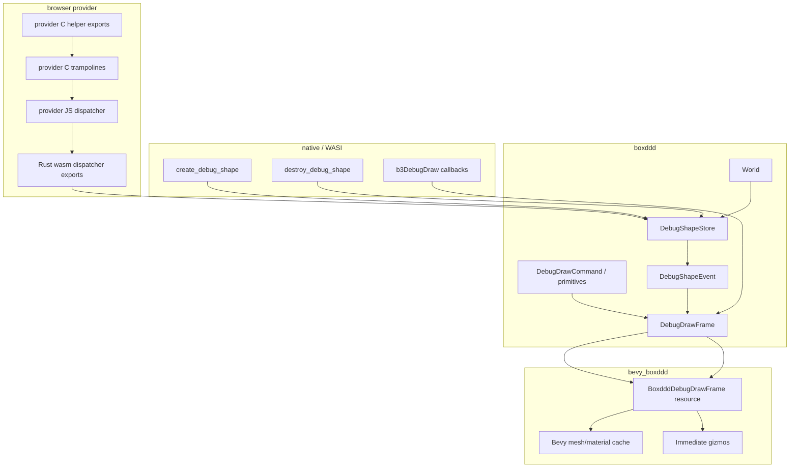
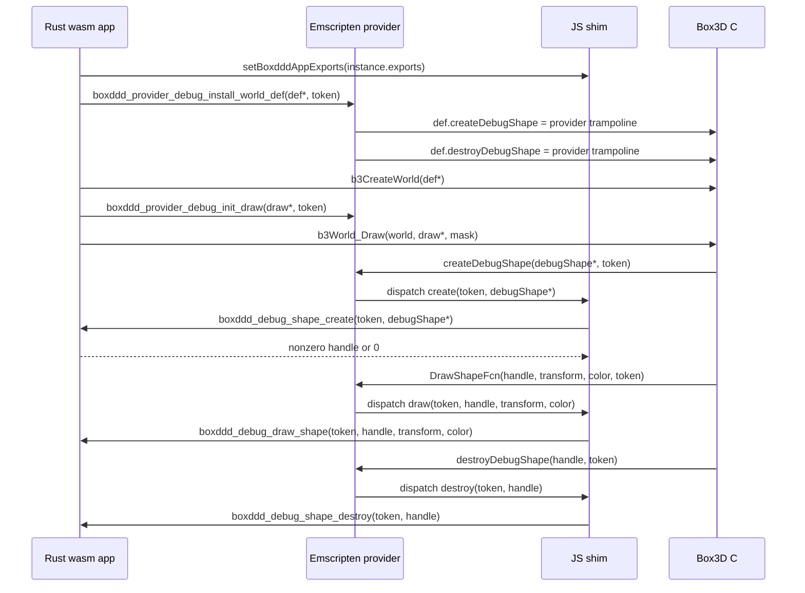
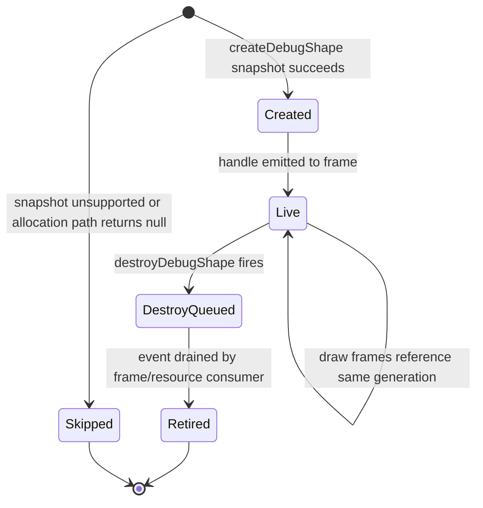

# Debug Draw WASM Callback Bridge - Plan

## Goal Capsule

| Field | Decision |
|---|---|
| Objective | Replace the current metadata-only debug draw wrapper with a data-oriented debug frame API that models Box3D's debug shape lifecycle and works in native, WASI, and browser provider WASM. |
| Authority | User request and vendored Box3D headers are authoritative; repo safety rules in `docs/platforms/wasm-callbacks.md`, `docs/development/ffi-lifetime-audit.md`, and existing callback guard patterns constrain the implementation. |
| Execution profile | Breaking changes are allowed; remove obsolete debug draw abstractions instead of layering compatibility over the wrong lifecycle. |
| Tail ownership | The implementation must land on local `main`, may be committed in coherent slices, and should be pushed when the user asks or when CI proof is needed. |
| Stop conditions | Stop only for an upstream ABI fact that contradicts the bridge model, a missing toolchain required by the Verification Contract, or a product decision that would expand beyond debug draw into all callback-heavy APIs. |

---

## Product Contract

### Summary

`boxddd` should support Box3D debug drawing as a real renderer integration surface, not only as a list of per-frame primitives.
Box3D debug draw has two callback layers: `WorldDef` owns `createDebugShape` and `destroyDebugShape` for persistent per-shape resources, while `b3DebugDraw` owns per-frame draw callbacks that reference those persistent resources.
The current Rust wrapper only exposes `shape_id` and `shape_type`, blocks browser provider mode, and forces Bevy to render shape commands as axes plus tiny marker spheres.
This plan makes debug draw a first supported cross-module callback bridge while keeping query, contact, dynamic-tree, and task callbacks on their existing explicit unsupported paths.

### Problem Frame

The browser provider runtime already proves shared-memory imports from an Emscripten Box3D module, but callback-heavy APIs are intentionally blocked because a Rust function pointer from the app module is not callable from the provider module without an agreed trampoline, table, ownership, and panic policy.
Debug draw is the right first bridge because it mostly copies geometry values and emits renderer events, while task callbacks require blocking `finishTask` semantics and query/contact callbacks have user-controlled early-stop or simulation mutation concerns.
The safe API should make the official lifecycle hard to misuse: renderer resources are created from owned geometry snapshots, per-frame draw commands reference generational handles, and Bevy consumes events outside the Box3D callback stack.

### Actors

- A1. Core Rust user: collects debug draw data from `boxddd` without depending on Bevy or wgpu.
- A2. Bevy user: enables a debug overlay in a normal Bevy app and sees actual Box3D shape geometry.
- A3. Browser demo user: opens a GitHub Pages example and sees provider-backed Bevy + egui debug draw behavior without a JavaScript-only substitute.
- A4. Maintainer: can prove native and provider callback behavior in CI and keep unsupported callback surfaces explicit.

### Requirements

**Core Debug Model**

- R1. The public debug draw API must expose owned debug shape lifecycle events for creation and destruction, including enough geometry data for a renderer to build persistent meshes.
- R2. Per-frame draw commands must reference stable typed debug shape handles instead of raw `void*` pointers or metadata-only `DebugShape` values.
- R3. Shape geometry snapshots must cover sphere, capsule, hull, mesh, height-field, and compound debug shapes without exposing borrowed Box3D pointers beyond the callback.
- R4. `HexColor` handling must preserve the full Box3D debug color payload, including the material preset stored in the high byte, while keeping RGB helpers ergonomic.
- R5. Create failure semantics must be explicit: unsupported or failed shape snapshot creation skips that shape through a null user shape and reports an observable safe error or frame diagnostic.

**Native And WASI Callback Safety**

- R6. Native and WASI debug draw must keep the existing guarantees: no Rust unwind crosses C, reentrant safe `World` calls fail with `Error::InCallback`, invalid options are rejected before FFI, and Box3D calls remain serialized by the crate lock.
- R7. Destroy events must be handled safely when they happen outside a draw call for ordinary world-owned shapes, including shape/body destruction and geometry replacement; world teardown invalidates all debug handles through a terminal clear contract instead of promising per-shape destroy events.
- R8. The safe API must not expose the upstream `DrawShapeFcn` boolean as reliable flow control because the current upstream draw loop does not use it as a public early-stop contract.

**Browser Provider Bridge**

- R9. Browser provider mode must support debug draw collection through provider-local C trampolines and JavaScript dispatch back to exported Rust functions, not by passing Rust function pointers into the provider module.
- R10. Provider callback tokens and debug shape handles must be integer-backed and generation-checked so the provider never stores Rust pointers and stale handles cannot alias a new shape silently.
- R11. The provider bridge must copy transient `b3DebugShape` and draw callback values immediately from shared memory, and JavaScript memory views must be refreshed after potential memory growth.
- R12. Provider-mode guardrails must change only for debug draw; query visitors, dynamic-tree visitors, contact/material callbacks, and task-system callbacks must keep returning `Error::UnsupportedOnWasm`.

**Bevy And Examples**

- R13. `bevy_boxddd` must consume debug shape create/destroy events in normal ECS systems and must not create meshes, materials, or render resources inside Box3D callbacks.
- R14. The Bevy debug overlay and testbed debug scene must render real cached shape geometry when debug shape assets exist, falling back only for immediate primitives such as lines, points, bounds, transforms, and strings.
- R15. The GitHub Pages example build must continue publishing direct Bevy + egui WASM pages, and the debug draw page must be a real provider-backed Bevy example after this bridge lands.

**Documentation And Release Contract**

- R16. README, crate READMEs, WASM docs, API coverage docs, and rustdoc must describe debug draw as supported in provider mode while keeping other callback-heavy surfaces explicitly unsupported.
- R17. The plan must not claim full arbitrary callback support, threaded browser scheduling, pthreads, Atomics, or user-defined provider callbacks.

### Key Flows

- F1. Native frame collection: A core user creates a world, creates shapes, calls the new debug frame collection API, receives created debug shape assets plus visible draw commands, calls it again, and sees stable handles reused without duplicate create events.
- F2. Shape lifecycle mutation: A core user replaces or destroys a shape after it has been drawn, then the next frame exposes a destroy event and no command references the retired handle.
- F3. Bevy debug overlay: A Bevy user enables the debug draw preset, `bevy_boxddd` collects a frame after physics stepping, a follow-up system updates cached meshes/materials from events, and rendering uses normal Bevy resources.
- F4. Browser provider frame collection: The Rust wasm app initializes the provider, registers app exports with the provider shim, creates a world whose `WorldDef` is patched by provider-local debug callbacks, draws a frame, and receives shape events and draw commands through the JS dispatcher.
- F5. Unsupported callback guardrail: The provider smoke still proves that world query visitors, dynamic tree callbacks, contact callbacks, material callbacks, and task system callbacks reject with `Error::UnsupportedOnWasm`.

### Acceptance Examples

- AE1. Given a native world with a cube and a sphere, when the first debug frame is collected, then the frame contains two create events with owned geometry snapshots and shape draw commands referencing nonzero typed handles.
- AE2. Given the same world, when a second debug frame is collected without modifying shapes, then no duplicate create events are emitted and the draw commands reference the same handles and generations.
- AE3. Given a shape that has already emitted a debug handle, when it is destroyed before the next draw, then a destroy event is queued and the handle is marked retired before renderer caches are updated.
- AE4. Given a provider-mode browser smoke, when debug draw collection runs, then it returns a frame with at least one created shape and one draw command instead of `Error::UnsupportedOnWasm`.
- AE5. Given the same provider-mode smoke, when `overlap_aabb`, dynamic tree query, custom filter, pre-solve, material mix, or task-system callbacks are exercised, then each still returns `Error::UnsupportedOnWasm`.
- AE6. Given a Bevy testbed debug scene, when the debug draw preset is enabled, then the visible overlay uses cached shape geometry and immediate gizmos instead of axes-plus-marker placeholders for every shape.
- AE7. Given a debug shape color created by Box3D with a high-byte material preset, when Rust converts it to and from `HexColor`, then the raw color payload round-trips and RGB helpers still expose the lower 24 bits.
- AE8. Given a WASI runtime smoke with a source-built Box3D module, when debug draw collection runs under `wasmtime`, then shape lifecycle and frame collection work through the same safe API as native.

### Scope Boundaries

- SB1. This plan supports Box3D debug draw callbacks only; it does not implement query visitor, dynamic tree visitor, contact/filter/material, recording replay debug-shape, or task-system provider bridges.
- SB2. This plan does not add browser worker, pthread, `SharedArrayBuffer`, Atomics, or multithreaded task-system support.
- SB3. This plan does not expose arbitrary user callbacks from browser provider mode; public consumption is a data frame plus events.
- SB4. This plan may break `DebugDraw`, `DebugShape`, and `DebugDrawCommand` source compatibility to replace them with the lifecycle-correct model.
- SB5. This plan does not promise production-grade rendering materials; Bevy output is a teaching and integration surface that must be visually truthful and maintainable.

### Sources

- `boxddd-sys/third-party/box3d/include/box3d/types.h` defines `b3WorldDef`, `b3DebugShape`, and `b3DebugDraw`.
- `boxddd-sys/third-party/box3d/docs/loose_ends.md` describes the two-layer debug draw lifecycle and mask behavior.
- `boxddd-sys/third-party/box3d/samples/gfx/debug_adapter.c` is the upstream sample pattern for persistent debug shape resources and compound flattening.
- `docs/platforms/wasm-callbacks.md` defines the existing provider callback bridge direction and safety contract.
- `docs/development/ffi-lifetime-audit.md` records current callback guard, panic containment, and token-guard decisions.
- Emscripten's official interacting-with-code documentation is the external reference for function pointer table bridging and signature-sensitive JavaScript function registration.

---

## Planning Contract

### Key Technical Decisions

- KTD1. Data frame API replaces callback-first public rendering. `boxddd` should expose a `DebugDrawFrame`-style object containing lifecycle events, owned shape assets, immediate primitives, and diagnostics; renderer-specific code consumes that data later instead of running inside Box3D callbacks.
- KTD2. Debug shape handles are crate-owned generational tokens. Native callbacks may internally box or encode handles, but public commands use `DebugShapeHandle` with an index and generation so destroy/recreate cycles cannot silently reuse stale renderer resources.
- KTD3. Debug shape assets are owned immutable snapshots. Sphere and capsule copy primitive fields; hull, mesh, and height-field snapshots expose owned debug mesh data rather than world-bound borrowed references; compound snapshots flatten children once using the upstream sample's shape-child pattern.
- KTD4. Browser provider callbacks are provider-local function pointers. Rust asks provider helper functions to patch `b3WorldDef` and `b3DebugDraw` with C trampolines compiled into the Emscripten provider; JavaScript dispatches those trampolines back into exported Rust functions by token.
- KTD5. No user code runs in create/destroy callbacks. The core callback layer records owned events and diagnostics, which avoids unreportable user panics during ordinary shape destruction, body destruction, geometry replacement, and world-resource teardown.
- KTD6. Per-frame callbacks remain immediate data capture. The only callback-time work is copying values and appending commands; Bevy mesh/material allocation and user rendering work happen after Box3D returns.
- KTD7. Provider panic policy is conservative. Native and WASI keep `Error::CallbackPanicked` where Rust `catch_unwind` is available; browser provider exports return primitive error codes and do not promise recovery from aborting Rust panics.
- KTD8. Existing unsupported callback guardrails stay explicit. The bridge infrastructure can be reusable, but implementation and docs only flip debug draw to supported provider mode in this plan.
- KTD9. Provider callbacks use a first-error status channel. Each active provider token owns diagnostics plus a first-error slot; JavaScript reports missing exports, memory-read failures, stale tokens, and Rust dispatcher error codes there; C trampolines map failures to ABI-safe null or false results; Rust drains the slot after `b3World_Draw`, returning `Err` for bridge infrastructure failures while keeping per-shape snapshot skips as frame diagnostics.
- KTD10. Bevy debug rendering has a strict schedule contract. Physics stepping collects the frame, a cache system applies create/destroy/clear events, and rendering systems consume the updated cache plus immediate primitives; commands referencing missing assets are ignored with diagnostics rather than creating assets inside callbacks.

### High-Level Technical Design

The public surface becomes a lifecycle-aware frame collector with one internal bridge per runtime family.

Provider mode uses two registration moments.
World creation installs debug shape lifecycle callbacks into `b3WorldDef` before `b3CreateWorld`.
Frame collection asks the provider helper to initialize a `b3DebugDraw` struct with provider-local draw callback function pointers before calling `b3World_Draw`.

Debug shape handles follow a small state machine.

### Sequencing

1. Build and test the runtime-neutral debug data model before touching provider mode.
2. Refactor native callbacks to write lifecycle events and frame commands into the new store while preserving current native tests.
3. Add provider helper functions and JavaScript dispatcher wiring behind provider cfg, then flip only debug draw provider guardrails.
4. Update Bevy resources and examples to consume frame data and render actual shape assets.
5. Expand docs, API coverage fixtures, provider smoke, Pages validation, and CI expectations after both native and provider behavior are proven.

### System-Wide Impact

- `boxddd` public API changes affect examples, tests, serde fixtures, rustdoc, README snippets, and any code importing `DebugDraw`, `DebugShape`, or `DebugDrawCommand::Shape`.
- `boxddd-sys` gains provider helper symbols that are not upstream Box3D APIs, so they must be cfg-gated, documented as support glue, and excluded from upstream public API coverage counts.
- `xtask` provider export collection must include helper imports automatically and must package any JS callback dispatcher support with both provider smoke and Pages artifacts.
- `bevy_boxddd` debug draw resources move from a command-only buffer to a frame/event/cache model, so plugin initialization, tests, examples, and prelude exports change together.
- Browser examples become a stronger claim: the debug draw page must be real Bevy + egui provider-backed behavior, not a placeholder or SVG substitute.

### Risks And Mitigations

| Risk | Mitigation |
|---|---|
| Cross-module callback ABI traps in browser provider mode | Keep all callable function pointers inside the provider module and cross back to Rust through JavaScript dispatcher exports with primitive arguments. |
| Borrowed Box3D debug geometry escaping the callback | Copy all fields into owned Rust debug assets before user code or Bevy sees them. |
| Destroy events happen when no frame collector is active | Store lifecycle events in the world-owned debug shape store and drain them on the next frame/resource update. |
| World drop cannot return errors | Treat world teardown as terminal invalidation: per-shape destroy events are best-effort before drop, and renderer integrations must clear all cached debug handles when the owning world/context is removed. |
| Bevy borrow conflicts or GPU resource creation inside callbacks | Queue events and update `Assets<Mesh>`/materials in ordinary Bevy systems after physics stepping. |
| Wasm memory growth invalidates JavaScript views | JS dispatcher constructs fresh `DataView`/typed-array views for each callback or after every app/provider call that may grow memory. |
| Provider helper names collide with upstream future APIs | Prefix helper exports with `boxddd_provider_` and keep them in project-owned headers/modules, not upstream vendored headers. |
| Debug color material preset is lost | Store full raw color and expose RGB as a view over the lower 24 bits. |

### Resolved During Planning

- D1. The first provider callback bridge is debug draw, not the generic callback subsystem, because debug draw can be data-oriented and does not require simulation mutation or blocking worker semantics.
- D2. Debug shape creation/destruction should not be user callbacks in the public safe API; users get events and owned assets instead.
- D3. The Bevy renderer should not be the source of truth for physical picking or shape lifecycle; it consumes core debug events and remains separate from physics query APIs.
- D4. WASI stays in scope as a runtime proof because `wasm32-wasip1` links Box3D in the same module; the plan adds a WASI smoke gate instead of relying on native tests by implication.

### Deferred Questions

- Q1. Whether `b3RecPlayer_SetDebugShapeCallbacks` should reuse the same debug shape lifecycle store is deferred until recording replay visualization is prioritized.
- Q2. Whether provider-mode query visitors should reuse the JS dispatcher infrastructure is deferred to a dedicated query callback bridge plan.
- Q3. Whether to expose richer material presets as a renderer-agnostic enum beyond raw color preservation is deferred until Bevy rendering proves what material metadata is useful.

---

## Implementation Units

### U1. Debug Frame Data Model

- **Goal:** Replace metadata-only debug draw types with lifecycle-aware owned data types that can represent Box3D debug shape assets and per-frame primitives.
- **Requirements:** R1, R2, R3, R4, R5, R8, AE1, AE2, AE7.
- **Files:** `boxddd/src/debug_draw.rs`, `boxddd/src/lib.rs`, `boxddd/src/prelude.rs` if present, `boxddd/tests/debug_draw.rs`, `boxddd/tests/serde_values.rs`, `docs/api-coverage.md`.
- **Approach:** Introduce typed debug shape handles, debug shape assets, debug shape events, and debug draw frames; remove or sharply demote the old `DebugDraw` trait if it no longer expresses the lifecycle correctly.
- **Test scenarios:** Native frame creation emits owned shape assets; repeated collection reuses handles without duplicate create events; `HexColor` raw round-trip preserves high-byte material data; serde feature round-trips the new public frame and command values; invalid options still return `Error::InvalidArgument`.
- **Verification:** `cargo nextest run -p boxddd --test debug_draw`; `cargo nextest run -p boxddd --features serde --test serde_values`.

### U2. Native Lifecycle Callback Refactor

- **Goal:** Rework native `createDebugShape`, `destroyDebugShape`, and per-frame draw callbacks so they populate the new debug shape store and command frame without exposing raw pointers.
- **Requirements:** R1, R2, R3, R5, R6, R7, R8, AE1, AE2, AE3, AE8.
- **Files:** `boxddd/src/debug_draw.rs`, `boxddd/src/world.rs`, `boxddd/src/world/creation.rs`, `boxddd/src/world/shape_api.rs`, `boxddd/examples/wasm_smoke.rs`, `boxddd/tests/debug_draw.rs`.
- **Approach:** Move debug shape state from simple created/destroyed counters to a world-owned store with generational slots, pending events, diagnostics, and native callback contexts whose destroy path is infallible.
- **Test scenarios:** Destroying a drawn shape queues a destroy event; replacing shape geometry retires the old handle before the new one is emitted; destroying a body with multiple shapes balances destroy events; world drop emits a terminal clear contract or invalidates the owner without running user code; callback guard and panic containment still apply to frame collection; `wasm_smoke` can collect a debug frame under WASI.
- **Verification:** `cargo nextest run -p boxddd --test debug_draw`.

### U3. Owned Geometry Snapshot Coverage

- **Goal:** Capture every `b3DebugShape` union variant into renderer-usable owned Rust data, including compound children.
- **Requirements:** R3, R5, R13, R14, AE1, AE6.
- **Files:** `boxddd/src/debug_draw.rs`, `boxddd/src/shapes.rs`, `boxddd/src/collision.rs`, `boxddd/tests/debug_draw.rs`, `boxddd/tests/fixtures/api_coverage_symbols.txt` only if upstream wrapper classification changes.
- **Approach:** Follow `boxddd-sys/third-party/box3d/samples/gfx/debug_adapter.c` for shape-kind handling and compound flattening, but keep the Rust data renderer-agnostic and owned.
- **Test scenarios:** Sphere and capsule snapshots copy center/radius/endpoints; hull and mesh snapshots expose owned vertex/index data or an owned compact debug mesh that can build a renderer mesh; height-field snapshots are represented without borrowing native pointers; compound snapshots include child transforms and child geometry; frame data remains safe to inspect after shape mutation or destruction; unknown or unsupported shapes produce a diagnostic and skip rather than UB.
- **Verification:** `cargo nextest run -p boxddd --test debug_draw`; `cargo nextest run -p boxddd --test api_coverage` if classifications move.

### U4. Provider C Helper And JS Dispatcher

- **Goal:** Add provider-local callback function pointers and JavaScript dispatcher plumbing so browser provider mode can install debug draw callbacks safely.
- **Requirements:** R9, R10, R11, R12, AE4, AE5.
- **Files:** `boxddd-sys/build.rs`, `boxddd-sys/src/ffi.rs`, new `boxddd-sys/src/provider.rs` or equivalent cfg-gated module, new `boxddd-sys/provider/debug_callbacks.c` or equivalent provider support source, `xtask/src/main.rs`, `examples-wasm/provider-smoke/src/lib.rs`.
- **Approach:** Add `boxddd_provider_` helper exports compiled into the Emscripten provider; make the browser and Node shims register Rust app exports; route create/destroy/draw callbacks through primitive token-based dispatchers and shared memory reads.
- **Test scenarios:** Provider helper imports are discovered by `xtask` and exported by the provider build; Node smoke proves debug draw returns events and commands; helper installation fails clearly if app exports are not registered; create failures return null, draw failures return false, and the token's first-error slot is drained after `b3World_Draw`; non-debug callback guardrails remain unchanged; memory views are refreshed before reading callback pointers and structs.
- **Verification:** `cargo run -p xtask -- provider-smoke-app`; `cargo run -p xtask -- provider-smoke`.

### U5. Rust WASM Dispatcher Integration

- **Goal:** Implement provider-mode Rust dispatcher exports and connect them to the same debug shape store used by native frame collection.
- **Requirements:** R9, R10, R11, R12, AE4, AE5.
- **Files:** `boxddd/src/debug_draw.rs`, `boxddd/src/core/wasm.rs`, new `boxddd/src/core/wasm_callbacks.rs` if useful, `boxddd/src/error.rs`, `examples-wasm/provider-smoke/src/lib.rs`, `docs/platforms/wasm-callbacks.md`.
- **Approach:** Keep token allocation scoped to world/frame collection, reserve zero as the null handle, return primitive success/error values across exports, and surface provider dispatch failures through normal `Result` paths where the Rust call owns the frame collection.
- **Test scenarios:** Token cleanup happens on success and provider dispatch error; stale handle generation is rejected; missing exports and memory-read failures populate the first-error slot; callback during callback context returns `Error::InCallback`; provider debug draw is supported while other callback-heavy surfaces remain unsupported; browser panic policy is documented and does not claim recovery from aborting panics.
- **Verification:** `BOXDDD_SYS_WASM_MODE=provider cargo check -p boxddd --target wasm32-unknown-unknown`; `cargo run -p xtask -- provider-smoke`.

### U6. Bevy Debug Frame Rendering

- **Goal:** Update `bevy_boxddd` to consume debug frames and render actual shape geometry through Bevy resources and gizmos.
- **Requirements:** R13, R14, R15, AE6.
- **Files:** `bevy_boxddd/src/debug_draw.rs`, `bevy_boxddd/src/plugin.rs`, `bevy_boxddd/src/prelude.rs`, `bevy_boxddd/tests/debug_draw.rs`, `bevy_boxddd/examples/debug_draw_overlay_3d.rs`, `bevy_boxddd/examples/testbed_3d/main.rs`, `bevy_boxddd/examples/testbed_3d/scenes.rs`, `bevy_boxddd/examples/testbed_3d/control.rs`.
- **Approach:** Replace `BoxdddDebugDrawCommands` with a frame resource or add a transitional frame resource, run systems in the order collect-frame then apply-cache-events then render-cache-and-immediate-primitives, and keep all mesh/material allocation out of Box3D callbacks.
- **Test scenarios:** Enabling debug draw populates frame events and commands; same-frame create/draw creates cache entries before rendering; disabling collection clears frame commands but does not incorrectly destroy cached assets; destroy events remove cached shape assets before rendering; missing cache entries are ignored with diagnostics; invalid options still clear the visible frame and emit `BoxdddErrorMessage`; debug scene uses real shape geometry.
- **Verification:** `cargo nextest run -p bevy_boxddd --test debug_draw`; `cargo check -p bevy_boxddd --features debug-gizmos --example debug_draw_overlay_3d`; `cargo check -p bevy_boxddd --features "debug-gizmos physics-picking" --example testbed_3d`.

### U7. Pages And Browser Example Proof

- **Goal:** Make GitHub Pages and local static validation prove the debug draw example is a real Bevy + egui provider-backed page.
- **Requirements:** R15, R16, AE4, AE6.
- **Files:** `xtask/src/main.rs`, `docs/pages/index.html`, `docs/pages/examples/index.html`, `docs/pages/bevy-testbed/loader.js`, generated pages under `docs/pages/examples/*` if `xtask generate-pages` owns them, `.github/workflows/pages.yml`.
- **Approach:** Package the JS dispatcher support with generated Bevy artifacts, update the generated debug draw page description only after the bridge is real, and add static validation that required provider/app export registration code is present.
- **Test scenarios:** `build-pages-wasm` packages provider, Bevy wasm, Bevy JS, provider shim, and callback dispatcher glue; `validate-pages` confirms the root index points directly to example entries; the debug draw page references the real Bevy testbed scene and not a placeholder animation.
- **Verification:** `cargo run -p xtask -- generate-pages`; `cargo run -p xtask -- build-pages-wasm`; `cargo run -p xtask -- validate-pages`.

### U8. Documentation, Coverage, And Migration Notes

- **Goal:** Update user-facing docs and internal coverage docs so the new support boundary is accurate for release and CI.
- **Requirements:** R12, R16, R17.
- **Files:** `README.md`, `boxddd/README.md`, `boxddd-sys/README.md`, `bevy_boxddd/README.md`, `examples-wasm/README.md`, `docs/platforms/wasm.md`, `docs/platforms/wasm-callbacks.md`, `docs/api-coverage.md`, `docs/development/ffi-lifetime-audit.md`, `CHANGELOG.md` if user-facing breakage needs release-note wording.
- **Approach:** State that debug draw is provider-supported, list the remaining unsupported callback-heavy APIs, document the data-frame migration path from old command-only APIs, and keep claims scoped to core debug draw rather than arbitrary host callbacks.
- **Test scenarios:** README and WASM docs no longer say debug draw is unsupported in provider mode after U4-U5 land; API coverage docs distinguish upstream raw debug-shape callback hooks from the safe frame API; rustdoc examples compile for the new API; changelog text is user-facing rather than implementation log spam.
- **Verification:** `RUSTDOCFLAGS="-D warnings" cargo doc --workspace --no-deps`; `cargo nextest run -p boxddd --test api_coverage`.

### U9. Cleanup And Compatibility Removal

- **Goal:** Remove obsolete compatibility code, placeholder rendering, and misleading docs after the new model is in place.
- **Requirements:** R2, R8, R14, R16, R17.
- **Files:** `boxddd/src/debug_draw.rs`, `bevy_boxddd/src/debug_draw.rs`, `examples-wasm/provider-smoke/src/lib.rs`, `docs/platforms/wasm.md`, `docs/pages/examples/debug-draw/index.html` if generated output is committed.
- **Approach:** Delete old trait/object pathways that only existed for metadata-only draw commands unless a clear low-level internal use remains; remove provider smoke assertions that debug draw is unsupported; remove axes-plus-marker shape fallback when an owned shape asset exists.
- **Test scenarios:** No public docs or examples use removed debug draw APIs; provider smoke fails if debug draw regresses to unsupported; Bevy debug scene does not render every shape as a marker-only proxy; remaining unsupported callback assertions still pass.
- **Verification:** `cargo fmt --all --check`; `cargo nextest run --workspace`; `cargo run -p xtask -- provider-smoke`; `cargo run -p xtask -- validate-pages`.

---

## Verification Contract

| Gate | Command | Proves |
|---|---|---|
| Format | `cargo fmt --all --check` | Rust formatting is stable across workspace changes. |
| Core debug draw | `cargo nextest run -p boxddd --test debug_draw` | Native lifecycle, frame collection, guard, panic, invalid-option, and geometry snapshot tests pass. |
| Serde values | `cargo nextest run -p boxddd --features serde --test serde_values` | Public debug frame and command values remain serializable when the feature is enabled. |
| API coverage | `cargo nextest run -p boxddd --test api_coverage` | Upstream symbol classifications and docs counts stay consistent. |
| Bevy debug tests | `cargo nextest run -p bevy_boxddd --test debug_draw` | ECS resources, error reporting, lifecycle event handling, and cache behavior work without rendering. |
| Workspace regression | `cargo nextest run --workspace` | Existing native crate tests and examples' unit tests still pass. |
| Bevy desktop examples | `cargo check -p bevy_boxddd --features debug-gizmos --example debug_draw_overlay_3d` and `cargo check -p bevy_boxddd --features "debug-gizmos physics-picking" --example testbed_3d` | Visual teaching examples compile with the new debug frame model. |
| Provider type check | `BOXDDD_SYS_WASM_MODE=provider cargo check -p boxddd --target wasm32-unknown-unknown` | Provider cfg and helper imports type-check for browser wasm. |
| WASI runtime debug smoke | `cargo build -p boxddd --example wasm_smoke --target wasm32-wasip1` then `wasmtime target/wasm32-wasip1/debug/examples/wasm_smoke.wasm` | Source-built WASI runtime can collect debug draw data through the same safe API. |
| Provider smoke | `cargo run -p xtask -- provider-smoke` | Node shared-memory provider bridge executes debug draw and preserves non-debug callback guardrails. |
| Pages wasm | `cargo run -p xtask -- build-pages-wasm` | Bevy + egui browser artifacts package provider, app, and callback dispatcher glue. |
| Pages static validation | `cargo run -p xtask -- validate-pages` | Generated example index and static links remain valid. |
| Docs | `RUSTDOCFLAGS="-D warnings" cargo doc --workspace --no-deps` | Rustdoc references, feature gates, and public API docs build without warnings. |

---

## Definition of Done

- The public `boxddd` debug draw API models create, destroy, and draw as typed frame data with owned shape geometry and no raw pointer exposure.
- Native debug draw tests prove lifecycle reuse, destroy events, compound/mesh/height-field geometry, invalid inputs, callback guard behavior, and panic containment; the WASI runtime smoke proves the same API runs in a source-built WASI module.
- Browser provider mode supports debug draw through provider-local C trampolines plus JS dispatch to Rust exports, and `xtask provider-smoke` proves it under Node.
- Provider-mode query, dynamic-tree, contact/material, and task callbacks still return `Error::UnsupportedOnWasm` and are tested as guardrails.
- `bevy_boxddd` renders real cached debug shape geometry in the overlay/testbed path and performs all Bevy resource work outside Box3D callback frames.
- GitHub Pages build artifacts and static validation continue to produce direct Bevy + egui example pages, with the debug draw entry backed by the real provider runtime.
- README, crate READMEs, WASM docs, API coverage docs, FFI audit docs, and rustdoc accurately describe the new support boundary and migration from the old command-only API.
- Obsolete compatibility code, placeholder-only shape rendering, and stale unsupported-debug-draw docs are removed rather than left as parallel pathways.
- All Verification Contract gates either pass locally or have a documented environment-specific blocker such as missing Emscripten, WASI SDK, or wasm-bindgen tooling.

---

## Appendix

### Research Notes

- The repo is a Rust 2024 workspace with `boxddd-sys`, `boxddd`, `bevy_boxddd`, `examples-wasm/provider-smoke`, and `xtask`; native Windows/Linux/macOS are primary, while browser provider mode is early but already used for Bevy + egui Pages examples.
- Existing FFI audit found no immediate need for a global token/drop guard, but it kept callback guard, panic containment, copied transient values, and `World: !Send + !Sync` as non-negotiable boundaries.
- Existing API coverage docs classify upstream `b3RecPlayer_SetDebugShapeCallbacks` and raw debug-shape callback hook as low-level interop, which remains true even after the safe frame API supports ordinary debug draw.
- The upstream sample renderer flattens compound debug shapes once and maintains a pool of persistent user-shape resources; this plan adapts that lifecycle but stores safe Rust data instead of renderer globals.
- Emscripten official docs support adding JavaScript functions to wasm tables with signatures, but the repo's provider architecture is safer if C function pointers stay provider-local and JavaScript dispatches into Rust exports by token.
