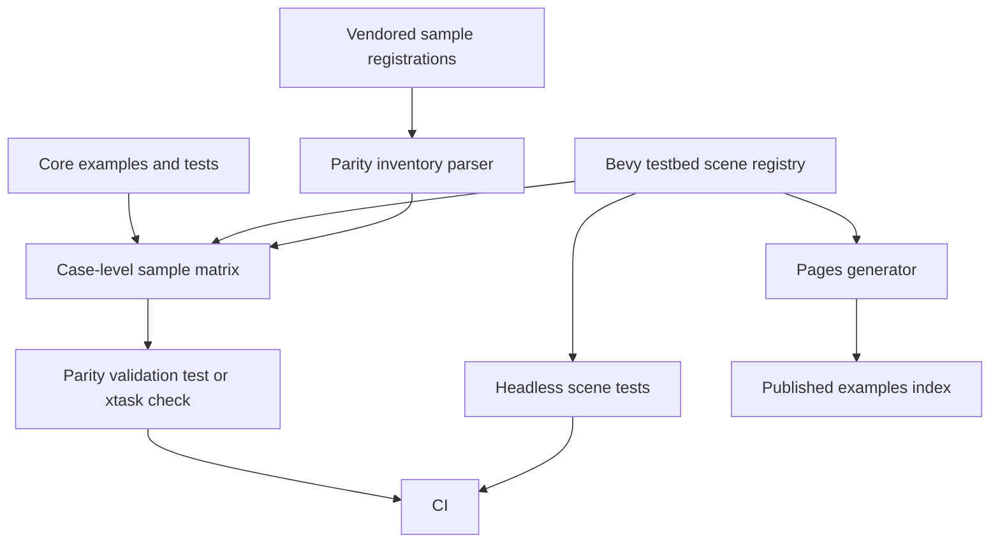

# Official Box3D Samples Parity - Plan

## Goal Capsule

| Field | Decision |
|---|---|
| Objective | Make `boxddd`'s examples visibly and verifiably track the vendored official Box3D sample set, with honest case-level parity rather than broad category claims. |
| Authority | Vendored Box3D 0.1.0 samples under `boxddd-sys/third-party/box3d/samples`, current `boxddd` and `bevy_boxddd` examples, and the user's request for official-sample coverage are the authority. |
| Execution profile | Deep example/docs/testbed work. Breaking changes are allowed in example metadata, testbed registry, Pages generation, and parity docs when they remove misleading claims. |
| Tail ownership | Work lands on local `main` in coherent commits; push `main` after green validation when CI proof is useful. |
| Stop conditions | Stop only for an upstream sample that requires an unsupported Box3D API, a browser/runtime capability that contradicts the current WASM boundary, or a scope expansion into a full clone of Box3D's C++ sample host. |

---

## Product Contract

### Summary

The current repository has many useful examples, but it does not fully replicate the official Box3D sample catalog. The existing parity matrix is category-level and currently compresses 152 `RegisterSample` entries plus the `RegisterReplay` viewer into broad rows, so it cannot answer "which official sample cases are covered?" with precision. This plan turns parity into a maintained case-level contract, ports the missing high-value visual samples into the Bevy testbed or standalone Bevy examples, and routes non-visual stress/issue/benchmark samples into tests, benches, or explicit deferrals.

### Problem Frame

Users comparing `boxddd` with the official Box3D samples expect visible scenes like bodies, shapes, stacking, joints, character movement, mesh/compound geometry, ragdolls, events, and continuous collision. They also need to trust that benchmark, issue, robustness, determinism, replay, and broad-phase samples were considered rather than forgotten.

The repo already has strong foundations: core examples for queries, events, body controls, collision, dynamic tree, recording, task systems, math interop, and a Bevy testbed with 14 scenes. The gap is traceability and depth. A category marked `Covered` can still hide missing official cases, and the static Pages index cannot yet show which scene maps to which official upstream sample.

### Requirements

**Parity Inventory**

- R1. The official sample inventory must parse every vendored `RegisterSample` and `RegisterReplay` declaration into category, sample name, source file, and line number.
- R2. `docs/upstream-parity/box3d-sample-matrix.md` must become case-level, not only category-level, and each official sample must be classified as faithful port, teaching adaptation, test-only parity, deferred, or upstream-only reference.
- R3. The matrix must distinguish "covered by a maintained example" from "adjacent concept exists" so release docs do not imply full parity before it is true.

**Visual Teaching Surface**

- R4. High-value official visual samples must have Bevy testbed scenes or standalone Bevy examples when they teach bodies, stacking, shapes/materials, compound/mesh, joints, character movement, events, collision, continuous collision, ragdoll, or world-scale behavior.
- R5. Every visual parity scene must carry upstream metadata that links it to one or more official sample cases.
- R6. The static Pages example index must display official sample parity metadata from the same checked source as the Bevy testbed registry.

**Core And Headless Coverage**

- R7. Official samples that are primarily algorithmic, deterministic, regression, benchmark, or API-surface checks must map to `boxddd` examples, nextest tests, or benches rather than forced renderer scenes.
- R8. Benchmark, issue, and robustness samples may remain deferred only when the matrix records a concrete reason and a trigger for future porting.
- R9. Existing custom teaching examples must be kept when useful, but their docs must label them as `boxddd` teaching scenes instead of official sample ports.

**Documentation And CI**

- R10. README and crate example READMEs must describe parity honestly: official coverage is tracked per case, faithful ports are named, and representative teaching adaptations are not marketed as one-to-one clones.
- R11. CI must fail when the vendored official sample registry changes without a refreshed parity matrix.
- R12. Example compile checks, Bevy testbed tests, Pages validation, and package checks must include new parity assets that users will see from GitHub, docs.rs, or crates.io.

### Acceptance Examples

- AE1. A maintainer updates the vendored Box3D subtree and runs the parity check; if upstream added a registered sample, the check fails until `docs/upstream-parity/box3d-sample-matrix.md` classifies it.
- AE2. A user opens the Bevy examples index and sees that `Domino Run` maps to official `Stacking / Dominoes` as a teaching adaptation, while a benchmark-only sample is labeled as deferred or bench-only.
- AE3. A user runs `cargo run -p bevy_boxddd --features "debug-gizmos physics-picking" --example testbed_3d` and can select scenes covering the high-value visual categories without reading the C++ sample host.
- AE4. A maintainer runs `cargo nextest run -p bevy_boxddd --test testbed` and the test proves scene registry metadata, upstream mappings, and basic native body/shape creation remain valid.
- AE5. A release reviewer reads the top-level README and sees a clear version/sample support statement, not a vague claim that all official Box3D samples are replicated.

### Scope Boundaries

- SB1. This plan does not port Box3D's C++ sample host, Sokol renderer, ImGui tooling, camera controls, or replay UI line-for-line.
- SB2. This plan does not require every official benchmark, issue repro, or robustness scene to become a visible Bevy scene; those categories are better as tests, benches, or deferred upstream references until they expose a wrapper bug or release measurement goal.
- SB3. This plan does not claim browser parity for every native Bevy example. WASM support follows the existing provider boundary and only ships examples that compile and run through the current Pages toolchain.
- SB4. This plan may remove stale example docs, misleading category-level `Covered` claims, and duplicate custom scenes if the new taxonomy makes them redundant.

---

## Planning Contract

### Sources And Current State

- `boxddd-sys/third-party/box3d/samples/sample_*.cpp` contains 152 `RegisterSample` cases across Benchmark, Bodies, Character, Collision, Compound, Continuous, Determinism, Events, Geometry, Issues, Joints, Manifold, Mesh, Ragdoll, Robustness, Shapes, Stacking, Tree, and World.
- `boxddd-sys/third-party/box3d/samples/sample_replay.cpp` registers `Replay / Viewer` through `RegisterReplay`, so any generator that only scans `RegisterSample` is incomplete.
- `docs/upstream-parity/box3d-sample-matrix.md` currently records category-level parity and uses `Covered`, `Partial`, `Planned`, and `Deferred`.
- `bevy_boxddd/examples/testbed_3d/scenes.rs` currently defines 14 scenes and has no upstream sample reference metadata.
- `xtask/src/main.rs` already parses `SCENE_REGISTRY` to generate and validate Pages entries, so parity metadata should extend that pipeline instead of adding a second handwritten site catalog.

### Key Technical Decisions

- KTD1. The parity matrix becomes case-level source of truth. Category summaries remain useful for human scanning, but CI and implementation work need one row per registered upstream sample case.
- KTD2. The Bevy testbed registry owns visual scene metadata. Add upstream references to `TestbedSceneMetadata` or a directly adjacent registry so tests, docs, and Pages read the same mapping.
- KTD3. Use three parity modes instead of a binary clone claim. `FaithfulPort` means scene intent and behavior closely follow the official sample; `TeachingAdaptation` means Rust/Bevy presentation teaches the same concept; `TestOnly` means the sample is better proven without rendering.
- KTD4. Prefer Bevy for visible official samples and core `boxddd` for renderer-free API concepts. The safe core crate stays renderer-free; Bevy scenes show bodies, shapes, joints, cameras, egui controls, picking, and debug draw.
- KTD5. Benchmarks and issue repros are not first-class teaching scenes. They become benches/tests only when they provide measurable value or guard a known wrapper bug; otherwise the matrix keeps them explicitly deferred.
- KTD6. Pages is generated from metadata, not hand-maintained prose. The public example index should show official sample mappings and avoid stale static labels.
- KTD7. CI should guard drift with lightweight structural checks. Do not run GPU windows in CI; compile examples and run headless registry/physics tests instead.

### High-Level Technical Design

### Sequencing

1. Build the inventory and matrix validation first so every later scene addition has a target and drift gate.
2. Extend Bevy metadata and Pages generation before adding many scenes so each new scene registers upstream references once.
3. Port high-value visual cases in batches by category, using tests after each batch to keep scene count and metadata coherent.
4. Classify non-visual cases into tests, benches, or deferrals after the visual path is stable.
5. Finish with README/example docs cleanup and CI/package validation.

### Risks And Mitigation

| Risk | Mitigation |
|---|---|
| The matrix becomes too large to read. | Keep category summaries plus case-level rows, and add generated grouping or anchors so humans can scan by category. |
| A "faithful port" label overpromises. | Use faithful only for close behavioral ports; use teaching adaptation for idiomatic Rust/Bevy scenes that intentionally differ. |
| Testbed scenes become heavy and slow. | Validate scene construction and short physics invariants headlessly; keep visual richness in example runtime, not in CI screenshots. |
| Pages generator becomes a Rust parser. | Extend the existing simple registry parser only for literal fields; move complex metadata into a simple const format or generated JSON if parsing becomes brittle. |
| Benchmark and robustness ports distract from release teaching goals. | Keep them deferred until a bench target, known wrapper bug, or user-facing regression makes them valuable. |

---

## Implementation Units

### U1. Official Sample Inventory And Drift Gate

- **Goal:** Create a maintained inventory of every vendored official sample registration, including `RegisterSample` and `RegisterReplay`.
- **Requirements:** R1, R2, R11, AE1.
- **Files:** `xtask/src/main.rs`, `docs/upstream-parity/box3d-sample-matrix.md`, optional `docs/upstream-parity/box3d-sample-inventory.json`, `.github/workflows/ci.yml`, `docs/development/ci.md`.
- **Approach:** Add an `xtask sample-parity --check` style command or equivalent test helper that scans `boxddd-sys/third-party/box3d/samples/sample_*.cpp`, extracts category/name/source location, and compares it with the matrix source. Keep the parser intentionally narrow: registered sample calls with string literals only.
- **Test scenarios:** The check counts the current 152 `RegisterSample` cases plus `Replay / Viewer`; deleting a matrix row fails; adding a fake unclassified registration in a fixture fails; duplicate category/name rows fail with a clear message.
- **Verification:** `cargo run -p xtask -- sample-parity --check`.

### U2. Case-Level Parity Matrix Rewrite

- **Goal:** Rewrite the official sample matrix so every upstream sample case has a classification and a target artifact.
- **Requirements:** R2, R3, R8, R9, R10, AE5.
- **Files:** `docs/upstream-parity/box3d-sample-matrix.md`, `README.md`, `boxddd/examples/README.md`, `bevy_boxddd/examples/README.md`.
- **Approach:** Replace category-only rows with grouped case rows containing category, official sample, source location, parity mode, Rust target, and notes. Preserve a short category summary above the detailed table for readability.
- **Test scenarios:** Every inventory entry has exactly one matrix row; no row points to a non-existent example/test/doc target unless marked deferred; README language says case-level tracking rather than full one-to-one clone.
- **Verification:** `cargo run -p xtask -- sample-parity --check`; `cargo fmt --all --check`.

### U3. Bevy Testbed Upstream Metadata

- **Goal:** Make visual parity metadata part of the executable Bevy scene registry.
- **Requirements:** R4, R5, R6, AE2, AE4.
- **Files:** `bevy_boxddd/examples/testbed_3d/scenes.rs`, `bevy_boxddd/tests/testbed.rs`, `xtask/src/main.rs`, generated files under `docs/pages/examples/`.
- **Approach:** Add upstream references to each `TestbedSceneMetadata` entry using a simple literal-friendly shape such as `upstream: &[UpstreamSampleRef { category: "...", name: "...", mode: ParityMode::TeachingAdaptation }]`. Extend tests and Pages parsing to validate non-empty references for official-port scenes.
- **Test scenarios:** Registry tests reject empty upstream names, duplicate upstream refs in one scene, unknown parity modes, and a scene claiming official parity without a matrix row; generated Pages show upstream sample labels for mapped scenes.
- **Verification:** `cargo nextest run -p bevy_boxddd --test testbed`; `cargo run -p xtask -- generate-pages`; `cargo run -p xtask -- validate-pages`.

### U4. High-Value Visual Sample Ports

- **Goal:** Add or refine Bevy scenes for official samples that users expect to see visually first.
- **Requirements:** R4, R5, R7, AE2, AE3, AE4.
- **Files:** `bevy_boxddd/examples/testbed_3d/scenes.rs`, `bevy_boxddd/examples/testbed_3d/main.rs`, `bevy_boxddd/tests/testbed.rs`, `docs/upstream-parity/box3d-sample-matrix.md`.
- **Approach:** Prioritize scene batches: Bodies (`Body Type`, `Gyroscopic Torque`, `Weeble`, `Kinematic`, locks), Stacking (`Box Stack`, `Sphere Stack`, `Jenga Stack`, `Dominoes`, `Arch`), Shapes (`Rolling Resistance`, `Restitution`, `Conveyor Belt`, `Wind`), Compound/Mesh (`Tile Floor`, `Mesh Tile`, `Height Field`, `Voxel`), and Continuous (`Thin Wall`, `Bullet vs Stack`, `Mesh Drop`). Merge with existing scenes where they already teach the case.
- **Test scenarios:** Each added scene spawns valid native bodies and shapes; material scenes contain friction/restitution variants; continuous scenes create bullet bodies; stack scenes contain at least one unstable dynamic stack; mesh/compound scenes include static resource-backed colliders plus dynamic test bodies.
- **Verification:** `cargo nextest run -p bevy_boxddd --test testbed`; `cargo check -p bevy_boxddd --features "debug-gizmos physics-picking" --example testbed_3d`.

### U5. Joints, Character, Events, And Ragdoll Parity

- **Goal:** Deepen the interactive and connected-body categories that most benefit from Bevy visualization.
- **Requirements:** R4, R5, R7, AE3, AE4.
- **Files:** `bevy_boxddd/examples/testbed_3d/scenes.rs`, `bevy_boxddd/examples/joint_gallery_3d.rs`, `bevy_boxddd/examples/contact_messages_3d.rs`, `boxddd/examples/character_mover.rs`, `bevy_boxddd/tests/testbed.rs`, `bevy_boxddd/tests/joints.rs`, `bevy_boxddd/tests/messages.rs`, `docs/upstream-parity/box3d-sample-matrix.md`.
- **Approach:** Map existing joint gallery coverage to official joint cases, add missing visible cases only when the current gallery does not teach them, expand character/ragdoll scenes without becoming a full character-controller or rigging framework, and keep event semantics backed by headless message tests.
- **Test scenarios:** Joint scenes create every public joint variant and map to official names; character mover scene proves a mover cast hits an obstacle; event scenes emit contact/sensor/body-move messages; ragdoll-lite scenes create joint chains and document that mesh pose editing is deferred.
- **Verification:** `cargo nextest run -p bevy_boxddd --test testbed`; `cargo nextest run -p bevy_boxddd --test joints`; `cargo nextest run -p bevy_boxddd --test messages`.

### U6. Core Examples, Tests, And Benches For Non-Visual Cases

- **Goal:** Cover official samples that are better as headless API proof than Bevy scenes.
- **Requirements:** R7, R8, R11, AE1.
- **Files:** `boxddd/examples/*.rs`, `boxddd/tests/*.rs`, optional `boxddd/benches/*.rs`, `boxddd/Cargo.toml`, `docs/upstream-parity/box3d-sample-matrix.md`.
- **Approach:** Map Manifold, Collision diagnostics, Dynamic Tree, Determinism, Replay, World far-origin, issue repros, and robustness cases to focused tests or examples. Add benches only for benchmark cases with a stable measurement story; otherwise classify benchmark rows as deferred with a reason.
- **Test scenarios:** Matrix rows that claim `TestOnly` point to a real nextest test; determinism/replay cases assert stable replay results; collision/manifold cases assert deterministic normals/fractions/counts; issue rows either have a regression test or a deferred trigger tied to an upstream issue sample.
- **Verification:** `cargo nextest run -p boxddd`; `cargo check -p boxddd --examples`; optional `cargo bench -p boxddd` only if benches are introduced and documented.

### U7. Public Pages And Example Index Parity Labels

- **Goal:** Make the published example index a direct entry point into official sample coverage.
- **Requirements:** R5, R6, R10, R12, AE2.
- **Files:** `xtask/src/main.rs`, `docs/pages/index.html`, `docs/pages/examples/index.html`, generated files under `docs/pages/examples/`, `docs/pages/sample-catalog.json` if kept or created.
- **Approach:** Extend generated Pages cards with upstream category/name labels and parity mode. Keep the root page as the example index, not a marketing homepage. Ensure live WASM pages only claim interaction for scenes actually backed by the current Bevy/provider build.
- **Test scenarios:** Generated pages include upstream labels for official-port scenes; links validate; root `docs/pages/index.html` is the example index; no page advertises a vector placeholder as a Bevy runtime.
- **Verification:** `cargo run -p xtask -- generate-pages`; `cargo run -p xtask -- build-pages-wasm`; `cargo run -p xtask -- validate-pages`.

### U8. Docs, README, And Release Packaging Cleanup

- **Goal:** Align user-facing docs with the new parity contract and ensure published crates contain the right example artifacts.
- **Requirements:** R9, R10, R12, AE5.
- **Files:** `README.md`, `boxddd/README.md`, `boxddd-sys/README.md`, `bevy_boxddd/README.md`, `boxddd/examples/README.md`, `bevy_boxddd/examples/README.md`, `docs/development/ci.md`, `CHANGELOG.md`, `Cargo.toml`, crate `Cargo.toml` files.
- **Approach:** Shorten README parity language to user-facing support and commands, move maintainer detail into development docs, update package include assertions for new docs/examples, and remove stale example lists or duplicated descriptions.
- **Test scenarios:** README names the official Box3D version and sample parity matrix; crate READMEs have run commands without internal smoke-state noise; package checks include matrix/docs and public examples; changelog stays user-facing.
- **Verification:** `cargo package -p boxddd-sys --allow-dirty --no-verify`; `cargo package -p boxddd --allow-dirty --no-verify`; `cargo package -p bevy_boxddd --allow-dirty --no-verify`; package archive assertions from `docs/development/ci.md`.

### U9. CI Integration And Cleanup

- **Goal:** Make sample parity a normal release gate without adding GPU flakes.
- **Requirements:** R11, R12, AE1, AE4.
- **Files:** `.github/workflows/ci.yml`, `.github/workflows/pages.yml`, `.github/workflows/release-preflight.yml`, `.github/workflows/release-crates.yml`, `docs/development/ci.md`.
- **Approach:** Add parity check and example metadata checks to CI; compile Bevy examples with their feature combinations; run nextest headless tests; validate Pages. Remove obsolete CI assertions that no longer match the generated parity format.
- **Test scenarios:** CI fails on sample matrix drift; CI checks native core examples; CI checks Bevy examples and feature-gated testbed; release-preflight validates package contents; Pages workflow validates generated example index before publish.
- **Verification:** `actionlint`; `cargo nextest run --workspace`; `cargo run -p xtask -- sample-parity --check`; `cargo run -p xtask -- validate-pages`.

---

## Verification Contract

| Gate | Command | Proves |
|---|---|---|
| Formatting | `cargo fmt --all --check` | Rust formatting remains stable. |
| Workspace tests | `cargo nextest run --workspace` | Existing core, sys, Bevy, and provider smoke tests remain green. |
| Core examples | `cargo check -p boxddd --examples` | Renderer-free examples compile after parity additions. |
| Bevy examples | `cargo check -p bevy_boxddd --examples` | Standalone Bevy teaching examples compile. |
| Bevy feature examples | `cargo check -p bevy_boxddd --features debug-gizmos --example debug_draw_overlay_3d`; `cargo check -p bevy_boxddd --features physics-picking --example physics_picking_3d`; `cargo check -p bevy_boxddd --features "debug-gizmos physics-picking" --example testbed_3d` | Feature-gated visual examples compile with the expected flags. |
| Testbed registry | `cargo nextest run -p bevy_boxddd --test testbed` | Scene registry, upstream metadata, and basic physics invariants are valid without GPU windows. |
| Sample parity drift | `cargo run -p xtask -- sample-parity --check` | Vendored official sample registrations match the case-level matrix. |
| Pages generation | `cargo run -p xtask -- generate-pages`; `cargo run -p xtask -- validate-pages` | Public example index stays generated and link-valid. |
| WASM Pages build | `cargo run -p xtask -- build-pages-wasm` | Browser example bundle still builds when the local toolchain is available. |
| Workflow lint | `actionlint` | GitHub Actions syntax stays current. |
| Packaging | `cargo package -p boxddd-sys --allow-dirty --no-verify`; `cargo package -p boxddd --allow-dirty --no-verify`; `cargo package -p bevy_boxddd --allow-dirty --no-verify` | Crate archives include intended examples, docs, and parity files. |

---

## Definition of Done

- Every registered vendored official sample case, including `Replay / Viewer`, appears in the parity matrix with category, sample name, source location, parity mode, target artifact, and rationale.
- High-value visual official samples have Bevy testbed or standalone Bevy coverage, and each visual parity scene carries upstream metadata consumed by tests and Pages.
- Non-visual official samples are mapped to core examples, nextest tests, benches, or explicit deferrals with future triggers.
- README, crate READMEs, example READMEs, Pages, and release docs stop implying category-level full parity and instead point users to the case-level matrix.
- CI catches parity drift, example compile failures, stale Pages output, and package omissions without running GPU windows.
- Stale docs, duplicate example claims, abandoned experimental scenes, and obsolete generated artifacts are removed before the work is considered complete.
