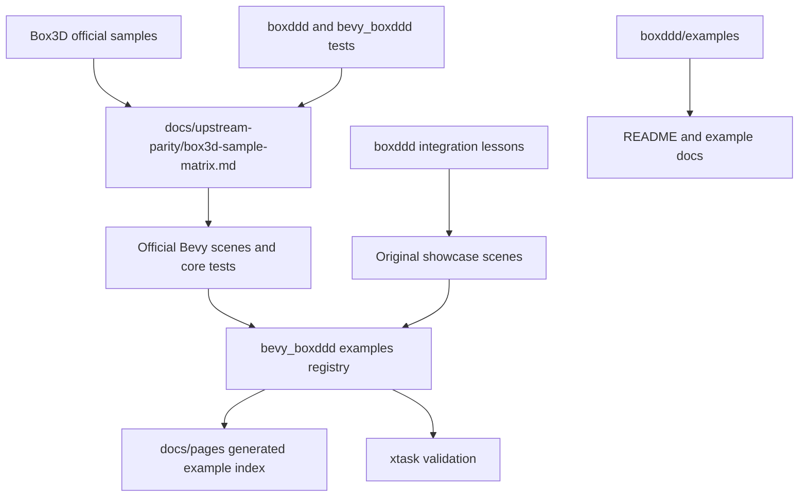

# 0.2 API Stabilization And Example Showcase - Plan

## Goal Capsule

| Field | Decision |
|---|---|
| Objective | Prepare the unreleased `0.2.0` development line for a stronger public surface by stabilizing breaking API changes, tightening the safe/raw FFI boundary, and expanding examples with both official Box3D parity and honest original showcases. |
| Authority | The repository code and docs are the source of truth; upstream Box3D `v0.1.0` samples and headers are reference inputs; `0.1.0` on crates.io is the semver baseline. |
| Execution profile | Break public APIs when the new shape is materially better for `0.2.0`, but document every break and avoid accidental breaks that do not buy safety, clarity, or capability. |
| Stop conditions | Stop when the plan's verification gates pass, every official deferred sample has a route, and every new showcase is clearly labeled as official parity, test-only proof, benchmark, or original `boxddd` showcase. |
| Tail ownership | Implementation owns code, examples, docs, changelog, generated Pages files, CI/package gates, and local commits; it does not tag or publish `0.2.0`. |

---

## Product Contract

### Summary

The next development pass should treat `0.2.0` as the last cheap window for API cleanup.
The safe wrapper already covers about 93% of upstream public `B3_API` symbols, so the remaining work is less about chasing a vanity 100% number and more about making the public API coherent, documented, and useful in real integrations.
Examples should expand in two directions: official Box3D parity where the upstream sample teaches a physics feature, and original `boxddd` showcases where Rust, Bevy, egui, WASM, async, or tooling integration is the thing users need to learn.

### Problem Frame

The current example surface is useful but still mixes two ideas: upstream sample parity and a Bevy testbed that teaches real Rust integration.
That is fine while every scene maps to upstream samples, but it blocks original showcase scenes because `xtask` currently requires every testbed registry item to carry upstream references.
The API surface also has intentional breaking changes after `0.1.0`; before continuing feature work, those breaks need to be classified as kept, softened with compatibility aliases, or refined further while breaking is acceptable.

### Requirements

**API and FFI boundary**

- R1. The implementation must run semver checks against `v0.1.0` and classify every break as intentional, softened, or fixed before treating the plan as complete.
- R2. The safe/raw boundary in `docs/api-coverage.md` and `docs/upstream-parity/box3d-api-matrix.md` must distinguish missing ergonomic wrappers from APIs that should remain raw because they are process-global, pointer-based, file-oriented, diagnostic, or callback-hostile.
- R3. Public lifecycle and callback APIs must avoid exposing borrowed native memory beyond its owner and must keep panic containment across C callbacks.
- R4. Migration docs must explain the `DebugDrawFrame` model, debug shape asset handles, `Error::ProviderCallbackFailed`, and `HullDescriptor::Cylinder` without exposing internal implementation churn.

**Official sample parity**

- R5. Every official Box3D sample row currently marked `Deferred` must get a concrete route: keep deferred with rationale, convert to a headless test, convert to a benchmark target, port to a Bevy scene, or replace with a better original showcase.
- R6. Official parity claims must stay honest: a scene that is not based on an upstream sample must not be counted as `FaithfulPort` or `TeachingAdaptation`.
- R7. Benchmark and robustness samples must not become visual demos unless they teach user-facing behavior; they should become benchmark harnesses or regression tests when they have a measurable goal.

**Original showcase examples**

- R8. The examples catalog must allow original `boxddd` showcases that teach integration patterns absent from official Box3D samples.
- R9. Showcase scenes must be real runnable Rust/Bevy/egui/WASM examples, not static mockups or generated animations.
- R10. Each new showcase must teach one primary integration lesson such as material tuning, query visualization, debug draw inspection, replay/determinism, stats profiling, async/thread bridging, conveyor forces, or large-world constraints.
- R11. WASM-published examples must be browser-eligible and must use the actual Bevy + egui WASM bundle path, with native-only examples clearly excluded from Pages.

**Docs and release posture**

- R12. README and example docs must present the example catalog from a user point of view and avoid exposing smoke-test state, CI internals, or implementation-only labels.
- R13. `CHANGELOG.md` must stay user-facing, keep post-`0.1.0` changes under `Unreleased`, and include migration notes only for user-visible breaks.
- R14. CI/package gates must continue proving native multi-platform builds and package contents without requiring end users to run bindgen.

### Acceptance Examples

- AE1. Given a user opens the Pages site, when they select a scene card, then the page launches a real Bevy + egui WASM example for that scene or clearly identifies that no web version exists.
- AE2. Given a developer runs `cargo run -p xtask -- sample-parity --check`, when original showcase scenes exist, then official sample coverage still validates without requiring fake upstream references.
- AE3. Given a user reads the README before installing, when they scan platform support and examples, then they see what is supported and where to run examples without seeing provider smoke-test implementation details.
- AE4. Given a maintainer runs semver checks against `v0.1.0`, when a breaking change remains, then the changelog and docs explain it as an intentional `0.2.0` migration.

### Scope Boundaries

- The plan does not tag, publish, or prepare release notes for `0.2.0`; it keeps the development line honest and closer to release quality.
- The plan does not require porting every official C++ sample as a visual scene; benchmark, issue, and robustness cases can remain tests, benches, or documented deferrals.
- The plan does not make all raw Box3D APIs safe; process-global hooks, raw `void*` user data, and native file helpers stay raw unless implementation proves a sound Rust ownership model.
- The plan does not promise threaded or callback-heavy WASM support beyond designs that can be proven safe with the provider runtime.

---

## Planning Contract

### Key Technical Decisions

- KTD1. Treat `0.2.0` as an API-shaping release, not a compatibility release.
  The debug draw frame model and Bevy hull descriptor breakage are acceptable only if they produce a cleaner long-term API and are documented as migrations from `0.1.0`.
- KTD2. Keep official parity and original showcases as separate metadata concepts.
  Official sample references should live on scenes that map to upstream Box3D behavior; original scenes should carry a `Showcase` source with a short integration lesson.
- KTD3. Convert deferred official samples by intent, not by count.
  Benchmarks need measurable benches, issue samples need regression triggers, robustness samples need release-risk targets, and teaching samples need visual scenes.
- KTD4. Prefer Bevy + egui for visual integration examples.
  Box3D is 3D and users benefit from camera, meshes, gizmos, picking, panels, and real renderer integration more than from terminal output.
- KTD5. Keep WASM publishing strict.
  A page entry should either launch the real Bevy WASM scene or be absent from the web catalog; fake visualizations undermine trust.
- KTD6. Keep raw APIs visibly raw.
  `boxddd::raw` may expose low-level escape hatches with validation and safety docs, but the prelude should stay safe, typed, and ownership-aware.

### High-Level Technical Design

The example system should become a catalog with three explicit source classes.
`Official` entries carry upstream sample references and count toward the parity matrix.
`Showcase` entries teach `boxddd` integration and do not pretend to be official ports.
`NativeOnly` or `Headless` entries live in example docs and tests but do not appear as clickable Bevy WASM scenes unless they can run in the browser.

### Prioritization

| Priority | Work | Rationale |
|---|---|---|
| P0 | Semver/API stabilization and raw boundary audit | Public API churn is cheapest before `0.2.0` is released and most expensive after. |
| P1 | Example metadata taxonomy and xtask validation | Original showcases cannot be added honestly until the catalog model stops requiring upstream references everywhere. |
| P2 | Deferred official sample triage | The current matrix is complete structurally but needs sharper routes for deferred rows. |
| P3 | First wave of original showcases | User-facing examples should teach real integration gaps after the catalog can represent them. |
| P4 | Docs, Pages, CI, and package polish | These turn the API/example work into a coherent user-facing surface. |

### Showcase Candidate Ranking

| Candidate | Primary lesson | First-wave decision |
|---|---|---|
| Material Lab | Tune friction, restitution, rolling resistance, and conveyor-style behavior with egui controls. | Build first if tangent-velocity or equivalent conveyor authoring is already safely available; otherwise split material controls first and defer conveyor. |
| Query Lab | Visualize ray casts, shape casts, overlaps, and picking results from camera input. | Build first because it teaches editor tooling and validates query APIs. |
| Debug Draw Inspector | Inspect debug draw frames, persistent shape assets, diagnostics, and Bevy gizmo rendering. | Build first because the debug draw API changed after `0.1.0`. |
| Replay Viewer | Record, replay, and compare deterministic snapshots. | Build after debug draw because it may need more UI and fixture work. |
| Stats Dashboard | Display counters, profile timing, awake bodies, and stress scene controls. | Build if benchmark deferred rows need a user-facing performance story. |
| Async Bridge Viewer | Show physics stepping on a worker thread with snapshot handoff to Bevy. | Keep native-only first; WASM worker support needs separate design. |
| Large World Probe | Show far-origin precision constraints and camera framing. | Defer unless implementation can state a clear user-facing precision contract. |
| Ragdoll Pose Editor | Interactive joint-chain posing and reset. | Defer until joint authoring ergonomics and UI value justify the complexity. |

---

## Implementation Units

### U1. Public API Semver Stabilization

- **Goal:** Classify and refine every breaking change since `0.1.0` before more examples depend on unstable names.
- **Requirements:** R1, R3, R4, R13.
- **Files:** `boxddd/src/debug_draw.rs`, `boxddd/src/error.rs`, `boxddd/src/lib.rs`, `boxddd/src/prelude.rs`, `bevy_boxddd/src/components.rs`, `bevy_boxddd/src/prelude.rs`, `README.md`, `CHANGELOG.md`.
- **Approach:** Run semver checks against `v0.1.0`, review each break, and either keep it with migration docs, add compatibility aliases where they do not compromise API clarity, or refactor the `0.2.0` API before it spreads through docs and examples.
- **Test Scenarios:** Semver check reports only breaks that are intentionally documented; exhaustive matches affected by `Error` and `HullDescriptor` have migration notes; debug draw examples compile against the final `DebugDrawFrame` model.
- **Verification:** `cargo semver-checks check-release -p boxddd --baseline-rev v0.1.0`; `cargo semver-checks check-release -p bevy_boxddd --baseline-rev v0.1.0`; `cargo semver-checks check-release -p boxddd-sys --baseline-rev v0.1.0`; `cargo nextest run -p boxddd --test debug_draw`; `cargo nextest run -p bevy_boxddd --test debug_draw`.

### U2. Safe/Raw Boundary And Lifecycle Audit

- **Goal:** Make the remaining non-safe API surface auditable and defensible rather than merely uncovered.
- **Requirements:** R2, R3, R6, R14.
- **Files:** `docs/api-coverage.md`, `docs/upstream-parity/box3d-api-matrix.md`, `boxddd/tests/fixtures/api_coverage_symbols.txt`, `boxddd/tests/api_coverage.rs`, `boxddd/src/raw.rs`, `boxddd/src/callbacks.rs`, `boxddd/src/world.rs`, `boxddd/src/world/runtime.rs`.
- **Approach:** Re-review the 40 non-safe public symbols by category, add a short reason for each raw/omitted bucket where the matrix is too broad, and only add typed wrappers when the wrapper can enforce ownership, lifetime, reentrancy, and platform constraints.
- **Test Scenarios:** Every upstream `B3_API` symbol is classified; raw user-data APIs remain unsafe and raw-named; process-global tuning APIs document global side effects; callback-heavy paths still contain panics and do not unwind through C.
- **Verification:** `cargo nextest run -p boxddd --test api_coverage`; `cargo nextest run -p boxddd --test world_callbacks`; `cargo nextest run -p boxddd --test panic_across_ffi_is_caught`; `cargo nextest run -p boxddd --test world_runtime`.

### U3. Example Catalog Source Taxonomy

- **Goal:** Allow original `boxddd` showcase scenes without polluting official sample parity.
- **Requirements:** R5, R6, R8, R9, R11.
- **Files:** `bevy_boxddd/examples/testbed_3d/scenes.rs`, `bevy_boxddd/examples/testbed_3d/ui.rs`, `xtask/src/main.rs`, `docs/pages/index.html`, `docs/pages/examples/index.html`, `bevy_boxddd/examples/README.md`.
- **Approach:** Replace the implicit "every registry entry has upstream refs" rule with an explicit source model such as official refs plus an optional showcase lesson; update the generated Pages cards and egui side panel to label official parity and showcase scenes differently.
- **Test Scenarios:** Existing official scenes still validate against upstream refs; a showcase-only scene can be registered without a fake upstream sample; generated Pages cards render the source label; `sample-parity --check` ignores showcase-only scenes for official matrix coverage.
- **Verification:** `cargo run -p xtask -- sample-parity --check`; `cargo run -p xtask -- generate-pages`; `cargo run -p xtask -- validate-pages`; `cargo nextest run -p xtask`.

### U4. Deferred Official Sample Triage

- **Goal:** Turn each deferred official sample row into an intentional route.
- **Requirements:** R5, R6, R7, R10, R12.
- **Files:** `docs/upstream-parity/box3d-sample-matrix.md`, `boxddd/examples/README.md`, `bevy_boxddd/examples/README.md`, `boxddd/benches`, `boxddd/tests`, `bevy_boxddd/examples/testbed_3d/scenes.rs`.
- **Approach:** Group deferred rows into benchmark, issue regression, robustness, conveyor, far-world, ragdoll pose, and mesh creation buckets; convert rows only when the target artifact has a clear user or release value; update notes so "deferred" means an active decision rather than a backlog shrug.
- **Test Scenarios:** Benchmark rows either point to an explicit bench target or remain deferred with a measurement prerequisite; issue rows point to tests only when the issue reproduces through safe wrappers; conveyor rows either land as a material/conveyor scene or document the missing authoring API; far-world rows keep a precision-contract prerequisite.
- **Verification:** `cargo run -p xtask -- sample-parity --check`; `cargo nextest run -p boxddd`; `cargo check -p boxddd --benches` when benches are added.

### U5. First-Wave Original Showcase Scenes

- **Goal:** Add a small set of high-value examples that teach real integration patterns not covered by official sample parity.
- **Requirements:** R8, R9, R10, R11, R12.
- **Files:** `bevy_boxddd/examples/testbed_3d/scenes.rs`, `bevy_boxddd/examples/testbed_3d/ui.rs`, `bevy_boxddd/examples/testbed_3d/picking.rs`, `bevy_boxddd/examples/support/mod.rs`, `bevy_boxddd/examples/README.md`, `docs/pages/examples`, `docs/pages/bevy-testbed/loader.js`.
- **Approach:** Build the first wave as Bevy testbed scenes instead of separate one-off apps unless an example needs a different runtime; start with Query Lab, Debug Draw Inspector, and Material Lab because they teach editor/tooling/debugging and exercise existing APIs.
- **Test Scenarios:** Query Lab shows ray, shape, and overlap hits from camera input; Debug Draw Inspector shows frame diagnostics and shape asset reuse; Material Lab exposes egui controls without overlapping UI or resizing layout; each scene works as a single-scene native launch and as a direct Pages route when WASM-eligible.
- **Verification:** `cargo check -p bevy_boxddd --features "debug-gizmos physics-picking" --example testbed_3d`; `cargo run -p bevy_boxddd --features "debug-gizmos physics-picking" --example testbed_3d -- --scene query-lab --single-scene`; `cargo run -p xtask -- build-pages-wasm` when local Emscripten and `wasm-bindgen` are available.

### U6. Core Examples For Non-Visual Integration

- **Goal:** Keep non-renderer lessons in small core examples instead of forcing them into Bevy.
- **Requirements:** R2, R8, R10, R12.
- **Files:** `boxddd/examples/physics_thread.rs`, `boxddd/examples/tokio_async_bridge.rs`, `boxddd/examples/task_system.rs`, `boxddd/examples/recording_replay.rs`, `boxddd/examples/README.md`, `README.md`.
- **Approach:** Review existing core examples for duplication, promote the best async/thread/task/replay lessons, and add focused examples only where Bevy would obscure the lesson.
- **Test Scenarios:** Async bridge example compiles without implying Box3D itself is async; physics-thread example uses snapshot handoff and keeps `World` on one owner thread; task-system example documents native-only and WASM limitations; replay example has deterministic assertions or readable checks.
- **Verification:** `cargo check -p boxddd --examples`; `cargo run -p boxddd --example physics_thread`; `cargo run -p boxddd --example tokio_async_bridge`; `cargo run -p boxddd --example recording_replay`.

### U7. WASM Eligibility And Pages Honesty

- **Goal:** Ensure the public example site only advertises real runnable browser examples.
- **Requirements:** R9, R11, R12, R14.
- **Files:** `xtask/src/main.rs`, `docs/pages/index.html`, `docs/pages/examples/index.html`, `docs/pages/bevy-testbed/index.html`, `docs/pages/bevy-testbed/loader.js`, `examples-wasm/README.md`, `.github/workflows/ci.yml`, `.github/workflows/pages.yml`.
- **Approach:** Add a registry field or generated eligibility rule for web examples, validate that each Pages card points to a real scene id, and keep native-only examples in docs rather than web cards.
- **Test Scenarios:** `docs/pages/` root remains the example index; direct scene URLs pass scene ids to the shared Bevy WASM bundle; native-only showcase candidates do not appear as playable web entries; CI does not require a GPU runtime.
- **Verification:** `cargo run -p xtask -- generate-pages`; `cargo run -p xtask -- validate-pages`; `cargo run -p xtask -- build-pages-wasm`; GitHub Pages deployment preview or `gh run view` confirms the artifact upload step includes generated WASM.

### U8. Docs, Changelog, And Package Polish

- **Goal:** Present the API and examples as a coherent user-facing `0.2.0` development line without implying release readiness.
- **Requirements:** R4, R12, R13, R14.
- **Files:** `README.md`, `CHANGELOG.md`, `boxddd/README.md`, `boxddd-sys/README.md`, `bevy_boxddd/README.md`, `boxddd/examples/README.md`, `bevy_boxddd/examples/README.md`, `Cargo.toml`, `boxddd/Cargo.toml`, `boxddd-sys/Cargo.toml`, `bevy_boxddd/Cargo.toml`.
- **Approach:** Rewrite docs around user decisions: which crate to install, which runtime is supported, which examples to run, which migration applies from `0.1.0`, and what remains unreleased; keep package includes strict and avoid README sections that explain CI internals.
- **Test Scenarios:** Crate READMEs render correctly on crates.io; root README links to the example site and version matrix; changelog has one concise unreleased section; `cargo package --list` includes required source, generated bindings, licenses, docs, and examples without local `repo-ref` noise.
- **Verification:** `cargo package -p boxddd --allow-dirty --list`; `cargo package -p boxddd-sys --allow-dirty --list`; `cargo package -p bevy_boxddd --allow-dirty --list`; `cargo package -p boxddd --allow-dirty --no-verify`; `cargo package -p boxddd-sys --allow-dirty --no-verify`; `cargo package -p bevy_boxddd --allow-dirty --no-verify`.

---

## Verification Contract

| Gate | Command | Applies to |
|---|---|---|
| Formatting | `cargo fmt --all --check` | Whole workspace |
| Workspace tests | `cargo nextest run --workspace` | Native unit and integration coverage |
| Box API semver | `cargo semver-checks check-release -p boxddd --baseline-rev v0.1.0` | Public safe API |
| Bevy API semver | `cargo semver-checks check-release -p bevy_boxddd --baseline-rev v0.1.0` | Bevy plugin public API |
| Sys API semver | `cargo semver-checks check-release -p boxddd-sys --baseline-rev v0.1.0` | Low-level binding crate |
| API coverage | `cargo nextest run -p boxddd --test api_coverage` | Upstream `B3_API` classification |
| Official sample matrix | `cargo run -p xtask -- sample-parity --check` | Official sample parity |
| Core examples | `cargo check -p boxddd --examples` | Non-visual example compilation |
| Bevy examples | `cargo check -p bevy_boxddd --features "debug-gizmos physics-picking" --examples` | Visual example compilation |
| Pages generation | `cargo run -p xtask -- generate-pages` | Static example pages |
| Pages validation | `cargo run -p xtask -- validate-pages` | Generated page integrity |
| WASM build | `cargo run -p xtask -- build-pages-wasm` | Browser example bundle when Emscripten and `wasm-bindgen` are available |
| Package audit | `cargo package -p boxddd-sys --allow-dirty --list && cargo package -p boxddd --allow-dirty --list && cargo package -p bevy_boxddd --allow-dirty --list` | Publish contents |

---

## Definition of Done

- U1 is complete when semver breaks are classified, accidental breaks are fixed or softened, and intentional breaks have user-facing migration notes.
- U2 is complete when all non-safe upstream APIs have an auditable raw/omitted rationale and callback/lifetime rules are reflected in tests or docs.
- U3 is complete when the example registry supports official and showcase sources without fake upstream references.
- U4 is complete when every deferred official sample row has a route and `sample-parity --check` still passes.
- U5 is complete when the first wave of original showcase scenes runs natively and every WASM-listed scene launches through the real Bevy + egui bundle.
- U6 is complete when core non-visual examples are deduplicated, documented, and compile under the intended feature sets.
- U7 is complete when the Pages root is a truthful example index and generated pages never advertise non-runnable browser demos.
- U8 is complete when README, crate READMEs, changelog, package lists, and CI expectations describe the unreleased `0.2.0` line clearly.
- The plan is complete when all verification gates that are feasible on the local machine pass, skipped gates have environment-specific reasons, and abandoned experimental code is removed from the diff before committing.
