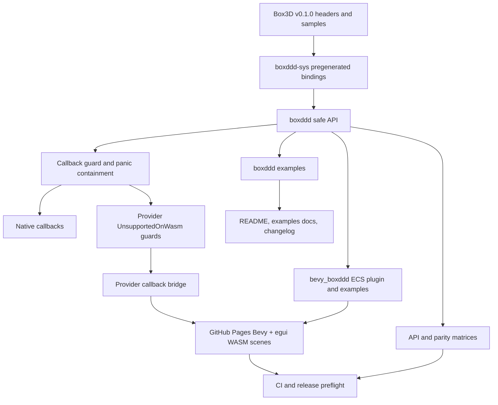

# 0.2 Release Hardening - Plan

## Goal Capsule

| Field | Decision |
|---|---|
| Objective | Harden the unreleased `0.2.0` development line by closing the remaining safe API, callback/WASM, Bevy example, documentation, package, and CI gaps that matter before release preparation. |
| Authority | The current repository is the source of truth; upstream Box3D `v0.1.0` headers and samples are reference inputs; crates.io `0.1.0` is the migration baseline. |
| Execution profile | Break public APIs freely when the replacement improves soundness, lifetime clarity, user ergonomics, or release trust; remove obsolete code instead of preserving compatibility shims that do not serve the `0.2.0` line. |
| Stop conditions | Stop when callback-heavy provider-mode gaps are either guarded or bridged, the example catalog remains truthful, docs and changelog are user-facing, package contents are verified, and the verification gates pass or have documented environmental blockers. |
| Tail ownership | Implementation owns code, examples, docs, generated Pages files, CI updates, local commits, and pushes to `main` when useful; it does not tag or publish `0.2.0` unless explicitly requested. |

---

## Product Contract

### Summary

`boxddd` already has a broad safe wrapper: the tracked upstream `B3_API` matrix currently reports 538 safe symbols, 35 raw-only symbols, 5 omitted symbols, and 0 deferred symbols.
The next pass should not chase a vanity 100% number.
It should instead make the remaining release blockers boring: callback-heavy APIs must not cross the browser provider boundary unsafely, examples must be real and honest, Bevy integration should show observable physics state, and public docs should tell users what to run without leaking maintainer-only smoke-test detail.

### Requirements

**Safe API and FFI boundary**

- R1. `docs/api-coverage.md` and `docs/upstream-parity/box3d-api-matrix.md` must stay machine-audited and must not contain unexplained `deferred` safe-wrapper gaps.
- R2. Raw-only and omitted APIs must keep a concrete reason: process-global hook, pointer ownership, caller-owned `void*`, file-system helper, callback-hostile surface, redundant unsafe getter, or upstream test harness detail.
- R3. Safe APIs must not expose borrowed Box3D-owned memory beyond the owner lifetime; if a current API makes that hard to reason about, prefer a targeted RAII/token refactor over broad global guards.
- R4. Callback entry points must contain Rust panics, reject reentrant world mutation, and preserve typed errors such as `Error::InCallback`, `Error::CallbackPanicked`, and `Error::UnsupportedOnWasm`.
- R5. `World`, dynamic-tree owners, recording/replay owners, and provider-backed state must remain `!Send`/`!Sync` unless an implementation proves a stronger ownership model.

**WASM and callback-heavy support**

- R6. Browser provider mode must never call an unbridged Rust callback through a raw C/JS trampoline; unimplemented callback-heavy surfaces must return `Error::UnsupportedOnWasm`.
- R7. Standalone geometry visitors in `MeshData`, `HeightField`, and `Compound` must be audited first because they are callback-heavy but are not currently covered by the same obvious provider guards as world and dynamic-tree visitors.
- R8. The next provider bridge should prioritize a minimal world-query slice because it directly improves the public Bevy + egui Query Lab and editor-tooling story without turning release hardening into an open-ended provider ABI project.
- R9. Dynamic-tree visitors and standalone geometry visitors may either reuse the query bridge or remain explicitly unsupported, but the decision must be documented and tested.
- R10. Contact/filter/material provider callbacks and browser task-system callbacks are not required for this plan; keep them deferred unless the implementation reaches a sound token and blocking-policy design.

**Examples and Bevy integration**

- R11. Pages examples must continue to launch real Bevy + egui WASM scenes, not static animations or mocked physics.
- R12. Query Lab must not silently report zero hits in browser provider mode when the real cause is an unsupported visitor callback.
- R13. Add at least one stats/profile teaching path that shows users how to inspect `World::profile()`, `World::counters()`, body counts, and solver/runtime settings without requiring the upstream benchmark harness.
- R14. Add or refine one Bevy egui observability showcase, preferably a Stats Dashboard inside the existing testbed scene registry, so users can see how to surface physics diagnostics in an app.
- R15. Official sample parity must stay honest: benchmark, issue, robustness, far-world, conveyor, and replay-viewer cases may remain tests, benches, documented deferrals, or original `boxddd` showcases instead of fake visual ports.
- R16. Bevy material/conveyor authoring should only be exposed when it maps to a real safe `SurfaceMaterial` or shape runtime capability, not a visual-only imitation.

**Docs, changelog, package, and CI**

- R17. README and crate docs should lead with user decisions: what the crates are, which Box3D version they bind, what is safe, how to run examples, and which platforms are supported.
- R18. Maintainer details such as provider smoke internals, package archive checks, and CI implementation should live in `docs/development/ci.md`, not in the README's first-read path.
- R19. `CHANGELOG.md` must keep `0.2.0` work under `Unreleased`, avoid duplicate/internal entries, and explain breaking changes as user migration notes.
- R20. Package contents must be verified for all published crates, including pregenerated bindings, vendored Box3D sources, examples, docs, and the shared top-level README path.
- R21. CI should keep proving native platforms, pregenerated binding usability, WASM compile/provider/runtime tiers, Pages generation, sample parity, release preflight, and action syntax with current GitHub Actions.

### Acceptance Examples

- AE1. Given a provider-mode browser build calls a callback-heavy safe API that is not bridged, when the call executes, then it returns `Error::UnsupportedOnWasm` instead of trapping, silently returning empty data, or crossing a Rust callback unsafely.
- AE2. Given a user opens the Query Lab on the Pages site, when a query feature is unsupported in browser mode, then the UI reports the limitation clearly and still shows any supported query diagnostics.
- AE3. Given a developer reads the examples catalog, when they want diagnostics, async/threading, math interop, or Bevy integration, then they can find runnable commands without reading CI internals.
- AE4. Given `cargo package --list` is run for each published crate, when the archive is inspected, then every file needed for ordinary user compilation and examples is present and repo-local reference folders are excluded by packaging rules or VCS ignore.
- AE5. Given `cargo run -p xtask -- sample-parity --check` runs after adding showcase scenes, when the matrix validates, then official sample rows remain separate from original `boxddd` examples.

### Scope Boundaries

- This plan does not publish, tag, or draft a final `0.2.0` release announcement unless explicitly requested after the hardening work lands.
- This plan does not require every upstream Box3D sample to become a visual Bevy scene; some official samples are better represented as tests, benchmarks, or documented deferrals.
- This plan does not make process-global hooks, raw user-data pointers, file-backed helpers, or upstream harness utilities safe unless the implementation proves a sound Rust ownership model.
- This plan does not promise browser threads, Web Workers, pthreads, Atomics, or Bevy task-pool integration for Box3D's blocking task-system callback.
- This plan does not create a separate `boxddd/README.md` unless crates.io rendering proves that the shared top-level README is not sufficient.

---

## Planning Contract

### Known Technical Decisions

- KTD1. The API coverage gap is qualitative rather than numerical: 93% safe coverage with 0 deferred symbols means work should focus on safety explanations, raw/omitted justifications, and ergonomic holes users actually hit.
- KTD2. Use targeted lifetime tokens only when a concrete API has ambiguous ownership. The current audit does not justify a broad `OutsideCallbackToken` or global capability parameter on ordinary APIs.
- KTD3. Provider-mode callback bridges should follow the debug draw bridge pattern: token registry, provider-local C/JS trampoline, exported Rust dispatcher, copied value payloads, panic containment, and deterministic token release.
- KTD4. Query visitor bridging is the highest-value browser callback bridge because it directly unlocks real Query Lab behavior and editor-style Bevy picking diagnostics.
- KTD5. Task-system browser support remains last because Box3D requires `finishTask` to block until scheduled work completes; that policy conflicts with ordinary browser event-loop and Bevy task-pool assumptions.
- KTD6. Bevy convenience belongs in `bevy_boxddd`; core `boxddd` remains renderer- and math-library-neutral except for optional interop features such as `mint`, `glam`, `nalgebra`, and `cgmath`.
- KTD7. The top-level README can remain the crate README for `boxddd` and `boxddd-sys`; avoid duplicated crate READMEs unless package rendering or user comprehension requires it.
- KTD8. Generated Pages files are source artifacts for GitHub Pages, so regenerate and validate them when changing the scene registry or page templates.

### Priority Order

1. Provider callback guard audit, because unsafe provider callbacks can create traps or undefined behavior in browser builds.
2. Query Lab honesty, because the public Pages site must not imply unsupported physics results are valid empty results.
3. Minimal world query provider bridge, because `visit_overlap_aabb` and `visit_cast_ray` are the smallest callback bridge slice with visible user value.
4. Stats/profile examples and Bevy dashboard, because they teach real integration and explain why benchmark samples are not visual ports.
5. API/rustdoc/package/changelog polish, because these make the release line understandable and publishable.
6. Optional bridge expansion to dynamic-tree or standalone geometry visitors if the query bridge abstraction is simple enough.

### System Shape

---

## Implementation Units

### U1. Provider Callback Surface Audit And Guardrails

**Intent:** Ensure every callback-heavy API has an explicit provider-mode behavior before adding more bridge code.

**Files:**

- `boxddd/src/query.rs`
- `boxddd/src/dynamic_tree.rs`
- `boxddd/src/shapes.rs`
- `examples-wasm/provider-smoke/src/lib.rs`
- `docs/platforms/wasm.md`
- `docs/platforms/wasm-callbacks.md`
- `docs/api-coverage.md`

**Approach:**

- Audit all safe methods that pass Rust closures into Box3D or provider C code.
- Confirm world and dynamic-tree visitors already return `Error::UnsupportedOnWasm` under `all(target_arch = "wasm32", boxddd_wasm_provider)`.
- Add equivalent provider guards for `MeshData::visit_triangles`, `HeightField::visit_triangles`, `Compound::visit_query_aabb`, and any owned convenience method that depends on those visitors.
- Keep native behavior unchanged, including panic containment and early-stop semantics.
- Extend provider smoke coverage so the unsupported surfaces are exercised in provider mode.

**Test Scenarios:**

- Provider mode returns `Error::UnsupportedOnWasm` for standalone mesh, height-field, and compound visitor APIs instead of trapping.
- Native visitor APIs still collect hits and preserve panic containment.
- `docs/platforms/wasm-callbacks.md` lists standalone geometry visitors alongside world queries, dynamic-tree visitors, world callbacks, replay debug-shape callbacks, and task callbacks.

**Verification:**

- `BOXDDD_SYS_WASM_MODE=provider cargo check -p boxddd --target wasm32-unknown-unknown`
- `cargo run -p xtask -- provider-smoke`
- `cargo nextest run -p boxddd --test shape_resources`
- `cargo nextest run -p boxddd --test panic_across_ffi_is_caught`

### U2. Bevy Query Lab Browser Honesty

**Intent:** Make the public browser example truthful before full provider query bridging exists.

**Files:**

- `bevy_boxddd/examples/testbed_3d/lab.rs`
- `bevy_boxddd/examples/testbed_3d/ui.rs`
- `bevy_boxddd/examples/testbed_3d/control.rs`
- `bevy_boxddd/tests/testbed.rs`
- `docs/platforms/wasm.md`
- Generated `docs/pages/examples/*` files if registry or page text changes.

**Approach:**

- Add an explicit diagnostic state for unsupported provider-mode query visitors.
- Keep supported non-callback query paths visible, such as closest ray casts, when they are available.
- Do not render unsupported query paths as zero-hit success.
- Ensure the single-scene Pages route still opens the real Bevy + egui scene.

**Test Scenarios:**

- Native Query Lab still reports ray, overlap, shape-cast, and mover diagnostics.
- Browser/provider build exposes an unsupported/limited diagnostic for unbridged visitor paths.
- Generated Pages cards do not overpromise full query support before the bridge lands.

**Verification:**

- `cargo nextest run -p bevy_boxddd --test testbed`
- `cargo check -p bevy_boxddd --features "debug-gizmos physics-picking" --example testbed_3d`
- `cargo run -p xtask -- generate-pages`
- `cargo run -p xtask -- validate-pages`

### U3. World Query Provider Bridge

**Intent:** Bridge the smallest high-value callback-heavy browser surface after guardrails are in place.

**Files:**

- `boxddd/src/query.rs`
- `boxddd/src/core/*`
- `boxddd-sys/provider/*`
- `examples-wasm/provider-smoke/src/lib.rs`
- `xtask/src/main.rs`
- `docs/platforms/wasm.md`
- `docs/platforms/wasm-callbacks.md`

**Approach:**

- Reuse the debug draw provider shape where possible: Rust callback token, provider C trampoline, JS import/export glue, copied value payloads, panic containment, and token cleanup.
- Treat `visit_overlap_aabb` and `visit_cast_ray` as the required bridge slice.
- Treat `visit_overlap_shape`, `visit_cast_shape`, and `visit_collide_mover` as stretch work; if they do not land in this pass, they must keep returning `Error::UnsupportedOnWasm` and remain documented as unbridged.
- Preserve early-stop and fraction-control semantics.
- Keep unbridged callbacks returning `Error::UnsupportedOnWasm`.
- Prefer a small internal provider-callback module over spreading token registry logic through each API.

**Test Scenarios:**

- Provider smoke proves bridged AABB overlap and ray-cast visitors return hits in a simple world.
- AABB early-stop and ray fraction-control callbacks stop traversal consistently with native behavior.
- Shape, shape-cast, and mover visitors either pass equivalent provider tests if bridged or keep explicit `UnsupportedOnWasm` assertions.
- Callback panic or provider callback failure maps to a typed `Error` without unwinding across C/JS/WASM.
- Callback tokens are released on success, early stop, error, and panic paths.

**Verification:**

- `cargo run -p xtask -- provider-smoke`
- `BOXDDD_SYS_WASM_MODE=provider cargo check -p boxddd --target wasm32-unknown-unknown`
- `cargo nextest run -p boxddd --test world_and_queries`
- `cargo nextest run -p boxddd --test panic_across_ffi_is_caught`

### U4. Query Lab Uses Bridged Queries

**Intent:** Convert the browser Query Lab from an honest limited state to real AABB overlap and ray-cast diagnostics as the minimal bridge lands.

**Files:**

- `bevy_boxddd/src/query.rs`
- `bevy_boxddd/examples/testbed_3d/lab.rs`
- `bevy_boxddd/examples/testbed_3d/ui.rs`
- `bevy_boxddd/tests/query.rs`
- `docs/pages/bevy-testbed/loader.js` only if extra wasm exports are needed.

**Approach:**

- Route Query Lab through safe APIs whose provider behavior is now bridged, starting with AABB overlap and ray cast.
- Keep the UI capable of showing partial support when later query types remain unbridged.
- Compare native and provider diagnostics for deterministic simple scenes where possible.

**Test Scenarios:**

- Query Lab browser path reports real ray and overlap diagnostics after U3.
- Native behavior remains unchanged.
- Unsupported shape-cast, shape-overlap, or mover surfaces are still shown as limited, not as zero results, until their bridge tests pass.

**Verification:**

- `cargo check -p bevy_boxddd --target wasm32-unknown-unknown --no-default-features`
- `cargo run -p xtask -- build-pages-wasm`
- `cargo run -p xtask -- validate-pages`

### U5. Stats/Profile Teaching Path

**Intent:** Add diagnostics examples users can copy without requiring the upstream benchmark renderer or harness.

**Files:**

- `boxddd/examples/stats_profile.rs`
- `boxddd/Cargo.toml`
- `boxddd/examples/README.md`
- `README.md`
- `CHANGELOG.md`

**Approach:**

- Add a small headless example that builds a mixed dynamic scene, steps it, and prints profile/counter fields in a stable, readable format.
- Keep the example focused on `World::profile()`, `World::counters()`, awake/sleeping body counts, and solver iteration choices.
- Document that this is a diagnostics teaching example, not a benchmark replacement.

**Test Scenarios:**

- The example compiles without optional renderer or async features.
- Output contains stable labels that a user can recognize without parsing internal struct dumps.
- The examples README points diagnostics-minded users to this path before benchmark internals.

**Verification:**

- `cargo check -p boxddd --example stats_profile`
- `cargo check -p boxddd --examples`
- `cargo run -p boxddd --example stats_profile`

### U6. Bevy Stats Dashboard Showcase

**Intent:** Teach how to surface physics diagnostics in a Bevy + egui app using the existing testbed and Pages pipeline.

**Files:**

- `bevy_boxddd/examples/testbed_3d/scenes.rs`
- `bevy_boxddd/examples/testbed_3d/lab.rs`
- `bevy_boxddd/examples/testbed_3d/ui.rs`
- `bevy_boxddd/examples/testbed_3d/control.rs`
- `bevy_boxddd/tests/testbed.rs`
- `bevy_boxddd/examples/README.md`
- Generated `docs/pages/examples/*`
- `CHANGELOG.md`

**Approach:**

- Add a showcase-only scene such as `Stats Dashboard` to the testbed registry.
- Display counters/profile values, body counts, current timestep, and selected solver/runtime controls through egui.
- Keep it clearly labeled as a `boxddd` showcase, not an official upstream sample port.
- Make the layout stable on desktop and browser viewports.

**Test Scenarios:**

- The scene is registered as showcase-only and does not affect official sample parity counts.
- The dashboard updates after stepping and resets correctly when scenes change.
- Pages generation includes a direct scene entry and validates all local links.

**Verification:**

- `cargo nextest run -p bevy_boxddd --test testbed`
- `cargo check -p bevy_boxddd --features "debug-gizmos physics-picking" --example testbed_3d`
- `cargo run -p xtask -- generate-pages`
- `cargo run -p xtask -- validate-pages`

### U7. Deferred Official Sample Route Refinement

**Intent:** Keep official parity honest and make deferred buckets useful without pulling new benchmark or far-world projects into the release-hardening path by default.

**Files:**

- `docs/upstream-parity/box3d-sample-matrix.md`
- `docs/platforms/wasm.md`
- `docs/development/ci.md`
- Optional tests or benches created by this unit.

**Approach:**

- Review deferred buckets for stale or misleading rationale: benchmarks, issue repros, robustness, far-world, conveyor, ragdoll pose, and mesh creation benchmark.
- Default to matrix and documentation refinement.
- Add tests, benches, or scenes only when the addition directly supports U5/U6 or fixes a failing `sample-parity --check` or Verification Contract gate.
- For conveyor scenes, first verify whether safe `SurfaceMaterial::tangent_velocity` and `bevy_boxddd::PhysicsMaterial` should expose conveyor authoring.
- For far-world scenes, document the current precision boundary before promising large-world behavior.

**Test Scenarios:**

- `sample-parity --check` still passes after any classification changes.
- Any converted benchmark or robustness route has a clear assertion or measurement purpose.
- No showcase scene is counted as official parity without upstream references.

**Verification:**

- `cargo run -p xtask -- sample-parity --check`
- `cargo nextest run -p boxddd`
- `cargo check -p boxddd --benches` if benches are added.

### U8. Rustdoc, Type Sugar, And User-Facing API Polish

**Intent:** Finish the documentation and ergonomics sweep without adding broad abstractions that do not simplify user code.

**Files:**

- `boxddd/src/*`
- `bevy_boxddd/src/*`
- `boxddd/src/interop/*`
- `bevy_boxddd/src/math.rs`
- `docs/development/rustdoc-alignment.md`
- `README.md`

**Approach:**

- Sweep public rustdoc for stale "cannot be called" wording and replace it with precise typed-error or panic behavior.
- Document optional math-library interop clearly: core features for `mint`, `glam`, `nalgebra`, and `cgmath`; Bevy adapters for Bevy math types.
- Keep convenience methods such as `to_boxddd_vec3` where they reduce friction, but prefer trait-based conversions when they are discoverable and do not cause inference ambiguity.
- Add compile-time or doc tests for the most common conversion paths if coverage is missing.

**Test Scenarios:**

- Public docs explain callback, WASM, and lifetime limits without requiring users to read source.
- Bevy examples use the recommended conversion style consistently.
- Math interop examples still compile with their optional features.

**Verification:**

- `cargo test -p boxddd --doc`
- `cargo rustdoc -p boxddd --all-features -- -D missing_docs`
- `cargo rustdoc -p bevy_boxddd --all-features -- -D missing_docs`
- `$env:RUSTDOCFLAGS = '-D warnings'; cargo doc --workspace --no-deps`
- `cargo nextest run -p boxddd --features "mint glam nalgebra cgmath serde" --test interop`

### U9. Changelog, Package, And CI Release Preflight

**Intent:** Make the branch ready for a later release decision without actually publishing.

**Files:**

- `README.md`
- `CHANGELOG.md`
- `Cargo.toml`
- `boxddd/Cargo.toml`
- `boxddd-sys/Cargo.toml`
- `bevy_boxddd/Cargo.toml`
- `.github/workflows/*.yml`
- `docs/development/ci.md`

**Approach:**

- Trim README duplication and keep platform support user-facing.
- Keep changelog entries grouped by user-visible value and migration impact.
- Verify package include/exclude behavior for all published crates, especially shared README usage and vendored Box3D/provider files.
- Run `actionlint` because the local tool is available.
- Preserve pregenerated bindings as the default user path so ordinary users do not need bindgen or clang for native builds; document where C/C++ toolchains are still needed for vendored C compilation and WASM provider/runtime jobs.

**Test Scenarios:**

- Package archives include all required files and exclude `repo-ref/`.
- GitHub Actions syntax validates locally.
- Release and preflight workflows parse the tag/version correctly for workspace crates.
- CI docs explain which jobs require clang, emcc, WASI SDK, wasmtime, Node, or wasm-bindgen.

**Verification:**

- `cargo package -p boxddd-sys --allow-dirty --list`
- `cargo package -p boxddd --allow-dirty --list`
- `cargo package -p bevy_boxddd --allow-dirty --list`
- `cargo package -p boxddd-sys --allow-dirty`
- `cargo package -p boxddd --allow-dirty`
- `cargo package -p bevy_boxddd --allow-dirty`
- `actionlint`

### U10. Full Local Gate And Landing

**Intent:** Prove the hardening pass with the same shape CI should prove remotely.

**Files:**

- Any files touched to fix verification failures.

**Approach:**

- Run targeted checks after each unit and the full gate before final landing.
- Commit coherent units with Conventional Commit messages.
- Push `main` after green or with clearly explained environmental skips, matching the user's preference to keep remote `main` updated.

**Verification:**

- `cargo fmt --all --check`
- `cargo nextest run --workspace`
- `cargo check --workspace --all-features`
- `cargo check -p boxddd --examples`
- `cargo check -p bevy_boxddd --examples`
- `cargo check -p bevy_boxddd --features "debug-gizmos physics-picking" --example testbed_3d`
- `cargo run -p xtask -- provider-smoke`
- `cargo run -p xtask -- sample-parity --check`
- `cargo run -p xtask -- generate-pages`
- `cargo run -p xtask -- validate-pages`
- `cargo run -p xtask -- build-pages-wasm` when Emscripten and matching `wasm-bindgen` are available.

---

## Verification Contract

| Gate | Command | Purpose |
|---|---|---|
| Format | `cargo fmt --all --check` | Rust formatting |
| Workspace tests | `cargo nextest run --workspace` | Native behavior regression |
| Full feature check | `cargo check --workspace --all-features` | Feature compatibility |
| Core examples | `cargo check -p boxddd --examples` | Headless examples compile |
| Bevy examples | `cargo check -p bevy_boxddd --examples` | Bevy examples compile |
| Bevy testbed | `cargo check -p bevy_boxddd --features "debug-gizmos physics-picking" --example testbed_3d` | Primary app example |
| Provider smoke | `cargo run -p xtask -- provider-smoke` | WASM provider runtime |
| WASM compile | `BOXDDD_SYS_WASM_MODE=provider cargo check -p boxddd --target wasm32-unknown-unknown` | Provider import surface |
| WASI smoke | `cargo build -p boxddd --example wasm_smoke --target wasm32-wasip1` plus `wasmtime target/wasm32-wasip1/debug/examples/wasm_smoke.wasm` | C-backed WASM runtime when local SDK exists |
| Sample parity | `cargo run -p xtask -- sample-parity --check` | Official sample matrix |
| Pages generation | `cargo run -p xtask -- generate-pages` | Generated example index |
| Pages validation | `cargo run -p xtask -- validate-pages` | Static site integrity |
| Pages WASM | `cargo run -p xtask -- build-pages-wasm` | Browser Bevy + egui bundle when local tools exist |
| Rustdoc | `cargo rustdoc -p boxddd --all-features -- -D missing_docs` and `cargo rustdoc -p bevy_boxddd --all-features -- -D missing_docs` | Public docs coverage |
| Doc warnings | `$env:RUSTDOCFLAGS = '-D warnings'; cargo doc --workspace --no-deps` | Rustdoc warnings |
| Package list | `cargo package -p boxddd-sys --allow-dirty --list`, `cargo package -p boxddd --allow-dirty --list`, `cargo package -p bevy_boxddd --allow-dirty --list` | Archive contents |
| Package build | `cargo package -p boxddd-sys --allow-dirty`, `cargo package -p boxddd --allow-dirty`, `cargo package -p bevy_boxddd --allow-dirty` | Publish preflight |
| Actions | `actionlint` | Workflow syntax |

Environmental skips are acceptable only when the missing tool is external, such as Emscripten, WASI SDK, wasmtime, or matching `wasm-bindgen-cli`; the final report must name the skipped gate and the missing prerequisite.

---

## Definition of Done

- Provider-mode callback-heavy APIs are guarded, bridged, or explicitly documented as unsupported with tests.
- Query Lab and Pages examples never present unsupported provider callback results as valid empty results.
- At least one diagnostics-focused core example and one Bevy egui observability path are available or the implementation documents why an equivalent existing path was strengthened instead.
- API coverage, sample parity, WASM, FFI lifetime, and rustdoc documents reflect the final code.
- README and changelog are user-facing, non-duplicative, and clear that `0.2.0` remains unreleased.
- Package archives for published crates contain the expected files and exclude local reference folders.
- Verification Contract gates pass locally or have precise environmental skip notes.
- Work lands on local `main` in reviewable commits and is pushed to `origin/main` when the local state is suitable.
